# Stage 15 — Domain model hardening

Closes **[03 §2]** (High), **[03 §7]** (High), **[03 §8]**, **[03 §9]**, **[03 §10]**,
**[03 §11]**, **[03 §12]**, **[03 §13]**, **[04 §3]**, **[04 §11]**, **[04 §12]** / **[06 §14]**,
**[06 §16]**. The findings behind "everything is an aggregate root, no structure" that the
restructure stage does not own — the *semantic* model, fixed before the files move.

This stage states the DDD rules the codebase claims to follow, measures the tree against each
one, and specifies the target model per module. Module order is **Identity → Core → Content**:
Identity is the smallest real aggregate graph and sets the house shape, Core is a single
aggregate whose problem is entirely in its repository, and Content is where the shape has to
scale to 49 types.

> Draft — finalized against the tree Stage 14 lands on. Deliberately **before** Stage 18's
> restructure: semantic changes hide badly inside a whole-repo file move.

---

## Part 0 — The rules

### 0.1 The rule catalogue

Sixteen rules. Each is stated as the house rule, with the mechanical check used to measure it.
Everything in Parts A–C is a citation against one of these.

| # | Rule | Mechanical check |
| --- | --- | --- |
| **R1** | **The aggregate root is the only entry point.** A member entity has no repository, is never loaded or saved independently, and is reached only by navigating from its root. | Every `Aggregate<T>` subtype has a repository and appears in a `DbSet`. Member entities must be `Entity<T>` with no repository. |
| **R2** | **One transaction changes one aggregate.** Consistency between aggregates is eventual, carried by domain events. | No handler mutates two roots and commits once, except where the second root is a same-module invariant explicitly recorded here. |
| **R3** | **Aggregates reference each other by identity.** Object navigations exist only *within* an aggregate. | Zero entity-typed navigation properties crossing an aggregate boundary. |
| **R4** | **The aggregate is a consistency boundary.** Any invariant that must hold at commit time lives inside one aggregate; anything outside it is not an invariant, it is a policy. | No property on a root is mutated by something other than that root. |
| **R5** | **Identity is immutable.** An entity is equal by id, and the id is assigned once at construction. | `Id` has no public setter. |
| **R6** | **Value objects for concepts with rules.** Immutable, compared by value, self-validating, no identity. A concept with a validation rule is a value object, not a `string`. | A value object that exists is used by the *entity*, not only at the application boundary. |
| **R7** | **Behaviour, not data.** State changes only through intention-revealing methods. No public setters, no bulk `Update(...)` that re-supplies every field. | No `public set` on domain state; no method named `Update` taking more than the fields one use case changes. |
| **R8** | **Constructed valid.** A factory never returns an invalid aggregate; the root creates its own members. | Factories validate; no root method accepts an already-constructed member entity. |
| **R9** | **Transitions are explicit and guarded.** An illegal transition raises a coded domain error; a repeated legal transition is an idempotent no-op returning `false`. | Every status mutator has a guard; the house shape is `bool` returning. |
| **R10** | **Events follow real state change.** The aggregate that owns the fact raises it, only when the state actually moved, carrying everything a consumer needs. | No `AddDomainEvent` reachable without a state change on the same object. |
| **R11** | **The domain is persistence-ignorant.** No EF, SQL, DTO, HTTP or configuration types under `Domain/`. | `Domain/` has no `Microsoft.EntityFrameworkCore` using. Currently **passing** in all four modules. |
| **R12** | **Domain logic lives in the domain.** Repositories persist, handlers orchestrate; neither decides. | No business rule, no `throw` of a rule error, and no `SaveChanges` inside a repository. |
| **R13** | **A repository is a collection of one aggregate root.** Not a query service, not an IO gateway. | One repository per root; no method performing network IO or returning another aggregate's data. |
| **R14** | **One fact, one source of truth.** Derived state is computed, not stored and hand-maintained. | No column whose value is written by more than one call site. |
| **R15** | **The domain is deterministic.** No ambient clock, randomness, or current-user read inside an entity — they are parameters. | `grep DateTime.UtcNow src/Modules/*/*/Domain/` is empty. |
| **R16** | **Ubiquitous language.** Types and methods carry the business word, not the CRUD word. | No `Update`/`Set`/`Mark` where the business has a verb (`Publish`, `Revoke`, `Commission`). |

### 0.2 Compliance as measured in the current tree

| Rule | Shared kernel | Identity | Core | Content | Mailer |
| --- | --- | --- | --- | --- | --- |
| R1 root-only entry | ✗ no root marker | ✗ 9/9 roots, ~4 real | ✓ 1/1 | ✗ 49/49 roots, 37 real | ✓ 3/3 |
| R2 one txn one aggregate | n/a | ✗ | ✓ | ✗ | ✓ |
| R3 reference by id | n/a | ✗ 11 navigations | ✓ none | ✗ 64 navigations | ✓ none |
| R4 consistency boundary | n/a | ✗ `UserEntity` | ✓ | ✗ | ✓ |
| R5 immutable identity | ✗ `Id` public set | ✗ inherited | ✗ inherited | ✗ inherited | ✗ inherited |
| R6 value objects | n/a | ✓ `Email`/`OtpPurpose`/`Client` on the entities (15.4) | ✗ none | ✗ 1 VO, 0 used by entities | ✗ none |
| R7 behaviour not data | ✗ `Update()` on `IRepository` | ✗ | ~ | ✗ | ✓ |
| R8 constructed valid | n/a | ✗ `AssignRole` | ✓ | ✗ `AddItem` | ✓ |
| R9 guarded transitions | n/a | ✓ guarded (15.5) | ✓ `EnumFileState` (15.8) | ✗ 7 unguarded | ✓ all guarded |
| R10 events follow change | ✗ `AddDomainEvent` public | ✗ 5 declarative raisers | ✓ | ✗ | ✓ raises none |
| R11 persistence-ignorant | ✓ | ✓ | ✓ | ✓ | ✓ |
| R12 logic in the domain | n/a | ✓ `OtpEntity.Verify` owns the policy (15.6) | ✓ split (15.7) | ✗ | ✓ |
| R13 repository = root collection | ✗ | ~ | ✗ 21-method god repo | ~ 25 repos / 49 aggregates | ✓ 3 repos / 3 roots |
| R14 one source of truth | n/a | ✓ | ✓ | ✗ `HasLyrics`, counters | ✓ |
| R15 deterministic | ✓ interceptor stamps (15.1) | ✓ 0 sites (15.17 slice) | ✓ 0 sites (15.8) | ✗ 29 sites | ✓ 0 sites |
| R16 ubiquitous language | n/a | ~ | ~ | ✗ 6× bulk `Update` | ✓ |

**Mailer is the reference implementation and passes everything the kernel does not force on
it.** Three entities, three roots, three repositories, zero navigations, zero
`DateTime.UtcNow` — every transition takes `DateTime now` as a parameter
(`NewsletterSubscriberEntity.Confirm(now)`, `Unsubscribe(now)`, `NotificationEntity.MarkRead(now)`,
`OutboxEmailEntity.MarkSent(now)`, `RegisterFailure(error, isTransient, now)`), and every
transition is guarded — `Confirm`, `Unsubscribe` and `MarkRead` return `bool`, `MarkSent` and
`ReissueConfirmation` are guarded no-ops. It is younger than the other three modules, which is the
whole point: the shape was affordable when it was written. Identity, Core and Content are not
being asked to adopt a theory — they are being asked to look like the module next door.

R11 is the only rule the *whole* tree passes, and it is the one that costs nothing — the
`Domain/` folders genuinely contain no EF or HTTP types. Everything else is partial outside
Mailer.

### 0.3 Shared-kernel prerequisites

Three of the failures are inherited from `src/Shared/Shared/Domain/` and have to be fixed
there before any module can pass. These land first, in 15.1.

**`Entity<T>.Id` is publicly settable** — `Entity.cs:10`:

```csharp
public required T Id { get; set; }   // R5: any code can re-identify a loaded entity
```

Becomes `{ get; protected init; }`, with `required` kept so factories must assign it. EF Core
materializes through the backing field, so no configuration changes.

**There is no root marker** — `Aggregate<TId>` is the only base offering domain events, so any
type that needs to raise one must declare itself a root. That is the whole reason 49 Content
types are roots. Split the concerns:

```csharp
public interface IAggregateRoot;                       // marker; repositories are constrained to it
public abstract class Entity<TId> : IEntity<TId>;      // members: identity + audit, no events
public abstract class Aggregate<TId> : Entity<TId>, IAggregate<TId>, IAggregateRoot;
```

`IRepository<TEntity, TId>` then constrains `where TEntity : class, IEntity<TId>, IAggregateRoot`,
so "member entity with a repository" stops compiling. This is the single change that makes R1
enforceable rather than aspirational.

**`AddDomainEvent` is public** — `Aggregate.cs:18`. No caller outside `Domain/` exists today
(verified), so narrowing it to `protected` is free and closes R10 permanently.

Also in the kernel: `IRepository.Update(TEntity)` is attach-semantics and is the mechanism
behind [04 §3]; it is removed per repository as callers convert (D4). And
`DomainEvent.OccurredOn = DateTime.UtcNow` (`IDomainEvent.cs`) is the R15 violation the
composition-root audit calls "the sole place it was skipped" — the stamp moves to the
`SaveChanges` interceptor, which already has a `TimeProvider`.

---

## Part 1 — The aggregate map

This is the single answer to "what is a root, and where does the boundary fall." Parts A–D
below argue each case with evidence; this part just states the target.

### 1.1 The test that decides a boundary

Five questions, applied to every entity. Any **yes** in the first three makes it a root; a
member must answer **yes to both** of the last two. Cascade deletion alone proves nothing —
every like, share and vote in the schema cascade-deletes with its target
(`ArticleLikeConfiguration.cs:23` and siblings) and they are all roots regardless, because of
who writes them.

| # | Question | If yes |
| --- | --- | --- |
| Q1 | Does it have its own lifecycle — a status that moves independently of any parent? | **Root** |
| Q2 | Does anything outside load it directly, by its own key — its own repository, its own use cases? | **Root** |
| Q3 | Is it written concurrently by arbitrary users, independent of the parent's own use cases? | **Root** — the interaction shape |
| Q4 | Is it written *only* through its parent's use cases, and cascade-deleted with it? | Member, if Q5 also holds |
| Q5 | Must it be consistent with its parent at *every* commit, not eventually? | Member, if Q4 also holds |

`ArticleImageEntity`: no status, written only by the article's own create/update flows,
cascade-deleted with it (Q4+Q5) → **member**. `LyricsRevisionEntity`: Pending→Accepted/Rejected
is its own lifecycle (Q1) → **root**, even though it points at a lyrics page.
`ArticleLikeEntity` and `LyricsRevisionVoteEntity`: written by arbitrary users concurrently,
one row per (user, target) enforced by a unique index (Q3) → **roots**, single-entity
aggregates — even though both cascade with their target. `StreamingLinkEntity`: loaded and
upserted through its own repository by (owner, platform) (Q2) → **root**.

### 1.2 Reading the diagrams

| Notation | Meaning |
| --- | --- |
| Box with a title | One aggregate — the transactional and consistency boundary |
| **Bold** node | The aggregate root; the only type with a repository and the only entry point |
| Plain node inside a box | A member entity — `Entity<Guid>`, no repository, no events, reached only through the root |
| Solid arrow | Navigation property, always root → member, always inside one box |
| Dotted arrow | Id reference across a boundary — a `Guid` property, **no** navigation property |

Every dotted arrow in these diagrams is an object navigation today. That is the whole of D1.

Each module below is drawn twice: once as a rendered diagram, and once as a plain-text box
sketch under **The same map, in plain words** — the same boundaries, readable straight off
the page with no renderer, followed by what the boxes mean when you sit down to write code.

### 1.3 Identity — 5 roots, 2 members, 3 sibling aggregates

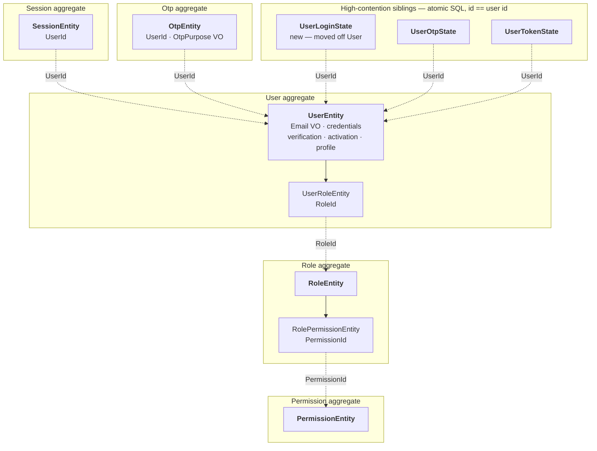

| Root | Inside the boundary | The invariant the boundary protects | Reached by id only |
| --- | --- | --- | --- |
| `UserEntity` | `UserRoleEntity` | A user never holds the same role twice; credentials, verification and activation move in one commit | Role, Session, Otp, the three siblings |
| `RoleEntity` | `RolePermissionEntity` | A role never holds the same permission twice | Permission, User |
| `PermissionEntity` | — | Resource + action unique among non-deleted | Role |
| `SessionEntity` | — | Revoked at most once; a refresh never extends past the absolute expiry | User |
| `OtpEntity` | — | A code is spent at most once; attempts never exceed the cap | User |
| `UserLoginState` · `UserOtpState` · `UserTokenState` | — | The counter moves atomically, never contending on the user's lock | User |

#### The same map, in plain words

```text
  ╔═ User aggregate ══════════════════════════════════╗
  ║  ★ UserEntity                        THE ROOT     ║
  ║      email · password · verified · active         ║
  ║      profile · avatar · phone                     ║
  ║                                                   ║
  ║      └── UserRoleEntity              member       ║
  ║            carries a RoleId and nothing else      ║
  ╚═══════════════════════════════════════════════════╝
         ╎ RoleId  — a plain Guid, no navigation property
         ▼
  ╔═ Role aggregate ══════════════════════════════════╗
  ║  ★ RoleEntity                        THE ROOT     ║
  ║      name · description · active                  ║
  ║                                                   ║
  ║      └── RolePermissionEntity        member       ║
  ║            carries a PermissionId                 ║
  ╚═══════════════════════════════════════════════════╝
         ╎ PermissionId
         ▼
  ╔═ Permission aggregate ════════════════════════════╗
  ║  ★ PermissionEntity                  THE ROOT     ║
  ╚═══════════════════════════════════════════════════╝

  These stand alone. Each one points back at the user by id, independently of the others:

  ╔═ Session ══════════╗  ╔═ Otp ══════════════╗  ╔═ Login / Otp / Token state ═╗
  ║  ★ SessionEntity   ║  ║  ★ OtpEntity       ║  ║  ★ three tiny rows          ║
  ║    holds a UserId  ║  ║    holds a UserId  ║  ║    id == the user's id      ║
  ╚═════════╪══════════╝  ╚═════════╪══════════╝  ╚═════════╪═══════════════════╝
            ╎                       ╎                       ╎
            └───────────────────────┴───────────────────────┘
                                    ╎ UserId
                                    ▼
                        the User aggregate, above
```

What the boxes mean when you sit down to write code:

- **To give a user a role**, you load the *user* and call `user.GrantRole(roleId, roleName)`.
  There is no `IUserRoleRepository` and you never load a `UserRoleEntity` by itself.
- **To show a role's name next to a user**, you cannot write `userRole.Role.Name` — that
  property is gone. You fetch the roles you need in one batched call and join them in the
  mapper.
- **To lock an account after failed logins**, you do not touch `UserEntity` at all. The counter
  lives on its own row so two simultaneous failed logins both count instead of one overwriting
  the other.
- **One commit changes one box.** Deactivating a user and revoking their sessions are two
  boxes, so they are two commits with a domain event in between — not one transaction.
- **Deleting a box deletes everything inside it, and nothing outside it.** Deleting a role
  removes its `RolePermissionEntity` rows; it does not remove the permissions themselves.

The three siblings are separate aggregates **on purpose** (D10/D11): their counters are bumped
by atomic SQL, so they must not share the user's optimistic lock. That is legitimate DDD —
eventual consistency between aggregates — and the only defect is that today it is undocumented
and the login counters sit on `UserEntity` instead.

### 1.4 Core — 1 root, 0 members

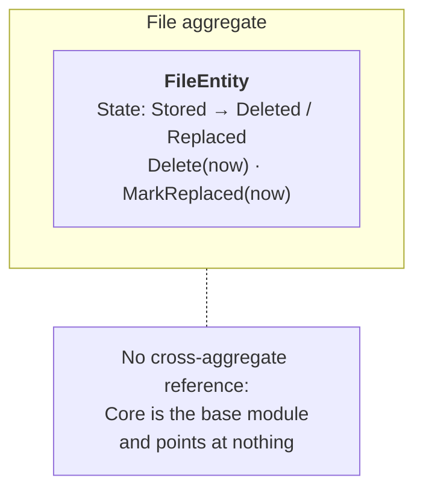

| Root | Inside the boundary | The invariant the boundary protects | Reached by id only |
| --- | --- | --- | --- |
| `FileEntity` | — | Deleted at most once; the three states are total and mutually exclusive | Nothing — Core depends on no module |

#### The same map, in plain words

```text
  ╔═ File aggregate ══════════════════════════════════════════════╗
  ║  ★ FileEntity                                   THE ROOT      ║
  ║      name · mime · size · storage key · colours               ║
  ║                                                               ║
  ║      state:  Stored ──▶ Deleted                               ║
  ║                  └────▶ Replaced                              ║
  ╚═══════════════════════════════════════════════════════════════╝

        Core points at nothing. It is the bottom of the stack:
        every other module depends on it, so it may depend on none.
```

What the box means when you sit down to write code:

- **A file is one box with no members.** There is nothing to navigate into and nothing to
  cascade.
- **The file never knows who uses it.** An article holds a `CoverImageFileId`; the file holds no
  `ArticleId`. The row and the reference are written in one transaction (D12), so a file row
  exists only if something already points at it.
- **Uploading is not a repository call.** After this stage `IFileRepository` only reads and
  writes rows; `IFileUploadService` is what talks to Cloudinary.
- **Every state move takes the clock as an argument** — `Delete(now)`, `MarkReplaced(now)` — so
  the stamp cannot drift between the API host and the job host.

Core's boundary is already right. Its problem (Part B) is entirely that `IFileRepository` does
network IO and knows an Identity policy, which is an R12/R13 failure, not an R1 failure.

### 1.5 Content — 37 roots, 12 members

Three clusters. Same grammar throughout; the 15 single-entity interaction aggregates are listed
in the table rather than drawn, because each is one box with one node.

#### Editorial

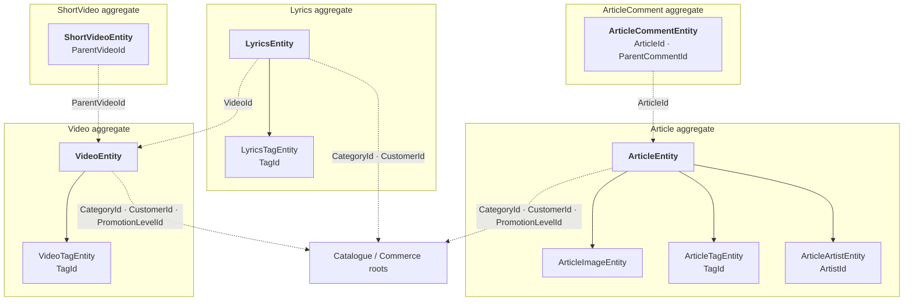

#### Community review — four independent lifecycles, which is exactly why they are roots

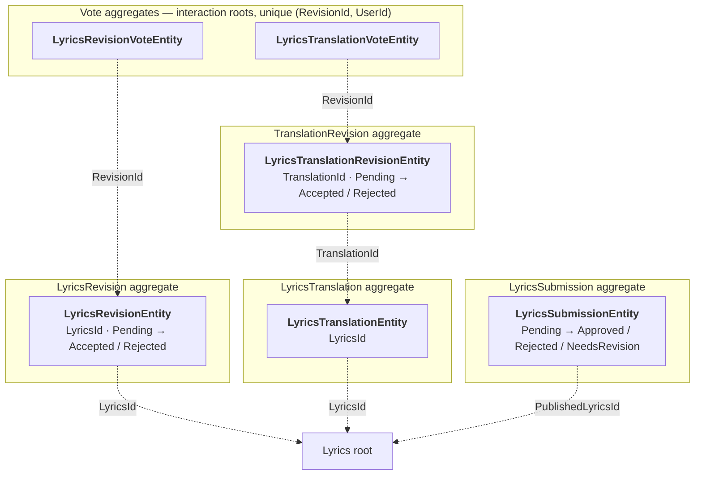

#### Commerce and catalogue

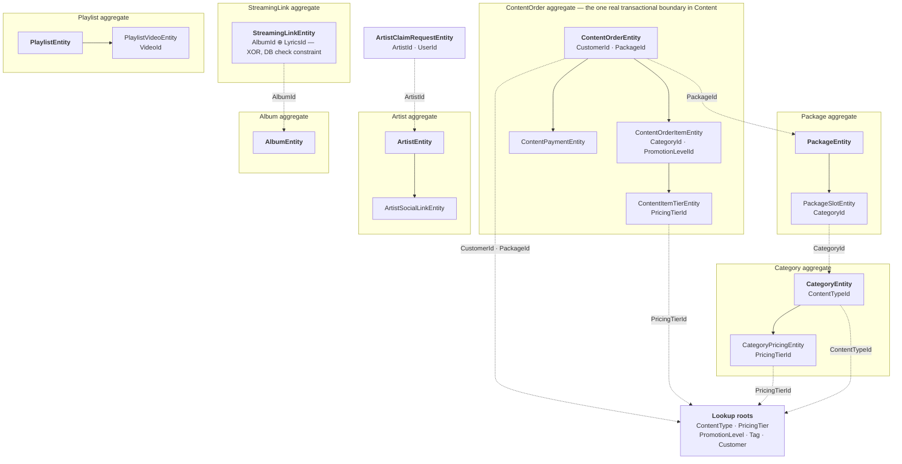

The complete target inventory — 37 roots and 12 members, summing to the 49 entities in the tree:

| Cluster | Roots | Members folded in |
| --- | --- | --- |
| Editorial | `Article`, `Video`, `ShortVideo`, `Lyrics`, `ArticleComment` | `ArticleImage`, `ArticleTag`, `ArticleArtist`, `VideoTag`, `LyricsTag` |
| Community review | `LyricsRevision`, `LyricsTranslationRevision`, `LyricsTranslation`, `LyricsSubmission` | — |
| Commerce | `ContentOrder`, `Customer`, `Package` | `ContentOrderItem`, `ContentItemTier`, `ContentPayment`, `PackageSlot` |
| Catalogue | `Category`, `ContentType`, `PricingTier`, `PromotionLevel`, `Tag` | `CategoryPricing` |
| Artists | `Artist`, `Album`, `ArtistClaimRequest`, `StreamingLink` *(see D9)* | `ArtistSocialLink` |
| Playlists | `Playlist` | `PlaylistVideo` |
| Interactions (15 single-entity aggregates, unchanged) | `ArticleLike`, `ArticleBookmark`, `ArticleShare`, `ArticleCommentLike`, `ShortVideoLike`, `ShortVideoBookmark`, `ShortVideoShare`, `ShortVideoViewEvent`, `LyricsLike`, `LyricsShare`, `LyricsViewEvent`, `VideoShare`, `VideoRating`, `LyricsRevisionVote`, `LyricsTranslationVote` | — |

The invariants each boundary protects:

| Root | The invariant the boundary protects |
| --- | --- |
| `ContentOrder` | The total always equals the sum of its billable items' tiers and promotions; items are added only while Draft; the payment settles this order and no other |
| `Article` · `Video` · `Lyrics` | Publication state and its stamp move together; images and tags never outlive the piece |
| `LyricsRevision` · `LyricsTranslationRevision` | Decided at most once — the tally lives outside the boundary (a SQL count over the vote aggregates), so the guard on `Accept` is what makes a threshold race harmless |
| `LyricsSubmission` | Decided at most once; an approved submission names exactly one published page |
| `Category` | Pricing rows exist only for a commissionable category |
| `Package` | Slots reference live categories; the slot set defines the bundle |
| `Artist` · `Album` | Social links never outlive the artist |
| `StreamingLink` | Exactly one owner — album or standalone single, never both (`ck_streaming_links_exactly_one_target`); one link per (owner, platform) |
| Interaction aggregates | One row per (user, target); creation and removal are independently idempotent |

#### The same map, in plain words

Thirty-four boxes are too many to draw at once. Here is the richest one, which is the pattern
every other cluster follows:

```text
  ╔═ ContentOrder aggregate ══════════════════════════════════════════╗
  ║  ★ ContentOrderEntity                              THE ROOT       ║
  ║      status: Draft ─▶ PendingPayment ─▶ Paid / Cancelled          ║
  ║      total  (always the sum of what is inside this box)           ║
  ║                                                                   ║
  ║      ├── ContentOrderItemEntity          member                   ║
  ║      │       └── ContentItemTierEntity   member                   ║
  ║      │                                                            ║
  ║      └── ContentPaymentEntity            member                   ║
  ║              proof · verified · receipt                           ║
  ╚═══════════════════════════════════════════════════════════════════╝
        ╎ CustomerId   ╎ PackageId   ╎ CategoryId   ╎ PricingTierId
        ▼              ▼             ▼              ▼
     Customer       Package       Category       PricingTier
     (own box)      (own box)     (own box)      (own box)
```

Compare that with a piece of content, where the review workflow deliberately sits *outside* the
box because it has its own life:

```text
  ╔═ Lyrics aggregate ════════════╗      ╔═ LyricsRevision aggregate ═══════════╗
  ║  ★ LyricsEntity      ROOT     ║      ║  ★ LyricsRevisionEntity    ROOT      ║
  ║      text · status · slug     ║◀╌╌╌╌╌╫──  LyricsId                          ║
  ║                               ║      ║      status: Pending ─▶ Accepted     ║
  ║      └── LyricsTagEntity      ║      ║                      └▶ Rejected     ║
  ║            carries a TagId    ║      ╚══════════╪═══════════════════════════╝
  ╚═══════════════════════════════╝                 ╎ RevisionId
                                                    ╎
  ╔═ one vote ═══════════════════════════╗          ╎
  ║  ★ LyricsRevisionVoteEntity   ROOT   ║╌╌╌╌╌╌╌╌╌╌┘
  ║    one row per (revision, user)      ║   cast by arbitrary users, like a like
  ╚══════════════════════════════════════╝
```

What the boxes mean when you sit down to write code:

- **Adding a line item is a message to the order, not a constructor call.** You write
  `order.AddItem(categoryId, tiers)` and the order builds the item itself. You never `new` a
  `ContentOrderItemEntity` in a handler and hand it over.
- **The total is never assigned.** It is recomputed inside the box whenever the box changes, so
  no call site can leave it stale.
- **A revision is its own box because it has its own status.** That is the whole test: an
  article's *image* has no status and dies with the article, so it is a member; a *revision*
  moves Pending → Accepted on its own schedule, so it is a root.
- **Accepting a revision touches two boxes**, so it is two steps: the revision decides, then the
  lyrics page is updated. Each step is idempotent on its own, which is what stops a
  double-clicked moderation from re-applying the text and re-notifying the proposer.
- **A like is its own box, and so is a vote.** They look tiny, but they are written by
  arbitrary users independently of the target's lifecycle, so each is a root with exactly one
  entity in it — that is normal and correct. Forcing votes through the revision root would
  serialize community voting for nothing; the unique `(RevisionId, UserId)` index is the real
  duplicate guard.
- **Nothing reaches across a dotted line.** You cannot write `order.Customer.Name`. You fetch
  the customers you need in one call and join in the mapper.

### 1.6 Mailer — 3 roots, 0 members, already correct

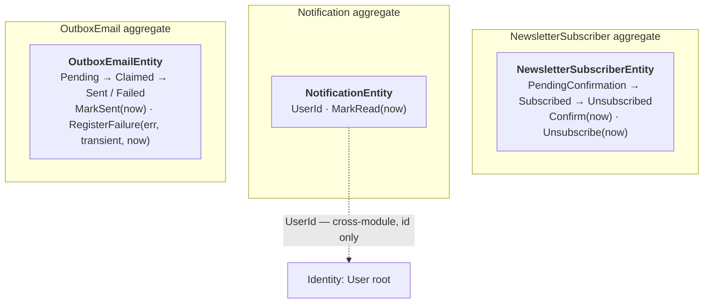

| Root | Inside the boundary | The invariant the boundary protects | Reached by id only |
| --- | --- | --- | --- |
| `NewsletterSubscriberEntity` | — | One row per address (unique index); unsubscribe is idempotent and re-subscription reuses the row via `ReissueConfirmation` | — |
| `NotificationEntity` | — | Read at most once | Identity's `User` |
| `OutboxEmailEntity` | — | Claimed by one dispatcher at a time; sent at most once; the lease is the only thing that returns a row to the pool | — |

#### The same map, in plain words

```text
  ╔═ NewsletterSubscriber ═════════╗  ╔═ Notification ═════════════════╗
  ║  ★ one row, one email address  ║  ║  ★ one row, one user           ║
  ║    Pending ─▶ Subscribed       ║  ║    unread ─▶ read              ║
  ║            └▶ Unsubscribed     ║  ║    UserId ╌╌▶ Identity's user  ║
  ╚════════════════════════════════╝  ╚════════════════════════════════╝

  ╔═ OutboxEmail ══════════════════════════════════════════════════════╗
  ║  ★ one row, one email to send                                      ║
  ║    Pending ─▶ Claimed ─▶ Sent                                      ║
  ║                  │   └──▶ Failed ─▶ back to Pending on retry       ║
  ║                  └─ the lease is the only way a stuck row returns  ║
  ╚════════════════════════════════════════════════════════════════════╝
```

Three boxes, nothing inside any of them, nothing pointing at anything except one id across a
module boundary. This is what the other three modules look like after Stage 15.

**No change is specified for Mailer** beyond the kernel-inherited `Id` fix (15.1). It is in this
document as the worked example: when Part A asks Identity to take `DateTime now` as a parameter
and return `bool` from a guarded transition, `OutboxEmailEntity.MarkSent(DateTime now)` is the
file to copy.

---

## Part A — Identity

### A.1 The model today

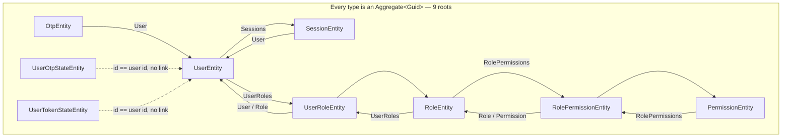

Eleven object navigations, ten of them forming bidirectional pairs — only `Otp.User` is
one-way — and no boundary anywhere: from a loaded
`PermissionEntity` a caller can walk to every user in the system.

### A.2 Violations, with evidence

**A.2.1 — Two of nine roots are not roots; two more are undocumented (R1, R13).**
`UserRoleEntity` and `RolePermissionEntity` are pure join rows: they exist only as part of a
user's grants and a role's permission set, and neither carries a lifecycle of its own. They are
`Aggregate<Guid>` solely because they raise events (`UserRoleEntity.cs:44,76`,
`RolePermissionEntity.cs:46,57`) and `Aggregate` is the only base that can.

The breach is wider than the base class. **Both have their own repository**, and both are
fetched by a key that is not their root's:

| Repository | Direct-retrieval methods | Callers |
| --- | --- | --- |
| `IUserRoleRepository` | `GetByUserAndRoleAsync(userId, roleId)`, `GetUserRolesWithRoleAsync(userId)`, `ExistsByUserAndRoleAsync` | `AdminAssignRoleToUserHandler`, `AdminRemoveRoleFromUserHandler`, `AdminGetUserRolesHandler` |
| `IRolePermissionRepository` | `GetByRoleAndPermissionAsync(roleId, permissionId)`, `GetByRoleAndPermissionIdsAsync`, `GetPermissionIdsByRoleIdAsync`, `ExistsByRoleAndPermissionAsync` | `AdminAssignPermissionToRoleHandler`, `AdminRemovePermissionFromRoleHandler`, `AdminBulkUpdateRolePermissionsHandler` |

Both are DI-registered (`IdentityModule.cs:156-157`) and both extend `IdentityRepository<T>`, so
after 15.1 they only still compile because their entities are `Aggregate<Guid>` and therefore
satisfy the `IAggregateRoot` constraint. Demoting the two types breaks the constraint, which is
what makes deleting the repositories a compile-time obligation rather than a tidy-up.

The six admin grant/revoke handlers consequently never go through a root at all: they add and
delete join rows directly and commit. `UserEntity.AssignRole` — the one method that does route a
grant through the root — is called from exactly one place, and it is not a handler (A.2.8).

`UserOtpStateEntity` and `UserTokenStateEntity` are 1:1 with the user — their `Id`
*is* the user id (`UserOtpStateEntity.cs:33`) — but they are genuinely separate aggregates by
design, because their counters are bumped by atomic SQL and must not contend on the user's
lock. That is legitimate; what is missing is saying so.

**A.2.2 — `UserEntity` carries state it does not control (R4, R7).**
`FailedLoginAttempts` (`UserEntity.cs:63`) and `LockedUntil` (`UserEntity.cs:68`) are
`private set` properties on the aggregate, and the code comment above them says outright:

```csharp
// Login brute-force counters. Moved by atomic SQL through IAccountLockoutRepository, never by
// a tracked mutation, so an increment survives the exception the failed attempt throws.
```

The aggregate declares ownership of two fields no aggregate method ever writes. The `private
set` is not a guarantee, it is decoration. Meanwhile the *same* concern for OTP already lives
correctly on a sibling aggregate (`UserOtpStateEntity`) — the login counters simply never
followed.

`UserEntity` also spans four unrelated concerns: credentials, verification/activation, profile
(country, phone, avatar — 7 properties), and role grants. Nothing in the profile block
participates in a credential invariant.

**A.2.3 — Seven value objects, zero of them in the domain (R6).**
`Email`, `AuthProvider`, `OtpPurpose`, `SessionStatus`, `Client`, `ExportFormat`,
`VisitorPermissions` all live in `Identity/Domain/ValueObjects/`. Not one is referenced by any
entity. `UserEntity.Email` is `string?` (`UserEntity.cs:22`); `OtpEntity.Purpose` is the raw
`EnumOtpPurpose`. The 21 files importing the namespace are all Application, Infrastructure or
test files — the value object is constructed at the edge, validated, then unwrapped to a
primitive before it reaches the entity. The rule it encodes is therefore enforced on the path
the validator already covers, and *not* enforced on any other path into the aggregate
(seeders, social login, admin flows).

**A.2.4 — Seven transitions with no guard (R9, R10), in six rows.**

| Site | Problem |
| --- | --- |
| `SessionEntity.cs:176` `Revoke(reason)` | No `IsRevoked` check. Revoking twice re-stamps `RevokedAt` and raises a second `SessionRevokedEvent` — a duplicate security notification. |
| `SessionEntity.cs:189` `Reactivate(...)` | No status check. Reactivates an active session and raises `SessionReactivatedEvent` again. |
| `OtpEntity.cs:103` `MarkAsUsed()` | No `IsUsed` check; re-stamps `UsedAt`. The sibling `MarkAsConsumed()` (`:138`) does it correctly with `ConsumedAt ??= …` — the house shape already exists two methods away. |
| `UserEntity.cs:322` `Activate()` | No guard **and no event**. An account being reactivated is a notifiable fact with no domain record. |
| `UserEntity.cs:331` `Deactivate()` | Same; deactivation should also be the trigger that revokes sessions, and today the doc comment asks the caller to remember ("You should also invalidate all their sessions separately"). |
| `RoleEntity.cs:446` / `PermissionEntity.cs:249` `Update(...)` | Raises `RoleChangedEvent` / `PermissionChangedEvent` unconditionally, even when the submitted values are identical. |

**A.2.5 — Five methods that raise an event for a change they do not make (R10).**
`UserEntity.RecordMassSignOut`, `UserRoleEntity.RecordRevocation`,
`RolePermissionEntity.MarkRemoved`, `RoleEntity.MarkHardDeleted`,
`PermissionEntity.MarkHardDeleted`. Each exists so a handler can announce a fact while
performing the actual mutation itself (deleting the row, revoking sessions in a loop). The
aggregate is being used as an event bus. This is the symptom of A.2.1: the fact belongs to a
root that does not exist yet.

**A.2.6 — The OTP verification policy lives in a repository (R12, R13).**
`OtpRepository.ValidateOtpAsync` (`OtpRepository.cs:33-84`) is the clearest instance in the
codebase. In 50 lines it: runs a specification query, checks expiry, checks the attempt cap,
compares the code against the peppered hash, increments the attempt counter, registers a
failure against the account, **calls `Context.SaveChangesAsync` directly** — bypassing
`IIdentityUnitOfWork` entirely — and throws four different localized domain errors.

Every one of those is a domain decision. The commit in the middle also means a failed
verification is durable even when the surrounding handler later throws, which happens to be
the desired behaviour and is exactly why it was written this way; the point is that the
behaviour is a *policy* that no one can find, sitting in infrastructure.

**A.2.7 — Handler-resident rules (R12).**
`PublicVerifyOtpHandler.cs:53-73` decides that only an `EmailVerification` purpose may flip
`IsVerified`, and check-then-throws on `user.IsVerified && purpose == EmailVerification`. Both
are `UserEntity` rules. `UserEntity.ValidateCanLogin()` (`:340`) is the shape the rest should
take, but it is a void method the caller must remember to call, and it dereferences `Email!`.

**A.2.8 — `AssignRole` accepts a pre-built member (R8).**
`UserEntity.cs:386` takes a fully constructed `UserRoleEntity`, checks for a duplicate, and adds
it. The root does not create its own child, so nothing stops a caller building a
`UserRoleEntity` with a mismatched `UserId`. Its sole production caller is
`AuthRepository.cs:274` — the signup visitor-grant, invoked from infrastructure, not from a
handler; the admin grant path (A.2.1) bypasses the root entirely via `IUserRoleRepository`.

**A.2.9 — Ambient clock in eight places (R15).**
`SessionEntity.cs:147,166,179`; `OtpEntity.cs:106,123,140`; `RoleEntity.cs:154`;
`PermissionEntity.cs:179`. `IsActive()` and `IsExpired()` are the expensive ones: a test cannot
drive them to a boundary without sleeping, and a session's validity depends on which machine
asks.

### A.3 The target model

**See §1.3** — five roots (`User`, `Role`, `Permission`, `Session`, `Otp`), two member entities
(`UserRole`, `RolePermission`), three high-contention sibling aggregates keyed by user id.

### A.4 The changes

1. **`UserRoleEntity` and `RolePermissionEntity` become `Entity<Guid>` members.** They lose
   `AddDomainEvent`; the grant/revoke facts move to the root that performs them —
   `UserEntity.GrantRole(roleId, roleName)` and `RevokeRole(roleId, roleName)`,
   `RoleEntity.GrantPermission(permissionId)` / `RevokePermission(permissionId)`. Each returns
   `bool` and raises only on a real change. `AssignRole(UserRoleEntity)` is deleted (A.2.8).

   The demotion drags the A.2.1 repositories with it — after 15.1 a member entity with a
   repository no longer compiles, so this is one indivisible change:
   - **`IUserRoleRepository` / `UserRoleRepository` and `IRolePermissionRepository` /
     `RolePermissionRepository` are deleted**, with their DI registrations
     (`IdentityModule.cs:156-157`) and the four specifications that only they applied
     (`UserRoleByUserAndRoleSpecification`, `UserRoleByUserIdSpecification`,
     `RolePermissionByRoleAndPermissionSpecification`, `RolePermissionByRoleIdSpecification`).
   - **The six admin handlers re-route through the roots.** `AdminAssignRoleToUser` /
     `AdminRemoveRoleFromUser` load the *user* with roles and call `GrantRole`/`RevokeRole`;
     `AdminAssignPermissionToRole`, `AdminRemovePermissionFromRole` and
     `AdminBulkUpdateRolePermissions` load the *role* with permissions and call
     `GrantPermission`/`RevokePermission`; `AdminGetUserRoles` reads from `IAuthRepository`'s
     user-with-roles query instead of the join-row repository. The duplicate-grant check moves
     from `ExistsBy…Async` round-trips into the root method's own guard, and the not-assigned
     404s become the `false`/absent case of the same methods.
   - **The bootstrap paths keep working through the roots**: `AuthRepository.cs:274` (visitor
     grant on signup) and the two seeders swap `CreateBootstrap` + `Add` for the root verbs on
     the loaded `UserEntity`/`RoleEntity`; the no-event bootstrap distinction moves behind a
     parameter or a dedicated root method rather than a second entity factory.
   - `RecordRevocation` / `MarkRemoved` (A.2.5's declarative raisers on these two types) go
     with `AddDomainEvent` — the facts are raised by `RevokeRole`/`RevokePermission`.
2. **Login counters move to `UserLoginStateEntity`**, a sibling of `UserOtpStateEntity` with
   the same shape and the same atomic-SQL repository. `UserEntity.FailedLoginAttempts` and
   `LockedUntil` are dropped. `IAccountLockoutRepository` re-points; migration drops two
   columns and creates one table.
3. **Value objects reach the entities.** `UserEntity.Email` becomes `Email?` with an EF value
   converter; `OtpEntity.Purpose` becomes `OtpPurpose`; `SessionEntity.Client` becomes
   `Client`. The converter is one line per property and the column type does not change, so
   this is a **no-migration** change. The four value objects that wrap an enum with only an
   `Enum.IsDefined` check (`SessionStatus`, `ExportFormat`, `AuthProvider`, and `Client` once
   converted) stay as edge parsers — recorded under D8.
4. **The six transitions get guards** in the Stage 6 shape: `bool` return, no-op returns
   `false` and raises nothing, illegal transition throws a coded `IdentityRuleException`.
   `Activate`/`Deactivate` gain `UserActivatedEvent` / `UserDeactivatedEvent`, and the session
   revocation that the doc comment asks callers to remember becomes a reaction to the latter.
5. **The OTP policy moves into the domain.** `OtpEntity.Verify(suppliedCodeMatches, now)`
   returns a `EnumOtpVerificationOutcome` (`Valid`, `Expired`, `AttemptsExhausted`, `Mismatch`)
   and performs the attempt increment itself. `OtpRepository.ValidateOtpAsync` shrinks to the
   query; the handler maps the outcome to its localized error, and the failed-attempt durability
   that the mid-repository `SaveChangesAsync` provided becomes an explicit second commit in the
   handler with a comment saying why.
6. **Clock injection.** `IsActive(now)`, `IsExpired(now)`, `Revoke(reason, now)`,
   `MarkAsUsed(now)`, `SoftDelete(now)` take the instant; callers pass `timeProvider.GetUtcNow()`.

---

## Part B — Core

### B.1 The model today

One entity, and the aggregate itself is close to correct — factory validation, guarded
`Delete()`/`MarkReplaced()` returning `bool`, events carrying the storage key. The problem is
entirely around it.

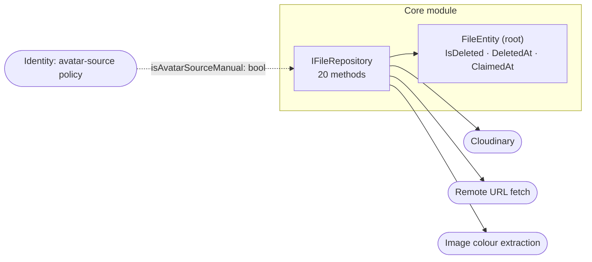

### B.2 Violations, with evidence

**B.2.1 — `IFileRepository` is not a repository (R13, R12).**
Twenty-one methods. Eleven are persistence-shaped (`GetByIdAsync`, `GetByIdsAsync`,
`GetStorageUrlsByIdsAsync`, `ClaimAsync`, `GetUnclaimedBeforeAsync`, `AddAsync`, `UpdateAsync`,
`Remove`, `GetAvatarFileAsync`, `SoftDeleteByIdAsync`, `SaveChangesAsync`). The other ten
perform network IO: `UploadAndStoreAvatarAsync`, `DownloadAndStoreAvatarFromUrlAsync`,
`UpdateAvatarFromUrlAsync`, `UpdateAvatarFromFileAsync`, `UpdateAvatarUrlFromSourceAsync`,
`UploadAndStoreImageFileAsync`, `UploadAndStoreVideoFileAsync`, `ReplaceImageFileAsync`,
`ReplaceVideoFileAsync`, `UploadAndStoreRawFileAsync`. A repository that uploads to Cloudinary
cannot be faked in a unit test, cannot be reasoned about transactionally, and cannot fail in a
way the caller can distinguish from a database failure.

And it commits. `SaveChangesAsync` is a public repository method. Of the ten `SaveChangesAsync`
occurrences in the file, two are the method's own declaration and body and two are the
deliberate cross-module commits below, leaving **six** upload-path commit sites that bypass
`ICoreUnitOfWork` (which exists, `Application/Shared/Persistence/`). Even the reaper commits
through the repository (`UnclaimedFileReaperJob.cs:54`).

**B.2.2 — Core knows an Identity policy (R13, module boundary).**
`UpdateAvatarUrlFromSourceAsync(..., bool isAvatarSourceManual, ...)`. `EnumAvatarSource` is an
Identity concept (`Identity/Domain/Enums/EnumAvatarSource.cs`); Core's file repository branches
on it, flattened to a bool so the dependency does not show up in the using list. Core is the
module every other module depends on — it must not depend back.

**B.2.3 — The claim decision sits in the repository (R12).**
`FileRepository.cs:77`:

```csharp
if (file is null || !file.Claim())
```

The aggregate's `Claim()` correctly returns `false` when already claimed (`FileEntity.cs:160`),
but what that `false` *means* — that the caller's referencing write is a duplicate — is decided
in infrastructure. `FileRepository.cs:65` also does `Context.Files.Update(file)`, the
whole-row attach of [04 §3].

**B.2.4 — The lifecycle is three flags, not a state (R9).**
`IsDeleted`, `DeletedAt`, `ClaimedAt` encode four states — Unclaimed, Claimed, Deleted,
Replaced — with no enum and no transition table. Nothing prevents the combination
`ClaimedAt != null && IsDeleted` from meaning two different things, and "replaced" is
distinguishable from "deleted" only by which event was raised, which is not queryable.

**B.2.5 — Ambient clock in three places (R15).**
`FileEntity.cs:167` (`Claim`), `:188` (`Delete`), `:210` (`MarkReplaced`). The reaper's grace
period is measured against `CreatedAt`, so a clock skew between the API host and the job host
silently changes the retention window.

**B.2.6 — Core has no application layer.** There is no `Application/.../UseCases` folder; every
file operation is invoked from another module *through the repository interface*. The
repository is Core's application layer. This is why B.2.1 and B.2.2 happened.

### B.3 The target model

The aggregate boundary is unchanged and already correct (**§1.4**). What changes is the layer
around it — the repository splits from the upload service:

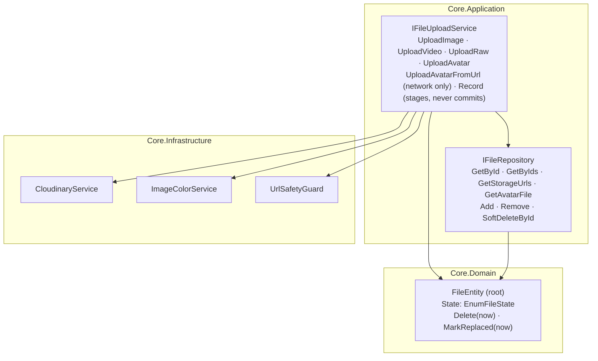

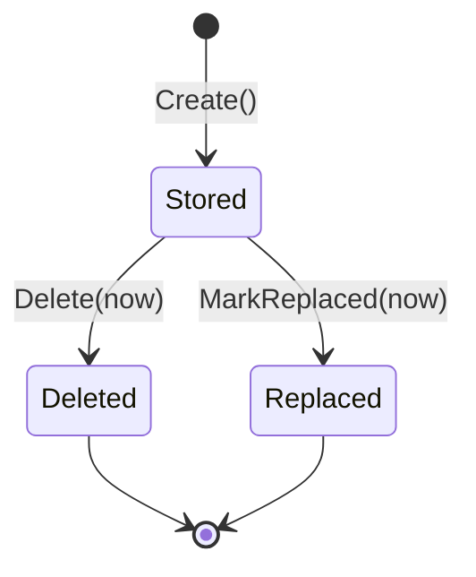

A row reaches `Stored` only inside the transaction that also writes the reference to it, so
there is no state for "uploaded but unreferenced" and nothing to sweep (D12).

### B.4 The changes

1. **The upload API splits in two.** `UploadImageAsync` / `UploadVideoAsync` / `UploadRawAsync` /
   `UploadAvatarAsync` / `UploadAvatarFromUrlAsync` do the network call and return an **unrecorded
   `FileEntity`** — the row to write, with no database work done at all.
   `RecordAsync(file, supersededFileId)` stages that row and marks the superseded file replaced,
   and **commits nothing**. The caller opens one transaction and does both halves inside it:

   ```csharp
   FileEntity uploaded = await fileUploadService.UploadImageAsync(file, id, folder, name, mime, ct);

   await unitOfWork.ExecuteInTransactionAsync(
       async transactionToken =>
       {
           await fileUploadService.RecordAsync(uploaded, album.CoverImageFileId, transactionToken);
           album.Update(coverImageFileId: uploaded.Id, ...);
           albumRepository.Update(album);
       },
       cancellationToken
   );
   ```

   No parallel DTO carries the upload across the boundary: `FileEntity.IsRecorded` reads the audit
   stamp the interceptor writes on first save, so an unrecorded file is one whose `CreatedAt` is
   still null, and `RecordAsync` refuses anything else with `CoreRuleCodes.FileAlreadyRecorded`
   (D13).

   The file row and the row referencing it now land or roll back together, across two
   `DbContext`s (D12). `SaveChangesAsync` and `UpdateAsync` leave `IFileRepository` (D4), and
   the six upload-path commits disappear rather than moving.
2. **Delete `UpdateAvatarUrlFromSourceAsync`.** Its branch moves to the Identity handler that
   owns `EnumAvatarSource`, which then calls the plain upload methods. Core stops knowing about
   avatars.
3. **`EnumFileState` replaces the flag trio.** `Stored | Deleted | Replaced`, mapped as the
   single source of truth. `IsDeleted` survives only as a `[NotMapped]` convenience for
   in-memory callers — it **cannot** appear in a query, so the global filter
   (`CoreDbContext.cs:41`), both `FileStatusSpecifications`, the repository predicates and the
   index all move to `State`. `CategorySpecifications.cs:125` records the same lesson for
   `IsPinnedToFeed`. `AddFileState` adds `state` and backfills it before dropping `is_deleted`;
   `CollapseFileStates` then folds `Claimed` away, drops `claimed_at`, and rebuilds the unique
   `file_name` index that the dropped column had taken with it.
4. **Clock as a parameter** on `Delete` and `MarkReplaced`; the dispatcher jobs take
   `TimeProvider` (the same change the composition-root audit prescribes).
5. **The claim protocol is deleted outright** — `FileEntity.Claim`, `ClaimAsync`,
   `GetUnclaimedBeforeAsync`, `UnclaimedFileReaperJob`, its Quartz registration and its three
   constants. It existed to repair a window that atomicity closes (D12), and a mechanism that
   deletes production data to compensate for a missing transaction is worse than the
   transaction.

---

## Part C — Content

### C.1 The model today

49 entities, 49 aggregate roots, 0 member entities, 64 entity-typed navigations, 25
repositories, 137 specification classes behind 117 `ApplySpecification` call sites.

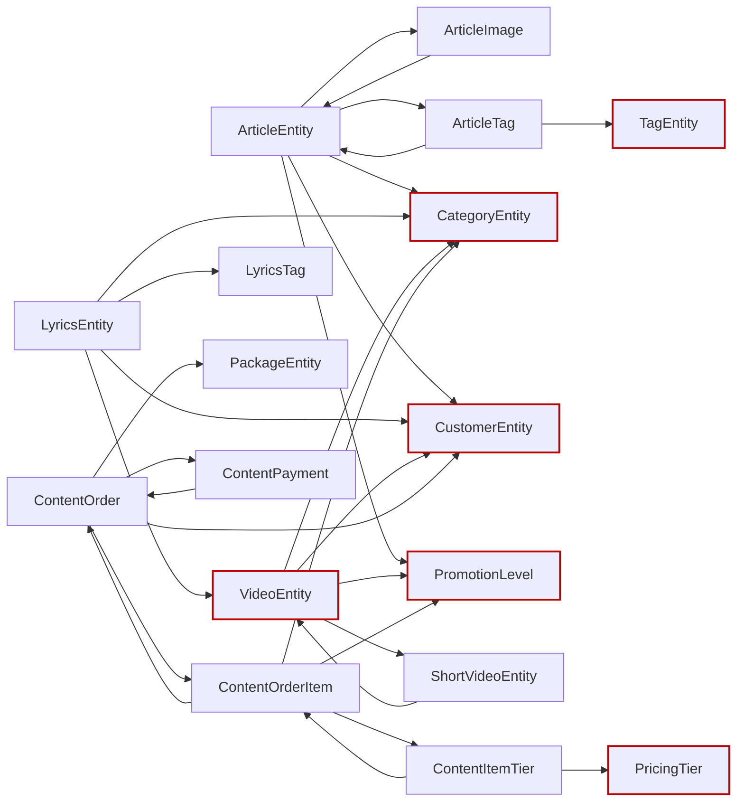

Red-outlined nodes are reached across an aggregate boundary by object reference. From a loaded
`ContentItemTierEntity` a caller can reach the order, its customer, and every other item on it.

### C.2 Violations, with evidence

**C.2.1 — Twelve member entities modelled as roots (R1).**
Each of these has a cascade FK to its parent, no repository, no independent retrieval, and is
written only through its parent's use cases:

| Member | Belongs to | Member | Belongs to |
| --- | --- | --- | --- |
| `ArticleImageEntity` | Article | `ContentOrderItemEntity` | ContentOrder |
| `ArticleTagEntity` | Article | `ContentItemTierEntity` | ContentOrder |
| `ArticleArtistEntity` | Article | `ContentPaymentEntity` | ContentOrder |
| `VideoTagEntity` | Video | `PackageSlotEntity` | Package |
| `LyricsTagEntity` | Lyrics | `CategoryPricingEntity` | Category |
| `PlaylistVideoEntity` | Playlist | `ArtistSocialLinkEntity` | Artist |

The 15 interaction types (`ArticleLikeEntity`, `ArticleBookmarkEntity`, `ArticleShareEntity`,
`ArticleCommentLikeEntity`, the ShortVideo and Lyrics equivalents, `VideoRatingEntity`,
`LyricsViewEventEntity`, `ShortVideoViewEventEntity`, and the two revision votes) are
**correctly** roots — single-entity aggregates written concurrently by arbitrary users, each
with a unique (user, target) index as its duplicate guard. The votes are the case the schema
decides: `ILyricsRevisionVoteRepository` exists with its own tally query
(`GetNetApprovalsAsync`), the unique index is `(RevisionId, UserId)`
(`LyricsRevisionVoteConfiguration.cs:29`) — byte-for-byte the `VideoRating` shape
(`VideoRatingConfiguration.cs:27`), which no one proposes folding into the video. They are not
part of this reduction. `StreamingLinkEntity` is also excluded — see D9. 49 roots →
37 roots + 12 members.

**C.2.2 — Twenty-six cross-aggregate navigations (R3).**
The complete list, by file and line:

| Navigation | Site | Navigation | Site |
| --- | --- | --- | --- |
| `Article.PromotionLevel` | `ArticleEntity.cs:114` | `ContentOrder.Customer` | `ContentOrderEntity.cs:42` |
| `Article.Customer` | `:193` | `ContentOrder.Package` | `:47` |
| `Article.Category` | `:198` | `ContentOrderItem.Category` | `ContentOrderItemEntity.cs:65` |
| `Video.PromotionLevel` | `VideoEntity.cs:102` | `ContentOrderItem.PromotionLevel` | `:70` |
| `Video.Customer` | `:184` | `ContentItemTier.PricingTier` | `ContentItemTierEntity.cs:37` |
| `Video.Category` | `:189` | `CategoryPricing.PricingTier` | `CategoryPricingEntity.cs:37` |
| `Video.Shorts` | `:199` | `PackageSlot.Category` | `PackageSlotEntity.cs:43` |
| `Lyrics.Video` | `LyricsEntity.cs:230` | `ShortVideo.ParentVideo` | `ShortVideoEntity.cs:103` |
| `Lyrics.Customer` | `:235` | `StreamingLink.Lyrics` | `StreamingLinkEntity.cs:50` |
| `Lyrics.Category` | `:240` | `ArticleArtist.Artist` | `ArticleArtistEntity.cs:32` |
| `Category.ContentType` | `CategoryEntity.cs:105` | `ArticleTag.Tag` | `ArticleTagEntity.cs:29` |
| `ArticleComment.Article` | `ArticleCommentEntity.cs:56` | `VideoTag.Tag` | `VideoTagEntity.cs:29` |
| `PlaylistVideo.Video` | `PlaylistVideoEntity.cs:33` | `LyricsTag.Tag` | `LyricsTagEntity.cs:29` |

The remaining 38 are within-aggregate and stay — except the back-references
(`ArticleImage.Article`, `ArticleLike.Article`, `ContentOrderItem.Order`, …), which are
unnecessary once traversal is root-down only.

**C.2.3 — Seven transitions with no guard (R9, R10).**
The [03 §7] finding, enumerated:

| Site | Effect of a second call |
| --- | --- |
| `LyricsRevisionEntity.cs:85` `Accept` | Re-sets `Accepted`, re-raises `LyricsRevisionDecidedEvent` — a second notification to the proposer, and the accepted text is re-applied to the lyrics page. |
| `LyricsRevisionEntity.cs:105` `Reject` | Same, and can flip an already-accepted revision to rejected. |
| `LyricsTranslationRevisionEntity.cs:83` `Accept` | Same shape. |
| `LyricsTranslationRevisionEntity.cs:103` `Reject` | Same shape. |
| `LyricsSubmissionEntity.cs:101` `Approve` | Re-stamps reviewer and `PublishedLyricsId`; a second approval can point at a different lyrics page. |
| `LyricsSubmissionEntity.cs:115` `Reject` | Can reject an already-approved submission. |
| `LyricsSubmissionEntity.cs:129` `RequestRevision` | Can pull an approved submission back to `NeedsRevision`. |

All seven are the revision/submission review workflow; nothing else in Content is unguarded.
`ArtistEntity.ClaimOwnership` (`:322`) already throws `ArtistAlreadyClaimed` when `UserId` is
set, and `ContentOrderEntity.Cancel` (`:291`) already throws on `Paid`/`Cancelled` — both are
correct and out of scope. `ContentPaymentEntity.Verify` (`:127`) and `Reject` (`:158`) are the
counter-example to copy: both guard on `Verified`/`Rejected` and throw coded errors. That is
the shape the seven above must take. (`Verify` still raises no event while `Reject` does — an asymmetry worth closing, since
`OrderPaidEvent` currently carries the fact from the order instead.)

The consequence is visible end-to-end: `AdminDecideLyricsRevisionHandler` calls
`revision.Accept(...)` then `lyrics.ReplaceLyricsText(...)` with no idempotency anywhere on the
path, so a double-submitted moderation click re-applies the text and re-notifies. The community
path is the same shape with a third aggregate: `PublicVoteOnLyricsRevisionHandler` commits the
vote, the revision's auto-accept and the lyrics text in one transaction, and its threshold
check (`GetNetApprovalsAsync` + the in-memory `+1`) races a concurrent vote — today both racers
can pass `Status == Pending` before either commits; after this stage the second `Accept`
returns `false` and the race is harmless.

**C.2.4 — Public guards and externally built members (R7, R8).**
`ContentOrderEntity.EnsureDraft()` (`:91`) is a public method whose entire purpose is for
callers to remember to call it. `AddItem(ContentOrderItemEntity)` (`:121`) and
`AddItems(IEnumerable<…>)` (`:132`) accept members the handler constructed — nothing checks
that the item's `OrderId` matches, and `AddItem` does not call `EnsureDraft`, so an item can
be appended to a paid order.

**C.2.5 — Raw setters dressed as behaviour (R7, R16).**
`LyricsEntity.cs:708` `ReplaceLyricsText(string) => LyricsText = lyricsText;` — no guard on
status, no length rule, no event, and it is the method the revision-acceptance path calls.
Likewise `ArticleEntity.cs:576` and `VideoEntity.cs:597` `StampSocialBoost() => SocialBoost =
true;`, `LyricsEntity.cs:626/632/639/644` `LinkArtist`/`UnlinkArtist`/`LinkAlbum`/`UnlinkAlbum`,
`VideoEntity.cs:670` `LinkArtist`, and `ArticleCommentEntity.cs:130` `Edit(string body) => Body
= body;` — which will happily edit a soft-deleted comment.

Six bulk `Update(...)` methods (`ArticleEntity.cs:321`, `LyricsEntity.cs:383`,
`VideoEntity.cs:305`, `CategoryEntity.cs:188`, `ArtistEntity.cs:180`, `AlbumEntity.cs:112`) require
re-supplying every field, which makes a partial update indistinguishable from a clear-to-null
and is why `ReplaceLyricsText` had to exist alongside `Update` in the first place.

**C.2.6 — `HasLyrics` has three writers (R14).**
`VideoEntity.cs:130` stores it; `:397`/`:402` mutate it; and three handlers must each remember:
`AdminCreateLyricsHandler.cs:61`, `AdminUpdateLyricsHandler.cs:81` and `:91` (the old and new
video on a re-link), `AdminDeleteLyricsHandler.cs:37`. Any fourth path that creates or deletes
lyrics — a community submission approval, a cascade — leaves the flag wrong, and nothing
detects it.

**C.2.7 — Engagement counters are `private set` but written by SQL (R7, R14).**
`ArticleEntity.cs:173-188`, `LyricsEntity.cs:210-220`, `VideoEntity.cs:179` and the ShortVideo
equivalents declare `LikeCount`/`CommentCount`/`ShareCount`/`BookmarkCount`/`ViewCount` with
`private set`, but every write is `ExecuteUpdateAsync` in a repository:
`ArticleInteractionRepository.cs:242`, `LyricsRepository.cs:365`,
`ShortVideoRepository.cs:343`, `ArticleCommentRepository.cs:197`, plus `VideoRepository`.

This is **deliberate** — Stage 8 made the counters atomic precisely because a read-modify-write
through the aggregate lost increments under concurrency. The defect is not the SQL, it is that
the aggregate still claims the fields. See D10.

**C.2.8 — One value object for 49 entities (R6).**
`ShareChannel` is the only type in `Content/Domain/ValueObjects/`, and it is used by four
endpoint files — never by an entity. The primitives carrying rules today:
`ContentOrderEntity.TotalAmountUsd` (`decimal`, "never negative" enforced nowhere),
`ContentItemTierEntity.PriceSnapshotUsd`, `ContentOrderItemEntity.PromoPriceSnapshotUsd`,
`ArticleEntity.Slug` / `LyricsEntity.Slug` (`string`, format enforced in a validator),
`LyricsTranslationEntity.Language` (`string`, no BCP-47 check),
`LyricsEntity.ReleaseYear` (`short?`, no range).

**C.2.9 — Ambient clock in 29 places (R15).**
The full list is in the verification grep. The two that matter most:
`VideoEntity.cs:358` decides whether a shoot is still upcoming by reading the wall clock inside
a domain predicate, and the ten interaction factories stamp `CreatedAt = DateTime.UtcNow`
inside `Create(...)`, duplicating what the audit interceptor already does.

**C.2.10 — Attach-Update and specifications (R7, R13).**
`ContentOrderRepository.cs:44,51,206`, `ArtistRepository.cs:197`,
`ArticleCommentRepository.cs:129`, `VideoRepository.cs:200` call `DbSet.Update(...)` — the
whole row goes `Modified`, so every commit rewrites `body`, `lyrics_text` and every other large
column ([04 §3]). And 137 specification classes serve 117 call sites, i.e. the average
specification has fewer than one caller ([04 §12] / [06 §14]).

### C.3 The target model

**See §1.5** — 37 roots and 12 members across six clusters, with the full inventory table and
the invariant each boundary protects.

The review workflow, as a state machine — the [03 §7] fix expressed once:

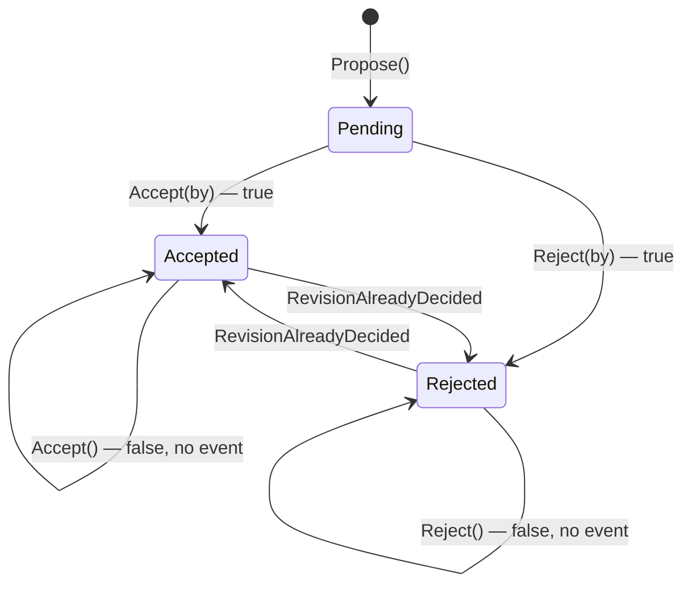

### C.4 The changes

1. **Twelve types demote to `Entity<Guid>`** (C.2.1). They lose events; **their `DbSet`s
   stay** (D13). Each root gains the creation method its members need:
   `Article.AddImage(...)`, `Order.AddItem(categoryId, tiers, …)` constructing the item
   internally (closing C.2.4), `Package.AddSlot(...)`.
2. **Twenty-six navigations become id-only** (C.2.2). The FK columns already exist, so this is
   a **no-migration** change per aggregate: delete the navigation, delete its EF configuration
   line, delete every `.Include(...)` of it, and re-point the mapper at the batched lookup the
   handler already performs (Stage 9's shapes). Reconcile each removed `Include` against Stage
   9's split-query list. Order: Commerce (fewest), then Catalogue, then Editorial.
   `[03 §9]` falls out here — the test builders' reflection hacks exist to satisfy navigations
   that no longer exist.
3. **Seven guards** (C.2.3), all in the Stage 6 shape:

   ```csharp
   /// <summary>
   /// Accepts this revision. Idempotent: a revision already accepted reports false and raises
   /// nothing; a revision already rejected cannot be flipped.
   /// </summary>
   /// <param name="decidedByUserId">The moderator, or null when auto-accepted by vote threshold.</param>
   /// <returns><c>true</c> if the revision transitioned; <c>false</c> if already accepted.</returns>
   public bool Accept(Guid? decidedByUserId)
   {
       if (Status == EnumRevisionStatus.Accepted)
       {
           return false;
       }

       if (Status == EnumRevisionStatus.Rejected)
       {
           throw new ContentRuleException(ContentRuleCodes.RevisionAlreadyDecided);
       }

       Status = EnumRevisionStatus.Accepted;
       DecidedByUserId = decidedByUserId;

       AddDomainEvent(
           new LyricsRevisionDecidedEvent(
               RevisionId: Id,
               LyricsId: LyricsId,
               ProposedByUserId: ProposedByUserId,
               Accepted: true,
               ByModerator: decidedByUserId.HasValue
           )
       );

       return true;
   }
   ```

   `AdminDecideLyricsRevisionHandler` and `AdminDecideTranslationRevisionHandler` translate the
   `false` into the existing `AlreadyDecided` problem instead of silently re-applying the text
   and re-notifying. `RevisionAlreadyDecided` and `SubmissionAlreadyDecided` join `ContentRuleCodes`
   and the catalog map (`ArtistAlreadyClaimed` already exists at `ContentRuleCodes.cs:130`).
4. **Raw setters gain rules** (C.2.5). `ReplaceLyricsText` becomes
   `bool ApplyAcceptedRevision(string text, Guid revisionId)` — guards on `Published`, no-ops
   when the text is unchanged, raises `LyricsTextRevisedEvent`. `ArticleComment.Edit` guards on
   `IsDeleted` and enforces the body rule the validator duplicates. The six bulk `Update(...)`
   methods split into the verbs the use cases actually invoke (`Retitle`, `Recategorize`,
   `ReviseBody`, `Reschedule`), which also removes the clear-to-null ambiguity.
5. **`HasLyrics` becomes derived** (C.2.6). The column, `MarkHasLyrics`/`UnmarkHasLyrics` and
   the three maintenance sites are deleted; the fact is computed at its source:

   ```csharp
   // VideoRepository — the one place the fact is computed from its source of truth.
   public Task<bool> HasPublishedLyricsAsync(Guid videoId, CancellationToken cancellationToken = default)
   {
       return context.Lyrics.AnyAsync(
           l => l.VideoId == videoId && l.Status == EnumContentStatus.Published,
           cancellationToken
       );
   }
   ```

   The feed queries project it as an `EXISTS` subquery; measure before denormalizing again.
   Column dropped in this stage's migration (generated, unapplied).
6. **Counters stop pretending** (C.2.7, D10). The five count properties become
   `{ get; private init; }` with a doc comment naming the repository method that maintains them,
   and the `private set` illusion goes. No behaviour change, no migration — this is an honesty
   fix so the next reader does not add a `Like()` method to the aggregate.
7. **Value objects for money and slug** (C.2.8). `Money` (amount + implicit USD, non-negative,
   arithmetic) replaces the four `decimal …Usd` properties; `Slug` replaces the two `string
   Slug` properties. Both are EF value converters over the existing columns — **no migration**.
   `Language` and `ReleaseYear` are left as primitives (D8).
8. **Clock injection** across the 29 sites; the ten interaction factories simply drop their
   `CreatedAt = DateTime.UtcNow` line, since the audit interceptor already stamps it.
9. **`Update()` deleted per repository** (C.2.10, D4) as its callers convert to tracked
   mutation, and the specification layer is hardened per **Part E** rather than inlined (D5).

---

## Part D — Mailer

### D.1 The model today, which is the target

Three entities, three roots, three repositories, zero navigations. Boundary map in **§1.6**.

Mailer passes every rule the kernel does not force on it, so this part records *why*, so the
shape survives the next entity added to the module.

**Clock is a parameter, everywhere.** `grep UtcNow src/Modules/Mailer/Mailer/Domain/` returns
nothing. `NewsletterSubscriberEntity.Confirm(DateTime now)`, `Unsubscribe(DateTime now)`,
`NotificationEntity.MarkRead(DateTime now)`, `OutboxEmailEntity.MarkSent(DateTime now)` and
`RegisterFailure(string error, bool isTransient, DateTime now)` all take the instant. This is
the R15 shape the other three modules adopt in 15.17.

**Guards first** — the state-changing transitions return `bool` (`Confirm`, `Unsubscribe`,
`MarkRead`); the delivery bookkeeping ones (`MarkSent`, `ReissueConfirmation`) are guarded
no-op voids. `NewsletterSubscriberEntity.cs:86`:

```csharp
public bool Confirm(DateTime now)
{
    if (Status != EnumNewsletterStatus.PendingConfirmation)
    {
        return false;
    }

    Status = EnumNewsletterStatus.Subscribed;
    ConfirmedAt = now;
    return true;
}
```

That is the template for the seven Identity guards (15.5) and the seven Content guards (15.12).

**No navigations.** `NotificationEntity.UserId` is a bare `Guid` pointing into Identity — the
cross-module case where an object reference is impossible, which is exactly why it was modelled
correctly. D1 asks Content and Identity to treat their *intra*-module boundaries with the same
discipline the module boundary already forced here.

**Raises no domain events at all.** All three are terminal aggregates: nothing reacts to a
notification being read or an email being sent. `Aggregate<Guid>` is therefore carrying only
the id and audit fields for them — after 15.1 splits `Entity<TId>` from `Aggregate<TId>`, all
three could drop to `Entity<Guid>` and stay roots via `IAggregateRoot`. Recorded as **optional**;
it removes an unused `_domainEvents` list per row and nothing else.

### D.2 The one inherited gap

`Id` is publicly settable (R5), from `Entity<T>` in the kernel. Fixed for every module at once
by 15.1. No Mailer-specific work.

---

## Part E — Content specification hardening

The owner's decision on D5, specified in full. The measured state the decision was taken
against: 137 specification classes in 21 files behind 117 `ApplySpecification` call sites;
105 classes instantiated at exactly one site, 16 at two, 3 at three, 1 at four, and **12 at
zero**; `.Or(` composition used nowhere in the repository; `IsSatisfiedBy` used by production
code exactly once repo-wide (`AuthRepository.IsUserAdmin`, Identity) and zero times in Content.
The layer briefly landed inlined (the Sep 13–14 series); this part restores it and makes it
earn its keep.

### E.0 Where a rule lives — the boundary this part enforces

| Rule kind | Home | Mechanism |
| --- | --- | --- |
| Selection / classification of rows | Specification class | `ApplySpecification` in the repository |
| The same selection re-checked on a loaded object | The same specification | `IsSatisfiedBy` in the handler |
| Lifecycle transition guard | The aggregate | Guarded entity method (15.5 / 15.12) — **never** a specification |
| Stacked filters | Composition | `.And` / `.Or` / `.Not` / `AndAll` / `OrAll` at the call site |

The 11 status checks in the Approve/Reject/Publish handlers and the three submission
`Status != Pending` guards are transition guards: 15.12 moves them **into the entities**, so
they are explicitly out of scope here — converting them to specifications would scatter
aggregate rules outward, the opposite of R9/R12.

### E.1 Restore the layer

The 21 specification files, the six `Specification`-returning query builders with their
contracts, and the spec/builder unit test files are restored from history as forward commits;
the 22 repositories re-point from the inlined predicates back to `ApplySpecification`. The
tracked-mutation change (15.18) and the exclusive-clear flush fix are preserved — the six
attach-`Update` members stay deleted from the restored repositories. The repository
integration tests added during the inlining stay: they prove predicate behaviour against real
Postgres regardless of where the predicate lives.

### E.2 The 12 unused specifications — adopt or delete, each investigated

| Specification | Verdict | Evidence |
| --- | --- | --- |
| `TagByNameSpecification` | **Fix, then adopt.** | `TagRepository.GetByNameAsync` hand-writes `t.Name.ToLower() == name.ToLower()` while the spec says `tag.Name == name` — the spec was dead because its semantics were wrong (case-sensitive). It becomes `EF.Functions.ILike(tag.Name, name)` and `GetByNameAsync` applies it. `GetByNamesAsync` stays hand-written: set-based lowered matching has no spec shape. |
| `ArtistByIdSpecification`, `ShortVideoByIdSpecification` | **Adopt.** | Both have a query-side site the base cannot serve: `ArtistRepository.GetTotalsAsync` filters the `IQueryable` so the five counts project server-side in one statement (no entity is loaded), and `ShortVideoRepository.ApplyEngagementDeltaAsync` is an `ExecuteUpdateAsync` row selector (no entity is materialised). This is the rule-5 boundary — a by-id specification is legitimate exactly where `GetById*`/`Exists*` structurally cannot reach. |
| `AlbumByIdSpecification`, `ContentTypeByIdSpecification`, `CustomerByIdSpecification`, `LyricsRevisionByIdSpecification`, `PricingTierByIdSpecification`, `PromotionLevelByIdSpecification`, `SubmissionByIdSpecification`, `TagByIdSpecification`, `TranslationByIdSpecification` | **Delete.** | Verified per entity against every queryable touch of its set: each is reached only through `RepositoryBase.GetByIdAsync`/`GetByIdOrThrowAsync`/`ExistsAsync`, which filter generically (`entity.Id.Equals(id)`, `RepositoryBase.cs:42/49/56`). None has an `ExecuteUpdate`/`ExecuteDelete` selector or an id-filtered projection. Adopting one would mean overriding the base purely to route the identical predicate through a class — ceremony shadowing the base rule, nine times over. |

### E.3 `IsSatisfiedBy` — the production adoptions

Each site below evaluates a **selection rule** on an already-loaded entity while a
specification (existing or newly named) encodes the same rule for queries — the dual-use the
method exists for. No other `IsSatisfiedBy` calls are added; usage follows need, never the
reverse.

| Specification | Replaces this hand-written check | Site |
| --- | --- | --- |
| `LyricsByStatusSpecification(Published)` | `lyrics.Status == EnumContentStatus.Published` after the by-video load | `PublicGetLyricsByVideoIdHandler.cs:43` |
| `ActiveShortVideoSpecification` | `shortVideo is null \|\| !shortVideo.IsActive` after the by-slug load | `PublicGetPublicShortBySlugHandler.cs:40` |
| `ActivePackageSpecification` | `package is null \|\| !package.IsActive` validating the ordered package | `AdminCreateOrderHandler.cs:54` |
| `PendingLyricsRevisionSpecification` *(new)* | `revision.Status == EnumRevisionStatus.Pending` gating the vote-threshold auto-accept | `PublicVoteOnLyricsRevisionHandler.cs:75` |
| `PendingTranslationRevisionSpecification` *(new)* | same gate on the translation path | `PublicVoteOnTranslationRevisionHandler.cs:72` |

Investigated and **excluded**, with reasons:

- `OrderPaidEffectsHandler.cs:120-124/:176-180/:227` — the `IsPromoted && PromotionLevelId ==
  effect… && PromotedUntil == effect…` checks compare the stamp against the *paid effect*, an
  idempotency verification; `PromotedArticleSpecification`/`PromotedVideoSpecification` encode
  a different rule (published, unexpired). Not equivalent; not adopted.
- `PublicGetVideoFeedHandler.cs:43` — filters loaded pinned categories by content-type *name*;
  no specification encodes that rule, and after 15.11 the navigation it reads is gone. Stays a
  plain in-memory filter.
- Every transition guard (E.0).

### E.4 Specifications that exist but are skipped where they should apply

`LyricsSubmissionRepository.GetPendingWithMatchingLyricsAsync` hand-writes
`submission.Status == EnumSubmissionStatus.Pending` two methods below the same file's
`ApplySpecification(new SubmissionByStatusSpecification(...))` — the query re-points through
the specification. Optional, recorded not mandated: a
`ContentItemTierByIdAndItemIdSpecification` would give the tier lookups
(`GetItemTierByIdAsync`/`OrThrowAsync`) the same two-key shape the item and slot lookups
already have.

### E.5 Composition — making `Or`/`And`/`Not` load-bearing

- **`OrAll` gets its one genuine home.** `ArtistHasContentSpecification` is already a four-way
  disjunction hidden in a single lambda. It decomposes into four named, independently
  reusable rules — `ArtistHasPublishedLyricsSpecification`,
  `ArtistHasPublishedVideosSpecification`, `ArtistHasFullLengthReleaseSpecification`,
  `ArtistHasPublishedArticleSpecification` — composed with `Specification.OrAll`. The per-row
  counts in `GetPublicDirectoryAsync`/`GetTotalsAsync` stay inline (EF cannot invoke shared
  expressions inside a projection; the existing doc comment already records this) but remain
  term-for-term aligned with the four named rules.
- **`And` stops being repeated by hand inside sibling specs.** `GossipCategorySpecification`,
  `ExclusiveCategorySpecification` and `DefaultLyricsCategorySpecification` each restate
  `&& category.IsActive`; they compose `ActiveCategorySpecification` internally instead, so
  "active" is defined once.
- **`PinnedToFeedCategorySpecification` drops its embedded optional filter.** The
  `(contentTypeId == null || …)` disjunct leaves the spec; the call site composes
  `.And(new CategoryByContentTypeSpecification(id))` when the filter is present — the same
  shape `GetActiveByContentTypeAsync` already uses.
- The existing `.And` sites (five repositories, six query builders, Identity) and the two
  `.Not()` sites stay as they are. **No artificial composition is added anywhere** — a forced
  `Or` would be the same disease as the 12 dead specs.

### E.6 Duplicates — kept now, one generic later

The per-entity by-id copies that are actually used (`Article`, `Video`, `Lyrics`, `Category`,
`ContentOrder`, `Package`, `PackageSlot`, `Playlist`, `ArticleComment`, `TranslationRevision`)
stay as they are, by owner decision. The agreed future direction — a Shared-kernel

```csharp
public class ByIdSpecification<TEntity>(Guid id) : Specification<TEntity>
    where TEntity : Entity<Guid>
```

in `Shared/Application/Specifications/` — is the target of a **separate cross-module pass**
that de-duplicates Identity's, Core's and Content's specifications together. Two-key scoped
lookups (`ArticleCommentByIdInArticle`, `PackageSlotByIdInPackage`,
`ContentOrderItemByIdAndOrderId`) are not duplicates of it: the pairing is the rule, and they
stay named. Kernel entry rule for that later pass: a primitive is promoted only when it has
three or more live duplications and needs no module-local type.

### C.4b Member `DbSet`s stay — what the first demotion found

The rollout plan's D-a called for deleting all twelve member `DbSet`s from `ContentDbContext`,
one step further than Identity, on the grounds that *"the direct reads are what produced the
god repositories."* The diagnosis is right — Content's repositories really do read member
tables directly (`Context.ArtistSocialLinks.Where(...)`, `Context.ArticleTags`,
`Context.ContentItemTiers`) and that habit is what grew them. The mechanism is wrong, and the
first slice (`ArtistSocialLinkEntity`) showed why.

**It does not enforce anything.** `Context.Set<ArtistSocialLinkEntity>()` compiles and reaches
the same table with no `DbSet` in sight; the integration tests reached for exactly that within
minutes of the property being removed. Deleting the property removes convenience, not access.

**It silently renames the table.** EF derives a table name from the `DbSet` property name, so
dropping `public DbSet<ArtistSocialLinkEntity> ArtistSocialLinks` renamed `artist_social_links`
to `artist_social_link_entity` — a destructive migration that no line of the diff mentions.
Keeping the `DbSet`, or pinning `builder.ToTable("artist_social_links")` on all twelve
configurations, are the only two ways to avoid it; the first costs nothing.

**No aggregate rule is violated by keeping it.** The DDD rule is *one repository per aggregate
root, and a member is loaded and mutated only through its root* — a `DbSet` is an ORM mapping
detail with no standing in that rule. The rule is already enforced by the compiler:
`IRepository<TEntity, TId>` is constrained to `IAggregateRoot` (D7/15.1), so a demoted member
**cannot** have a repository. Identity, the finished reference, demoted
`UserRoleEntity`/`RolePermissionEntity` to `Entity<Guid>` and kept both `DbSet`s for this
reason.

**What actually closes the direct reads** is the rest of the demotion, which this stage does
anyway: delete the repository's member methods (`GetSocialLinksAsync`, `GetSocialLinkAsync`,
`AddSocialLinkAsync`, `RemoveSocialLink`) and route every handler through the root's verbs.
Once those are gone there is no direct read left to tempt anyone, and the `DbSet` is an unused
property that keeps the table name. That is the shape the remaining eleven members follow.

### C.4c App-assigned keys must be declared, or member inserts are lost

The first member written through a root's collection did not persist, and nothing failed
loudly: EF tracked the new child as `Modified`, issued an `UPDATE` against a row that does not
exist, and surfaced a `DbUpdateConcurrencyException` ("expected to affect 1 row, actually
affected 0") from a path that was plainly an insert. The cause is that every identifier in this
codebase is assigned by the domain factory (`Guid.NewGuid()` inside `Create`), while EF's
default for a `Guid` key is store-generated — so a child arriving with its key already set
looks like an existing row being re-attached.

Nothing hit this before because no member was ever added through a root: every member was
created by a repository calling `Context.X.AddAsync(member)`, which states the intent
explicitly. The moment `AddSocialLinkAsync` becomes `artist.SetSocialLink(...)`, the intent has
to come from the model instead.

`ContentDbContext.OnModelCreating` now declares it once for every `Guid` key:

```csharp
foreach (IMutableEntityType entityType in modelBuilder.Model.GetEntityTypes())
{
    IMutableProperty? key = entityType.FindPrimaryKey()?.Properties.SingleOrDefault();

    if (key?.ClrType == typeof(Guid))
    {
        key.ValueGenerated = ValueGenerated.Never;
    }
}
```

There is no schema change — `has-pending-model-changes` reports none before and after — because
the keys never had a database default to drop. It is declared as a convention rather than a
`ValueGeneratedNever()` line per configuration so the remaining members cannot silently
regress: a missed line would not fail the build, it would drop writes.

**Gate for every remaining member:** a demotion is not done until a test adds a row *through
the root* and reads it back from a second context. Hydration-only tests pass while inserts are
being dropped.

### C.5 What 15.12 and 15.17 changed

**15.12 — the seven guards.** `LyricsRevisionEntity.Accept/Reject`,
`LyricsTranslationRevisionEntity.Accept/Reject` and `LyricsSubmissionEntity.Approve/Reject/
RequestRevision` all return `bool` in the Stage 6 shape: the same decision twice returns
`false` and raises nothing, a flip to a different outcome throws. `RevisionAlreadyDecided`
and `SubmissionAlreadyDecided` joined `ContentRuleCodes` behind a new `ReviewRuleProblems`
catalog, both mapping to 409 — the submission code reuses the existing `NotPending` phrasing
so today's HTTP contract is unchanged, while the revision code surfaces a new
`AlreadyDecided` message because a second decision previously returned 200 and silently
re-applied the text and re-notified the proposer.

The two `AdminDecide*` handlers turn `false` into that 409. `AdminRejectLyricsSubmission`
and `AdminRequestLyricsSubmissionRevision` dropped their own `Status != Pending` checks — the
transition is their first mutation, so the entity is now the only place the rule lives.
`AdminApproveLyricsSubmission` **keeps** its pre-check: it creates and commits the lyrics
record before calling `Approve`, so removing the check would let an already-approved
submission create a duplicate record before the guard fired. The two vote handlers treat
`false` as the harmless race it is and simply skip the text apply.

**15.17 — the clock.** The 17 `CreatedAt = DateTime.UtcNow` factory lines are gone; the
auditing interceptor already overwrote them unconditionally on insert, so production
behaviour is identical. Twelve lifecycle sites take the instant instead: `Publish(now)` ×3,
`ForceUnpromote(by, reason, now)` ×3, `ContentPayment.Verify(admin, receipt, now)`,
`Category.PinToFeed(now)`, `ArticleComment.SoftDelete(now)`, `Artist.ClaimOwnership(user,
now)`, `Video.AttachYoutubeVideoUrl(url, now)`, and `Artist.Create/Update(..., DateOnly
today)` for the birthdate guard. Fourteen handlers inject `TimeProvider`.

Two things the test suite exposed and that are worth keeping in mind:

- The repository **unit** tests build a bare in-memory context with no interceptor, so
  nothing stamped `CreatedAt` once the factories stopped — and the column is required. They
  now register a test-only `CreatedAtStampingInterceptor` that fills the value **only when
  unset**, standing in for the application's auditing interceptor while leaving the
  timestamps an ordering or time-window test arranges intact.
- Assertions that compared a stamp to wall-clock `UtcNow` became deterministic: they now
  assert the exact instant the caller passed. The two `OrderPaidEffects` re-stamp tests
  likewise state their ordering explicitly (`PaidAt.AddMinutes(1)` for "unpromoted after
  payment") instead of relying on real time to order the two events.

### C.6 What 15.10 changed — the twelve demotions

All twelve members are `Entity<Guid>` with `internal` factories, created and removed only
through their root's verbs: `Artist.SetSocialLink/RemoveSocialLink/FindSocialLink`,
`Category.SetPricing/RemovePricing/FindPricing`, `Package.AddSlot/RemoveSlot/FindSlot`,
`Playlist.AddVideo/RemoveVideo/ContainsVideo`, `Article.AddImage/RemoveCoverImage/
RemoveBodyImages/ReplaceArtists`, `Article/Video/Lyrics.ReplaceTags`, and
`ContentOrder.AddItem/AddTier/RemoveItem/RemoveTier/FindItem/AttachPayment/RejectPayment`.
Each follows the Identity `GrantRole` shape — business verb, `bool` for the no-op, event only
on change — and `ReplaceTags` raises one `TagGraphChangedEvent` per tag joined or left,
returning `false` on an identical set.

The two member-raised events moved to their roots: `CategoryPricing`'s upsert raises
`CategoryChangedEvent` from `Category.SetPricing`, and `PaymentRejectedEvent` moved from
`ContentPayment.Reject` (now `internal`, guards only) to `ContentOrder.RejectPayment`, which
is the only caller. `AdminRejectPaymentHandler` correspondingly loads the order, guards
`Payment is null` and calls the root verb — the `OrderPaymentFactory` lookup survives only for
the two read paths (payment proof upload, receipt email), now resolving through
`GetByIdWithItemsAsync(...).Payment` instead of a payment-set query.

Repository member methods are gone: `AddImageAsync`, `AddItemAsync`/`AddItemTierAsync`/
`AddPaymentAsync`, `GetItemById*`/`GetItemTierById*`/`GetPaymentByOrderIdAsync`,
`RemoveItem*`, `GetTagsBy*`, `GetSlotBy*`, `GetPricing*`, `GetSocialLink*` and
`VideoExistsInPlaylistAsync`. Handlers hydrate the root — every root repository now declares
its member graph once in a `Query()` override (D-b; Order and Package split the query) — and
call the verb. Dropping `AdminAddItemTierFactory`/`AdminRemoveItemTierHandler`'s
transaction + reload + recalculate dance is the visible payoff: `AddTier`/`RemoveTier`
recalculate the total in the same tracked instance, so the loaded order *is* the result.
Dependencies the rewiring left unread were removed rather than kept as ballast:
`ContentOrderRepository` no longer takes `ContentOrderErrors`, and the AddOrderItem, SubmitOrder
and VerifyPayment factories no longer take `IContentOrderRepository`.

Member by-id specifications whose only site was a deleted member method died with it
(`PackageSlotById`, `PackageSlotByIdInPackage`, `PlaylistVideoByPlaylistAndVideo`,
`ArticleImageByArticleId`, `ArticleTagByArticleId`, `VideoTagByVideoId`); their rule — "this
member, inside this root" — now lives in the root's `Find*`/`Contains*` method over the loaded
collection, which is where a rule about an already-loaded aggregate belongs (E.0).

Test-side, `_116.Tests.Fixtures` joined `_116.Unit.Tests` in `InternalsVisibleTo` so builders
and factories can still reconstitute member state directly while production code cannot; the
member builders now take the root and add through its verb, and the former member-method
repository tests assert the same facts through the root (`AddItem` persists the row,
`GetByIdOrThrowAsync` hydrates `Items`/`Tiers`/`Payment`, `RemoveTier` deletes the row) — the
C.4c gate, including one integration test that attaches a payment through a tracked root and
reads it back from a second context against Postgres.

Navigations 15.11 will delete were deliberately **kept** in this pass where a live
specification still reads them (`ArticleArtist.Article` for `ArtistHasPublishedArticle`,
`ContentPayment.Order` for the payment search, the junction `.Tag` navs, the item
`Category`/`PromotionLevel` navs): each pass makes one kind of change, and those die in 15.11
with their query-side rewrites.

### C.7 What 15.14 changed — `HasLyrics` derived

The `videos.has_lyrics` column, `MarkHasLyrics`/`UnmarkHasLyrics` and the three maintaining
handler sites are gone; the fact is computed from its source of truth in `VideoRepository`:
`HasPublishedLyricsAsync(videoId)` (an EXISTS over `LyricsByVideoIdSpecification` +
`LyricsByStatusSpecification(Published)`) and its batch companion
`GetIdsWithPublishedLyricsAsync(videoIds)`, which returns the linked subset in one query.
The semantics changed to *published* lyrics as the spec asks — the old flag was set the
moment a draft lyrics record was created, so the public API claimed lyrics nobody could see.

Every video DTO keeps its `HasLyrics` field; the four `VideoMapper` projections now take the
value as a parameter, `VideoDtoFactory` resolves it (per-video probe on the two detail paths,
one batched set for the list paths, exposed as `ResolveVideosWithLyricsAsync` for the
promotion feed's multi-list assembly), and the four handlers that map without the factory
(video feed, promotion feed, own-rated, own-shared) batch the same set themselves — one
extra query per request, never per card. The lyrics create/update handlers now validate a
supplied video id with `ExistsOrThrowAsync` instead of materializing the aggregate to flip
a flag; the delete handler no longer touches videos at all.

Migration `DropVideoHasLyrics` (generated, unapplied) drops the column and adds the partial
index `ix_lyrics_video_id_published` on `lyrics(video_id) WHERE status = 'Published'`. One
correction to this plan's premise: an unfiltered `ix_lyrics_video_id` already existed (EF's
conventional FK index), and it stays — `GetByVideoIdAsync` reads all statuses and the FK's
`SET NULL` cascade needs it — so the configuration declares both indexes explicitly.

### C.8 What 15.11 changed — navigations become ids

All four slices have landed. Each deletes the navigation, rewrites its EF configuration to
the navigation-less `HasOne<T>().WithMany().HasForeignKey(...)` form (the FK column and delete
behaviour are unchanged, so `has-pending-model-changes` stays clean), deletes every `Include` of
it, and re-points the readers.

**Commerce** — `ContentOrder.Customer`, `ContentOrder.Package`, `ContentOrderItem.Category`,
`ContentOrderItem.PromotionLevel`, `ContentItemTier.PricingTier`, and the two back-references
kept back in 15.10 (`ContentPayment.Order`, plus `ContentOrderItem.Order` and
`ContentItemTier.OrderItem`). The order's `Query()` is down to its own members
(`Items → Tiers`, `Payment`).

**Catalogue** — `Category.ContentType`, the dead `Category.PackageSlots`,
`CategoryPricing.PricingTier` and `PackageSlot.Category`. `CategoryRepository.Query()` keeps only
`Pricing`; `PackageRepository.Query()` keeps only `Slots`, and its three-level
`Slots → Category → Pricing/ContentType` chains are gone.

**The shapes the readers take.** Mapper-side reads (D-e) become pre-resolved lookups handed in by
a DTO factory, which is where the batching lives: `OrderLookups` (customers, categories,
promotion levels, pricing tiers) behind the new `IContentOrderDtoFactory`, `CategoryLookups`
(posters, content types, pricing tiers) behind the existing `ICategoryDtoFactory`, and a resolved
category map behind the new `IPackageDtoFactory` — which the package price needs anyway, since it
sums each required slot's category pricing. Five repositories gained the batch primitive
`GetByIdsAsync(ids) → IReadOnlyDictionary<Guid, T>` (Customer, Category, ContentType,
PromotionLevel, PricingTier) and `CategoryRepository.GetPricingByCategoriesAsync` is deleted:
`GetByIdsAsync` returns the categories with their `Pricing` loaded, which is what its one caller
wanted. Its three `CategoryPricing*Specification`s were left with no site and are deleted with it;
the rule now lives in `Category.FindPricing` over the loaded collection.

Query-side reads (D-d) become correlated `EXISTS` inside the specification, fed the row source by
the repository — the pattern `ArtistHasPublishedLyricsSpecification(IQueryable<LyricsEntity>)`
already set. `ContentOrderSearchSpecification(search, customers)` replaces the customer-name,
-email and -company search that used to join through `order.Customer`, and it is reached through
`Build(IQueryable<CustomerEntity>)`: **query sources arrive at `Build`, never as a constructor
argument or a filter step**, matching the four `Build(source)` builders that already exist
(`PopularArticles`, `PopularVideos`, `PopularTags`, `AllTags`). The payments listing re-roots onto
its aggregate, as the plan requires: `GetAllPaymentsAsync` becomes
`GetOrdersWithPaymentAsync`, paging orders that carry a payment behind
`OrderHasPaymentSpecification` + `OrderPaymentByStatus/ByMethod`, and the payment summary reads
the customer name and order status from the order it is now reached through.

Three reads that were not projections moved with their owners: `CommerceCustomerNotifier` resolved
`order.Customer.Email` for the invoice, receipt and rejection emails and now loads the customer by
id, exactly as its other four methods already did; its invoice item summary takes the resolved
categories; and the four `category.ContentType.Name` guards (pin-to-feed, set-exclusive, and the
two in update-category) load the content type by id before comparing. Four builder reflection
hacks died with the navigations they existed to satisfy (`ContentOrder.Customer`,
`ContentOrderItem.Category`, `ContentPayment.Order`, `Category.ContentType`,
`PackageSlot.Category`), leaving the fixtures setting ids only.

One measured behaviour change worth recording: the public video feed now makes two batched file
calls per request (one for video thumbnails, one for category posters, since the category factory
owns posters) where it previously made one combined call. Both are batched — never per card — and
the feed test asserts exactly two.

**Editorial** — the largest slice: `Category`, `Customer` and `PromotionLevel` on all three
content roots, `Lyrics.Video`, `ShortVideo.ParentVideo`, `PlaylistVideo.Video`,
`ArticleComment.Article`, the three junction `.Tag` navigations, `ArticleArtist.Article`, and the
five dead ones (`Video.Shorts`, `ArticleComment.ParentComment`, `ArticleArtist.Artist`,
`StreamingLink.Album`, `StreamingLink.Lyrics`). 57 `Include`s went with them.

The mapper-side answer here is one shared carrier rather than a factory per content type:
`ContentLookups` (categories, customers, promotion levels, tags) resolved by the new
`IContentLookupFactory` — one query per kind of row per request, never one per projected entity —
and read through named helpers (`lookups.CategoryName(id)`, `CustomerName(id?)`,
`PromotionLevelName(id?)`). The three junction `TagDto` Mapster configs, which mapped
`src.Tag.Id/Name/Slug`, become one `TagEntity → TagDto` config plus a per-root `TagDtos` helper
that reads the resolved map and drops a tag row that no longer exists. `VideoRepository` and
`TagRepository` gained `GetByIdsAsync`, and `VideoRepository` also `GetPublishedByIdsAsync`,
which is how the playlist projection now applies the published-only rule the filtered `Include`
used to carry: `PlaylistDtoFactory` resolves the entries' published videos and the mapper drops
any entry whose video is absent. `ShortVideoMapper` resolves its parent-video slug the same way,
batched once per list.

Query-side, five more rules became correlated `EXISTS` with the source injected:
`VideoByTagSlugSpecification(slug, tags)`, `LyricsSimilarByVideoCategorySpecification(categoryId,
excludeId, videos)`, `Article`/`VideoBySpotPrioritySpecification(spot, promotionLevels)`, and
`ArtistHasPublishedArticleSpecification(articleArtists, articles)` — the last one composed into
`ArtistHasContentSpecification`, which gained the same source. `VideoQueryBuilder` follows the
house rule the Commerce builders set: the tag rows arrive at `Build(tags)`, never as a filter
argument. Three reads that were not projections moved with their navigations: the comment
listing's "article is published" half, and the two artist tagged-article counters, all now
`Context.Articles.Any(...)` probes.

One trap worth recording: a blanket `Include` strip also removed three includes whose navigation
is an *interaction* back-reference and therefore still live (`ArticleBookmark.Article`,
`ArticleLike.Article`, `VideoRating.Video`). Nothing failed to compile — the navigation simply
came back null and the endpoints returned 500, caught by the integration suite. Those three were
restored and then removed properly with the Interactions slice.

**Interactions** — the last slice: the 13 back-references from an interaction row to the content
it records (`ArticleBookmark`/`Like`/`Share`.`Article`, `ArticleCommentLike.Comment`,
`Lyrics{Like,Share,ViewEvent}.Lyrics`, `ShortVideo{Like,Bookmark,Share,ViewEvent}.ShortVideo`,
`Video{Rating,Share}.Video`). Eight of them existed only to carry a "the target is still
published/active" filter, and those become the same correlated `EXISTS` the rest of the group
uses — `Context.Articles.Any(article => article.Id == like.ArticleId && article.Status ==
Published)` — written inline in the repository rather than in a specification, because the
predicate is about the *target* while the specification's subject is the interaction row.

The six listings that projected through the navigation (`GetBookmarkedArticlesAsync`,
`GetLikedArticlesAsync`, `GetShared*`, `GetLiked`/`GetBookmarkedShortVideosAsync`,
`GetRatedVideosByUserAsync`) adopt the two-step shape `GetSharedArticlesAsync` already used: page
the interaction rows down to ids and timestamps, then load that page's targets in one keyed query.
Each of the three repositories owns one private `Load*Async(ids, ct)` helper for the second step,
so the `Include` is gone without a per-row query appearing in its place, and the page is still
ordered and counted by the interaction row as before.

**Builder reflection** (verification #9) is now **zero in the Content fixtures** — the eleven
`GetProperty(...).SetValue(...)` hacks are gone, including the last two that were not navigation
related: the category pin stamp now calls `PinToFeed(now)` and the order payment now calls
`AttachPayment()`. The three remaining sites in the repository are Identity's, out of scope.

### C.9 What 15.13 changed — the six bulk `Update(...)` become verbs

Per D-f the six bulk setters are gone, replaced by the verbs the use cases actually invoke:

| Root | Verbs |
| --- | --- |
| `ArticleEntity` | `Retitle(title, slug)`, `ReviseBody(headline, body, orphanedKeys?)`, `Recategorize(categoryId)`, `AssignCommission(customerId, orderItemId, socialBoost)`, `ReviseSeo(metaTitle, metaDescription)` |
| `VideoEntity` | `Retitle`, `ReviseDescription(description)`, `Recategorize`, `AssignCommission`, `ReviseSeo` |
| `LyricsEntity` | `Retitle(songTitle, artistName, slug)`, `ReviseText(lyricsText, language)`, `Recategorize`, `Relink(videoId)`, `AssignCommission(customerId, orderItemId)`, `ReviseSeo(metaTitle, metaDescription, structuredData)` |
| `CategoryEntity` | `Rename(name, slug)`, `Redescribe(description)`, `Reclassify(isGossip, isExclusive, isDefaultForLyrics)` |
| `ArtistEntity` | `Rename(name)`, `ReviseProfile(bio, realName, aliases, birthdate, hometown, today)` |
| `AlbumEntity` | `Rename(name)`, `SetCoverImage(coverImageFileId)`, `ReviseRelease(releaseYear, label, releaseType)` |

Every verb returns `bool` and writes nothing when the incoming values match the current ones,
the shape `ReplaceTags` and Identity's `Revoke` already set. Where the bulk method carried the
editability gate — Article and Video — each verb still calls
`ContentPublicationState.EnsureEditable` and calls it **before** the no-op check, so a published
root refuses an edit exactly as it did when one call did everything; a no-op check placed first
would have let a same-valued edit through on content that is no longer editable. The three
`UpdateSeo` methods are renamed `ReviseSeo` and stay deliberately ungated: SEO metadata has its
own use case and is maintained after publication.

Two roots raise a change notice, and a handler now calls two or three verbs where it called one,
so the notice is deduplicated inside the aggregate: private `MarkChanged()` on `CategoryEntity`
and `MarkArtistChanged()` on `AlbumEntity` (and the same guard on `ArtistEntity`) add the event
only when no event of that type is already pending. One admin edit therefore still produces one
`CategoryChangedEvent` / `ArtistChangedEvent`, and the cache handler is invalidated once.

Two ambiguities die with the bulk signatures. `AdminUpdateAlbumHandler` had to re-pass
`album.CoverImageFileId` into `Update` so the edit would not null it, and
`AdminUploadAlbumCoverHandler` had to re-pass the name, year, label and release type to set only
the cover; both now call the one verb they mean (`ReviseRelease`, `SetCoverImage`). The Lyrics
verbs also split `ValidateRequiredFields`: `Retitle` guards the song title, artist name and slug,
`ReviseText` guards the text, and each guard now fires on the edit that can actually violate it.

### C.10 What 15.15 changed — the counters are read-only in memory

The fifteen denormalized counters — `Article` (like, comment, share, bookmark),
`ArticleComment.LikeCount`, `Lyrics` (view, like, share), `Video` (rating average, rating count,
share) and `ShortVideo` (view, like, share, bookmark) — are `{ get; private init; }`, and each
one's doc line now names the repository method that maintains it
(`ApplyEngagementDeltaAsync`, `ApplyCommentLikeDeltaAsync`, `SetRatingAsync`). Nothing in `src/`
had to change: every maintainer already wrote set-based through `ExecuteUpdateAsync`, whose
`SetProperty` takes a *getter* expression and never touches a CLR setter, and EF materializes
through the init accessor.

`VideoEntity.UpdateRating(average, count)` is deleted. It was the one in-memory mutator left on a
counter and had no production caller — every one of its six call sites was a test arranging a
rating. Those go through `EngagementCounterExtensions.WithRating(average, count)`, beside the
`WithShareCount`/`WithLikeCount` helpers the same tests already used, so counter arrangement has
one home and one reflection primitive rather than a second one inside `VideoBuilder`. The domain
unit test that only proved `UpdateRating` assigned its two arguments is deleted with it;
`SetRatingAsync` is covered for real in `EngagementCounterTests`.

One deviation from the plan, recorded deliberately: the popular-videos integration test seeds its
rating with `WithRating` rather than `SetRatingAsync`. Its seed block already arranges the share
count with `WithShareCount` inside the same `SeedAsync` callback, and the test's subject is the
ordering query, not rating maintenance — splitting the seed across a save and a second repository
round-trip would have bought nothing.

### C.11 What 15.16 changed — `Money` and `Slug`

Per D-g both concepts are converted whole, not partly: all **seven** slug properties
(`Article`, `Lyrics`, `Video`, `ShortVideo`, `Artist`, `Category`, `Tag`) and all **six** money
properties (`ContentOrder.TotalAmountUsd`, `ContentItemTier.PriceSnapshotUsd`,
`ContentOrderItem.PromoPriceSnapshotUsd`, `ContentPayment.AmountUsd`,
`CategoryPricing.PriceUsd`, `PromotionLevel.PriceUsd`). Both are records in
`Content/Domain/ValueObjects/` shaped exactly like `Identity/Domain/ValueObjects/Email.cs`:
a validating constructor, a non-throwing `TryFrom`, and implicit operators both ways.
`Slug` validates format only — the `^[a-z0-9]+(?:-[a-z0-9]+)*$` rule that was duplicated across
three validators — and per-entity maximum lengths stay in the validators and the EF
configurations. `Money` guards non-negativity and carries `Zero`, `+`, `* int` and `Sum`.

Two new rule codes, `content.slug.invalid` and `content.money.negative-amount`, arrive with the
full machinery the module requires: a `ValueObjectRuleProblems` catalog registered in
`DomainRuleExceptionStrategy`, a `ValueObjectErrorMessage` facade, and neutral/en/fr resx — the
completeness guard and the localization catalogue count both assert this.

Each property is converted inline in its own configuration —
`.HasConversion(slug => slug.Value, value => new Slug(value))` — with no converter classes, since
the repository has none. The column types are unchanged and
`has-pending-model-changes` reports none, so there is no migration.

**The `ILike` pre-flight the plan required came back clean.** `TagEntity.Slug` was converted
first and the tag search and by-slug queries were run against Postgres before the other six:
`EF.Functions.ILike(tag.Slug, pattern)` and `tag.Slug == slug` both translate, because the
converter stores the bare string and EF applies the conversion on the parameter side. The
`EF.Property<string>(t, "Slug")` escape hatch was not needed anywhere.

The fallout was almost entirely in assertions — about 70 sites comparing an entity's `Slug` or
money property to a raw `string`/`decimal` now read `.Value` / `.Amount`. Three production reads
needed the same treatment, all of them nullable: `PublicGetVideoBySlugHandler` and
`PublicGetLyricsBySlugHandler` resolve an optional linked slug (`artist?.Slug.Value`), and the
order-item projection reads `PromoPriceSnapshotUsd?.Amount` — the implicit operator dereferences,
so a lifted `Money? → decimal?` has to be written explicitly, including in the Mapster config.

Coverage follows the standing rules: the constructor guards are unit-tested in `SlugTests` and
`MoneyTests` (malformed slugs, negative amounts, `TryFrom`, the operators and equality), and the
converters round-trip through DI repositories in `ValueObjectConversionTests` — a slug written
and read back, a slug still matched by string equality in the database, a `numeric(10,2)` amount
keeping its cents, and a nullable money column coming back null rather than zero.

### E.8 Module-wide predicate audit — the remaining adoption gaps

Every predicate site in the 26 Content repositories and the two infrastructure query builders
was classified line by line, across all predicate-carrying operators (`Where`,
`FirstOrDefaultAsync`, `AnyAsync`, `CountAsync`, `Count`, correlated `Any`, filtered `Include`,
query-syntax `join`, `ExecuteUpdateAsync`, `ExecuteDeleteAsync`, and predicates embedded in
projections). Eight rules had no specification and earned one:

| Specification | Adopted at | Rule |
| --- | --- | --- |
| `ArtistByInitialLetterSpecification` | `ArtistRepository.GetPublicDirectoryAsync` | Directory letter bucket. |
| `ArtistByFoldedNameSpecification` | `ArtistRepository.GetPublicDirectoryAsync` | Directory search over the pre-folded column. A distinct rule from `ArtistSearchSpecification` (ILIKE over raw Name/Bio): the folding happens in the constructor closure, so the expression tree stays a plain translatable `LIKE`. |
| `LyricsCountedViewSinceSpecification`, `ShortVideoCountedViewSinceSpecification` | `HasCountedViewSinceAsync` in each repository | The view-count deduplication window, previously the same four-term predicate hand-written in both files with nothing naming it. |
| `UncountedShortVideoViewBeforeSpecification` | `ShortVideoRepository.PruneUncountedViewEventsAsync` | The retention sweep's row selector, feeding `ExecuteDeleteAsync`. |
| `ContentOrderByItemIdSpecification` | `ContentOrderRepository.GetOrderByItemIdAsync` | The order owning an item, through the kept `Items` member collection. |
| `LyricsLikeByUserIdSpecification`, `ArticleCommentLikeByUserIdSpecification` | `LyricsRepository.GetLikedIdsAsync`, `ArticleCommentRepository.GetLikedCommentIdsAsync` | The last two interaction id-set reads still inlining the user half; they now follow the `XByUserIdSpecification` + `.Where(ids.Contains(...))` shape already used for article and short-video interactions. |

Two verdicts went the other way, and both matter more than the additions:

- **The soft-delete rule is a global query filter, not a specification.**
  `ContentDbContext.OnModelCreating` declares
  `modelBuilder.Entity<ArticleCommentEntity>().HasQueryFilter(comment => !comment.IsDeleted)`,
  which EF applies to every query over the set unless it calls `IgnoreQueryFilters` — only the
  threaded listing does, deliberately, to render tombstones. Four inline `!IsDeleted`
  restatements in `ArticleCommentRepository` were therefore redundant and are deleted: a
  hand-copy of a global filter is a rule with two homes that can silently disagree. New
  repository integration tests seed a soft-deleted comment and assert the reply counts, the
  own-comments listing and the commented-articles feed all exclude it, which is what proves the
  removal rather than asserting it.
- **Five repositories were violating the base by-id rule already.** `VideoRepository`,
  `ArticleRepository`, `CategoryRepository` and `LyricsRepository` each overrode
  `GetByIdAsync` **and** `GetByIdOrThrowAsync` only to re-apply `entity.Id == id` through a
  module specification and to repeat the same `Include` chain twice per file. `RepositoryBase`
  already owns that predicate and its own documentation places the hydration graph in a
  `Query()` override; the four now declare their graph once there and inherit both finders,
  which is behaviour-identical (same includes, same `AsSplitQuery` for articles, untracked
  `GetByIdAsync` / tracked `GetByIdOrThrowAsync` as before) and deletes eight overrides.
  `CategoryByIdSpecification` had no other site and is deleted with them; `VideoById`,
  `LyricsById` and `ArticleById` keep their `ExecuteUpdate` row-selector sites.
  `PlaylistRepository.GetByIdAsync` is **kept**: its override exists to force tracking, which
  the untracked base finder cannot express, so removing it would silently drop mutations.

Everything else is correctly placed: rules reading a navigation 15.11 deletes become
IQueryable-injected specifications in that pass rather than nav-reading ones now; predicates on
member sets 15.10 removes die with their methods; counts inside a `Select` stay inline because
EF Core cannot invoke a shared expression in a projection; and id-set membership, keyset cursor
arithmetic, self-exclusion, ordering and in-memory LINQ are plumbing with no rule to name.

### E.7 Tests and verification for this part

- The restored spec unit tests come back minus the deleted classes'; the two new pending
  specs and the four artist sub-rules get predicate tests; every `IsSatisfiedBy` adoption is
  covered by the existing endpoint tests it sits under (no response change is expected).
- Verification greps, replacing the retired item 6:
  1. Every specification class in Content has at least one production instantiation —
     enumerate classes, grep `new <Name>(`, zero orphans.
  2. `grep -rn "IsSatisfiedBy" src/Modules/Content` → the five adoption sites.
  3. `grep -rn "\.OrAll\|\.Or(" src/Modules/Content` → the artist composition, nothing else.
  4. `TagRepository.GetByNameAsync` applies `TagByNameSpecification`; the case-insensitivity
     integration test still passes.
  5. Build 0/0, CSharpier clean, unit and integration suites green.

### C.12 What 15.20 and 15.21 verified — the closing run

Every check in the Verification section was run against the finished branch. What it found:

| # | Check | Result |
| --- | --- | --- |
| 1 | Build, format, suites | `dotnet build` 0 errors / 0 warnings; `csharpier check` clean on 3,964 files; 8,378 unit, 2,120 integration, 6 architecture — all green |
| 2 | Roots and members | 37 `Aggregate<Guid>` and 12 `Entity<Guid>` in Content — exactly the target, down from 49/0 |
| 3 | Entity-typed navigations in Content `Domain/` | The 11 kept root→member ones and nothing else (10 collections plus `ContentOrder.Payment`) |
| 4 | `UtcNow` in any `Domain/` | Zero across all modules |
| 5 | `MarkHasLyrics`/`UnmarkHasLyrics` | Zero |
| 6 | Part E.7 specification checks | 134 specification classes, **zero orphans** after deleting `PackageByIdSpecification`; `IsSatisfiedBy` at exactly the five adoption sites; `OrAll` only at the artist composition |
| 7 | `SaveChangesAsync` in repositories | The three expected Identity files (`AccountLockoutRepository`, `UserTokenStateRepository`, `AuthRepository`); zero in Content |
| 8 | `IRepository<T>` closes over `IAggregateRoot` | Compiler-enforced; the build is the check |
| 9 | Builder reflection | Zero in the Content fixtures; Identity's 12 sites across 5 builders remain and are out of scope |
| 10 | Root counts | Identity 8, Core 1, Content 37 + 12, Mailer 3 |
| 11 | Mailer regression | `git diff` against Mailer is empty |
| 12 | Core claim protocol | Only historical migration files still contain the word; the live Core code names it nowhere |
| 13 | Migrations | `has-pending-model-changes` reports none, and `DropVideoHasLyrics` is the only new migration in Part C |

Two things the closing run turned up rather than confirmed. The orphan sweep needs its filter
written carefully: eight classes look unused because their only instantiation is *inside their
own specifications file* — the four artist sub-rules composed through `OrAll` and the four
private `Marked*` category rules composed with `ActiveCategorySpecification`. Those are the E.5
composition working as intended. The ninth, `PackageByIdSpecification`, was a real orphan with no
reference anywhere including tests, base-covered by `RepositoryBase.GetById*`, and is deleted
under E.2.

Check 3 is clean for Content but **not for Identity**, which still carries six entity-typed
navigations: `Otp.User`, `Session.User`, `UserRole.User`, `UserRole.Role`,
`RolePermission.Role` and `RolePermission.Permission`. Part A is shipped and Part C does not
reopen it, so this is recorded as a finding for a later pass, not fixed here.

**15.20 — D2 and D6.** D2 stands as decided-against and is recorded as such. D6 is verified
rather than acted on: 75 Content files inject `IMapper`, and a clean `--no-incremental` build
reports zero CS9113 (unread primary-constructor parameter) warnings, so none of them is unused.
The 0-warning gate is read from build output, which is how this is enforced going forward.

**Counts the spec undercounted.** Where the spec says 26 cross-aggregate navigations, 4 money
properties and 2 slug properties, the tree had **52**, **6** and **7** respectively, and Part C
converted all of them.

---

## Decisions

| # | Question | Options weighed | Decision |
| --- | --- | --- | --- |
| D1 | Cross-aggregate navigations | keep object references, or IDs at the boundary | **IDs at the boundary, navigations within.** The FK columns already exist, so **no migration**: the change is deleting the navigation, its `Include`, and re-pointing the mapper at a repository lookup the handler already batches. Done per aggregate, Commerce first (fewest navigations), Editorial last. |
| D2 | Strongly-typed IDs | wrap the 105 Guids, or reject with reasons | **Reject, recorded here.** The cost (every signature, EF converter, DTO, test builder — thousands of lines) buys compile-time protection against cross-assigning ids, but the top sources of that bug class — cross-aggregate navs (D1) and check-then-act guards (Stage 6) — are closed by cheaper means. Revisit only if an id-swap bug actually ships. `[03 §8]` closes as *decided-against*. |
| D3 | Review guards | ad-hoc ifs, or the Stage 6 pattern | **Stage 6's pattern:** idempotent transitions return `bool`, invalid transitions throw coded rule exceptions, events raised only on actual transition. |
| D4 | `Update()` semantics | keep attach-Update everywhere, or tracked mutation | **Tracked mutation on load-then-mutate paths.** Post-Stage 9 the write paths are explicitly `AsTracking`; a loaded entity's `SaveChanges` diffs columns. `Update()` (attach) remains only where the entity genuinely arrives detached — after this stage that is nowhere in Content, and the method is deleted per repository as its callers convert. |
| D5 | Specifications | make them carry include/sort/page, retire the layer, or harden it | **Harden — owner decision, overriding the earlier "retire".** The retirement measured the layer as ceremony (105/137 single-use, 12 dead, zero `Or`, one `IsSatisfiedBy` production use repo-wide) and briefly landed; the owner overruled: the layer stays and is made genuinely load-bearing instead. Unused specs are removed only after checking whether a hand-written predicate should have adopted them; `IsSatisfiedBy` and `And`/`Or`/`Not` are wired in wherever a real dual-use or composition exists — and nowhere else. Duplicated per-entity specs are kept for now; the cross-module de-dup into a Shared `ByIdSpecification<TEntity>` is a later, all-modules pass. Full design in **Part E**. |
| D6 | `[06 §16]` unused `IMapper` | sweep now | **Verify first — likely already closed.** Stage 7's CS9113 cleanup removed unread primary-ctor params and the build holds at 0 warnings, which would flag an injected-never-read `mapper`. Re-census at finalization; sweep only what remains. |
| D7 | How to make R1 enforceable | convention + review, or a type-level marker | **`IAggregateRoot` marker in the kernel**, with `IRepository` constrained to it. Convention is what produced 49/49 roots; a constraint makes the mistake a compile error. Costs one interface and one `where` clause. |
| D8 | Which primitives become value objects | wrap everything with a rule, or only where the rule is violable | **The 15.4 trio plus `Money` and `Slug`.** `Email` closes a real hole (seeders and social login bypass every FluentValidation rule); `OtpPurpose` and `Client` were converted with it at 15.4 so the OTP and Session aggregates carry self-validating types rather than raw enums, resolving this decision's earlier conflict with the 15.4 checklist line in the checklist's favor. `Language`, `ReleaseYear` and the remaining enum-wrapping VOs (`SessionStatus`, `ExportFormat`, `AuthProvider`) stay primitives and their VOs stay edge parsers. |
| D13 | Member `DbSet`s after demotion | delete all twelve (plan D-a), or keep them as Identity did | **Keep them.** Deleting a member's `DbSet` enforces nothing — `Context.Set<T>()` reaches the same table — while EF derives table names from the `DbSet` property, so removing it silently renames the table (`artist_social_links` → `artist_social_link_entity`, caught by `has-pending-model-changes` on the first slice). No aggregate rule is at stake: a `DbSet` is an ORM mapping detail, and "a member has no repository" is already a compile error via `IRepository`'s `IAggregateRoot` constraint (D7). The direct reads D-a wanted gone are closed by deleting the repository's member methods and routing handlers through the root's verbs, which the demotion does regardless. Reverses plan D-a; see C.4b. |
| D9 | `StreamingLinkEntity`'s parent | child of Album, child of Lyrics, or its own root | **Its own root.** The schema decides it: `ck_streaming_links_exactly_one_target` enforces `album_id XOR lyrics_id`, so half the rows (a standalone single's links) have no album at all and *cannot* be members of the Album aggregate — a link cannot be a member of two different aggregate types. It already has its own repository upserting by (owner, platform) under two unique indexes. It stays a single-entity root; the XOR stays in the factory + check constraint. |
| D10 | Engagement counters on the aggregate | move them back inside, or admit they are outside | **Admit they are outside.** Stage 8 moved them to atomic SQL for a real reason — a read-modify-write through the aggregate loses increments. Reverting that to satisfy R14 would reintroduce a concurrency bug to satisfy a diagram. The fix is to stop the aggregate claiming them: `private init` plus a doc comment naming the maintaining repository method. |
| D12 | An upload and the row referencing it are written by two modules | keep the claim-and-reap repair, or make the two writes atomic | **Make them atomic.** All four module contexts now resolve one scoped `DbConnection`, so `ExecuteInTransactionAsync` enlists every other context via `UseTransactionAsync` and commits once. The file row and its reference cannot disagree, which removes the window the claim protocol existed to repair — so `Claim`, `ClaimAsync`, `GetUnclaimedBeforeAsync` and `UnclaimedFileReaperJob` are deleted, not fixed. The cost is `AddDbContextPool` becoming `AddDbContext`: contexts are no longer pooled, because a pooled context cannot be handed a connection from the scope. `CrossContextTransactionTests` proves both directions against real Postgres. |
| D11 | `UserEntity` login counters | leave them, or move to a sibling aggregate | **Move to `UserLoginStateEntity`.** Same argument as D10, opposite conclusion: here the sibling aggregate already exists as a pattern (`UserOtpStateEntity`), so the honest model is reachable at the cost of one table and two dropped columns. |
| D13 | Distinguishing an uploaded-but-unrecorded file from a persisted one | a dedicated DTO the upload returns, or a fact already on the entity | **A fact on the entity.** A parallel `UploadedAsset` record made the state a compile-time type, but mirrored `FileEntity` field for field — every new column would mean editing the entity, the record and the mapping. `CreatedAt` is null until `AuditableEntityInterceptor` stamps it on first save, so `IsRecorded` already expresses it for free, and it also catches an entity loaded in another scope, which the record could not. The cost is that the check moves from compile time to a guard at the top of `RecordAsync`. |
| D14 | The remaining declarative raisers (`RecordMassSignOut`, `Role`/`PermissionEntity.MarkHardDeleted`) | delete them, or admit them | **Admit them, documented.** Unlike 15.2's join rows, there is no other root to move these facts to: a hard delete destroys the aggregate itself, leaving no state to transition, and a mass sign-out's real mutations are N session revocations that already raise per-session events — the account-level fact exists so consumers get one notification instead of N. Each raiser's doc comment states this. |

---

## Checklist

- [x] 15.1 — Kernel: `IAggregateRoot`, `Entity<T>` without events, `Id` init-only, `AddDomainEvent` protected, `OccurredOn` from the interceptor
- [x] 15.2 — Identity: `UserRole`/`RolePermission` demote to members; their two repositories and
  four specifications are deleted; the six admin handlers and the bootstrap paths re-route
  through grant/revoke verbs on the roots
- [x] 15.3 — Identity: `UserLoginStateEntity`; drop `FailedLoginAttempts`/`LockedUntil` from `UserEntity` (D11)
- [x] 15.4 — Identity: `Email`/`OtpPurpose`/`Client` value objects reach the entities via converters (D8)
- [x] 15.5 — Identity: six transition guards; `UserActivatedEvent`/`UserDeactivatedEvent` with the
  admin activate/deactivate-user use cases that raise them; the remaining declarative raisers
  are kept by decision (D14)
- [x] 15.6 — Identity: OTP verification policy moves out of `OtpRepository` into `OtpEntity.Verify`
- [x] 15.7 — Core: `IFileRepository` splits from `IFileUploadService`; `UpdateAvatarUrlFromSourceAsync` moves to Identity
- [x] 15.8 — Core: `EnumFileState` replaces the flag trio; clock injected
- [x] 15.8b — Core: upload and reference become one transaction; the claim protocol and its reaper are deleted (D12)
- [x] 15.9 — Content: navigation census commit (the 64, classified within/across)
- [x] 15.10 — Content: twelve members demote to `Entity<Guid>`; roots gain their member factories
- [x] 15.11 — Content: cross-aggregate navs → id-only, Commerce → Catalogue → Editorial → Interactions
- [x] 15.12 — Content: seven review-workflow guards `[03 §7]`
- [x] 15.13 — Content: raw setters gain rules; the six bulk `Update(...)` split into verbs
- [x] 15.14 — Content: `HasLyrics` derived; the three maintaining handlers stop writing it `[03 §11]`
- [x] 15.15 — Content: counters demote to `private init` with their maintaining method named (D10)
- [x] 15.16 — Content: `Money` and `Slug` value objects via converters (all 6 money, all 7 slug props — D-g)
- [x] 15.17 — All modules: `DateTime.UtcNow` out of `Domain/` (Identity, Core and Content all at zero)
- [x] 15.18 — Load-then-mutate paths drop `Update()`; attach-Update deleted per repository `[04 §3]` (**Identity's `OtpRepository` site done**)
- [x] 15.19 — Content specification hardening per **Part E** (supersedes the inlining that
  briefly landed): restore the layer; delete the 11 base-covered by-id orphans; fix and adopt
  `TagByNameSpecification`; wire the five `IsSatisfiedBy` adoptions; re-point
  `GetPendingWithMatchingLyricsAsync` through `SubmissionByStatusSpecification`; decompose
  `ArtistHasContentSpecification` via `OrAll`; compose `ActiveCategorySpecification` into the
  three category-singleton specs; move `PinnedToFeed`'s optional filter to call-site `.And`
- [x] 15.20 — D2/D6 verified and recorded (D2 decided-against; D6 clean — 0 CS9113 on a clean build)
- [x] 15.21 — Verify (build 0/0, csharpier, unit, integration; builder reflection hacks gone `[03 §9]`)

---

## Tests

- **Unit — every new guard transition.** Accept-after-accept returns `false`, accept-after-reject
  throws the coded error, and `DomainEvents.Count` is asserted after a double call so a
  re-raise fails the test. Same shape for the seven in Identity and the seven in Content.
- **Unit — value objects.** The existing `EmailTests` etc. stay; add the converter round-trip
  (entity → column → entity) as an integration repository test, since a converter is
  infrastructure.
- **Unit — member creation.** `Order.AddItem(...)` on a submitted order throws; the created
  item's `OrderId` matches the root. `AssignRole(UserRoleEntity)` no longer compiles.
- **Integration — the re-notify regression `[03 §7]`.** Decide a revision twice over HTTP: the
  second call 409s and **no second notification row or outbox email** exists. This fails today
  and is the proof for C.2.3.
- **Integration — the column-clobber regression `[04 §3]`.** Load an article on the tracked
  path, change only the title, commit; assert via SQL logging that `body` was not in the
  `UPDATE`. Fails before D4's change.
- **Integration — derived `HasLyrics`.** `HasPublishedLyricsAsync` against draft, published and
  deleted lyrics, driven through `IVideoRepository` from DI.
- **Integration — cross-context atomicity.** `CrossContextTransactionTests` writes a `core.files`
  row and a `content.tags` row in one `ExecuteInTransactionAsync` and asserts both are persisted;
  a second test throws inside the operation and asserts neither is. Without the shared scoped
  `DbConnection` the first test fails outright, so it is the proof for D12.
- **Unit — the upload halves are separable.** `UploadImageAsync` writes nothing to the database
  and tracks no entity; `RecordAsync` leaves the new row `Added` and the superseded row
  `Replaced`, both uncommitted until the caller's transaction commits.
- **The existing suites are the no-op proof for D1**: removing navigations must not change any
  response body. Any assertion that moves is a bug in the mapper re-point, not a test to update.

---

## Rollout

Four schema changes, all generated and left unapplied per house rule:

| Migration | Module | Change |
| --- | --- | --- |
| `AddUserLoginState` | Identity | Create `user_login_state` (singular, matching its siblings); backfill non-zero counters; drop `users.failed_login_attempts`, `users.locked_until` |
| `AddFileState` | Core | Add `files.state`; backfill from `is_deleted`/`claimed_at` |
| `CollapseFileStates` | Core | Fold `Claimed` into `Stored`; drop `files.claimed_at`; rebuild the unique `file_name` index on `state` |
| `DropVideoHasLyrics` | Content | Drop `videos.has_lyrics` |

`AddFileState` drops `is_deleted`, which silently takes `ix_files_file_name` and
`ix_files_created_at` with it — a partial index cannot outlive a column in its predicate.
`CollapseFileStates` rebuilds the unique one on `state`; the `created_at` one went with the
reaper it served. Both directions were applied to a scratch database seeded with a row in each
legacy state before either was committed.

Everything else — the value objects, the navigation removals, the demotions, the guards — is
converter-level or code-level and touches no column.

The stage lands module by module in checklist order. 15.1 is the only step every other step
depends on; after it, Identity (15.2–15.6), Core (15.7–15.8) and Content (15.9–15.16) are
independently shippable and independently revertible. Content's 15.11 lands aggregate by
aggregate — Commerce, Catalogue, Editorial — each its own PR.

---

## Verification

1. Build/format/unit/integration green, 0 warnings.
2. `grep -rn "class .*Entity : Aggregate<" src/Modules/Content` → 37, not 49.
3. Cross-aggregate entity-typed navigations in Content `Domain/` → 0; in Identity → 0.
4. `grep -rn "Date\(Time\|TimeOffset\)\.UtcNow" src/Modules/*/*/Domain/` → empty.
5. `grep -rn "MarkHasLyrics\|UnmarkHasLyrics" src/` → empty.
6. The Part E.7 specification checks: zero orphan specification classes; `IsSatisfiedBy`
   present at exactly the five adoption sites; `OrAll` present at the artist composition;
   `TagByNameSpecification` applied by `TagRepository.GetByNameAsync`.
7. `grep -rln "SaveChangesAsync" src/Modules/*/*/Infrastructure/Repositories/` → shrinks from
   five files to two. `OtpRepository`'s commit moves to the handler (15.6) and
   `FileRepository`'s commit sites disappear into the caller's transaction (15.7/15.8b);
   `AccountLockoutRepository` and `UserTokenStateRepository` keep theirs **by design** — they
   are the atomic-counter aggregates whose write must survive the surrounding failure (D10/D11)
   — and `AuthRepository` is re-audited at 15.6 with the same test.
8. Every `IRepository<T, TId>` closes over a type implementing `IAggregateRoot` — enforced by
   the compiler after 15.1, so this is a build check, not a grep.
9. Builder reflection: `grep -rn "GetProperty\|SetValue" tests/Fixtures/Builders` → only the
   engagement-counter arrangement helper remains.
10. Root counts match §1.3–§1.6: Identity 5 roots + 3 siblings, Core 1, Content 37 roots + 12
    members = 49, Mailer 3.
11. **Mailer regression:** it enters this stage passing every rule (§0.2) and must leave it the
    same way. Its only change is the kernel `Id` fix, so any Mailer diff beyond that is drift.
12. `grep -rn "Claim\|Unclaimed\|reaper" src/Modules/Core` → empty. The protocol is gone, not
    disabled, and nothing in Core still names it.

---

**PR series:** `refactor(domain): aggregate roots, value objects, guarded transitions` —
one PR per checklist group, in module order.
