# Stage 15 — Domain model hardening

Closes **[03 §2]** (High), **[03 §7]** (High), **[03 §8]**, **[03 §9]**, **[03 §10]**,
**[03 §11]**, **[03 §12]**, **[03 §13]**, **[04 §3]**, **[04 §11]**, **[04 §12]** / **[06 §14]**,
**[06 §16]**. The findings behind "everything is an aggregate root, no structure" that the
restructure stage does not own — the *semantic* model, fixed before the files move.

This stage states the DDD rules the codebase claims to follow, measures the tree against each
one, and specifies the target model per module. Module order is **Identity → Core → Content**:
Identity is the smallest real aggregate graph and sets the house shape, Core is a single
aggregate whose problem is entirely in its repository, and Content is where the shape has to
scale to 49 types.

> Draft — finalized against the tree Stage 14 lands on. Deliberately **before** Stage 18's
> restructure: semantic changes hide badly inside a whole-repo file move.

---

## Part 0 — The rules

### 0.1 The rule catalogue

Sixteen rules. Each is stated as the house rule, with the mechanical check used to measure it.
Everything in Parts A–C is a citation against one of these.

| # | Rule | Mechanical check |
| --- | --- | --- |
| **R1** | **The aggregate root is the only entry point.** A member entity has no repository, is never loaded or saved independently, and is reached only by navigating from its root. | Every `Aggregate<T>` subtype has a repository and appears in a `DbSet`. Member entities must be `Entity<T>` with no repository. |
| **R2** | **One transaction changes one aggregate.** Consistency between aggregates is eventual, carried by domain events. | No handler mutates two roots and commits once, except where the second root is a same-module invariant explicitly recorded here. |
| **R3** | **Aggregates reference each other by identity.** Object navigations exist only *within* an aggregate. | Zero entity-typed navigation properties crossing an aggregate boundary. |
| **R4** | **The aggregate is a consistency boundary.** Any invariant that must hold at commit time lives inside one aggregate; anything outside it is not an invariant, it is a policy. | No property on a root is mutated by something other than that root. |
| **R5** | **Identity is immutable.** An entity is equal by id, and the id is assigned once at construction. | `Id` has no public setter. |
| **R6** | **Value objects for concepts with rules.** Immutable, compared by value, self-validating, no identity. A concept with a validation rule is a value object, not a `string`. | A value object that exists is used by the *entity*, not only at the application boundary. |
| **R7** | **Behaviour, not data.** State changes only through intention-revealing methods. No public setters, no bulk `Update(...)` that re-supplies every field. | No `public set` on domain state; no method named `Update` taking more than the fields one use case changes. |
| **R8** | **Constructed valid.** A factory never returns an invalid aggregate; the root creates its own members. | Factories validate; no root method accepts an already-constructed member entity. |
| **R9** | **Transitions are explicit and guarded.** An illegal transition raises a coded domain error; a repeated legal transition is an idempotent no-op returning `false`. | Every status mutator has a guard; the house shape is `bool` returning. |
| **R10** | **Events follow real state change.** The aggregate that owns the fact raises it, only when the state actually moved, carrying everything a consumer needs. | No `AddDomainEvent` reachable without a state change on the same object. |
| **R11** | **The domain is persistence-ignorant.** No EF, SQL, DTO, HTTP or configuration types under `Domain/`. | `Domain/` has no `Microsoft.EntityFrameworkCore` using. Currently **passing** in all four modules. |
| **R12** | **Domain logic lives in the domain.** Repositories persist, handlers orchestrate; neither decides. | No business rule, no `throw` of a rule error, and no `SaveChanges` inside a repository. |
| **R13** | **A repository is a collection of one aggregate root.** Not a query service, not an IO gateway. | One repository per root; no method performing network IO or returning another aggregate's data. |
| **R14** | **One fact, one source of truth.** Derived state is computed, not stored and hand-maintained. | No column whose value is written by more than one call site. |
| **R15** | **The domain is deterministic.** No ambient clock, randomness, or current-user read inside an entity — they are parameters. | `grep DateTime.UtcNow src/Modules/*/*/Domain/` is empty. |
| **R16** | **Ubiquitous language.** Types and methods carry the business word, not the CRUD word. | No `Update`/`Set`/`Mark` where the business has a verb (`Publish`, `Revoke`, `Commission`). |

### 0.2 Compliance as measured in the current tree

| Rule | Shared kernel | Identity | Core | Content | Mailer |
| --- | --- | --- | --- | --- | --- |
| R1 root-only entry | ✗ no root marker | ✗ 9/9 roots, ~4 real | ✓ 1/1 | ✗ 49/49 roots, 37 real | ✓ 3/3 |
| R2 one txn one aggregate | n/a | ✗ | ✓ | ✗ | ✓ |
| R3 reference by id | n/a | ✗ 11 navigations | ✓ none | ✗ 64 navigations | ✓ none |
| R4 consistency boundary | n/a | ✗ `UserEntity` | ✓ | ✗ | ✓ |
| R5 immutable identity | ✗ `Id` public set | ✗ inherited | ✗ inherited | ✗ inherited | ✗ inherited |
| R6 value objects | n/a | ✗ 7 VOs, 0 used by entities | ✗ none | ✗ 1 VO, 0 used by entities | ✗ none |
| R7 behaviour not data | ✗ `Update()` on `IRepository` | ✗ | ~ | ✗ | ✓ |
| R8 constructed valid | n/a | ✗ `AssignRole` | ✓ | ✗ `AddItem` | ✓ |
| R9 guarded transitions | n/a | ✗ 7 unguarded | ✗ no state enum | ✗ 7 unguarded | ✓ all guarded |
| R10 events follow change | ✗ `AddDomainEvent` public | ✗ 5 declarative raisers | ✓ | ✗ | ✓ raises none |
| R11 persistence-ignorant | ✓ | ✓ | ✓ | ✓ | ✓ |
| R12 logic in the domain | n/a | ✗ `OtpRepository` | ✗ `FileRepository` | ✗ | ✓ |
| R13 repository = root collection | ✗ | ~ | ✗ 21-method god repo | ~ 25 repos / 49 aggregates | ✓ 3 repos / 3 roots |
| R14 one source of truth | n/a | ✓ | ✓ | ✗ `HasLyrics`, counters | ✓ |
| R15 deterministic | ✗ `OccurredOn` | ✗ 8 sites | ✗ 3 sites | ✗ 29 sites | ✓ 0 sites |
| R16 ubiquitous language | n/a | ~ | ~ | ✗ 6× bulk `Update` | ✓ |

**Mailer is the reference implementation and passes everything the kernel does not force on
it.** Three entities, three roots, three repositories, zero navigations, zero
`DateTime.UtcNow` — every transition takes `DateTime now` as a parameter
(`NewsletterSubscriberEntity.Confirm(now)`, `Unsubscribe(now)`, `NotificationEntity.MarkRead(now)`,
`OutboxEmailEntity.MarkSent(now)`, `RegisterFailure(error, isTransient, now)`), and every
transition is guarded — `Confirm`, `Unsubscribe` and `MarkRead` return `bool`, `MarkSent` and
`ReissueConfirmation` are guarded no-ops. It is younger than the other three modules, which is the
whole point: the shape was affordable when it was written. Identity, Core and Content are not
being asked to adopt a theory — they are being asked to look like the module next door.

R11 is the only rule the *whole* tree passes, and it is the one that costs nothing — the
`Domain/` folders genuinely contain no EF or HTTP types. Everything else is partial outside
Mailer.

### 0.3 Shared-kernel prerequisites

Three of the failures are inherited from `src/Shared/Shared/Domain/` and have to be fixed
there before any module can pass. These land first, in 15.1.

**`Entity<T>.Id` is publicly settable** — `Entity.cs:10`:

```csharp
public required T Id { get; set; }   // R5: any code can re-identify a loaded entity
```

Becomes `{ get; protected init; }`, with `required` kept so factories must assign it. EF Core
materializes through the backing field, so no configuration changes.

**There is no root marker** — `Aggregate<TId>` is the only base offering domain events, so any
type that needs to raise one must declare itself a root. That is the whole reason 49 Content
types are roots. Split the concerns:

```csharp
public interface IAggregateRoot;                       // marker; repositories are constrained to it
public abstract class Entity<TId> : IEntity<TId>;      // members: identity + audit, no events
public abstract class Aggregate<TId> : Entity<TId>, IAggregate<TId>, IAggregateRoot;
```

`IRepository<TEntity, TId>` then constrains `where TEntity : class, IEntity<TId>, IAggregateRoot`,
so "member entity with a repository" stops compiling. This is the single change that makes R1
enforceable rather than aspirational.

**`AddDomainEvent` is public** — `Aggregate.cs:18`. No caller outside `Domain/` exists today
(verified), so narrowing it to `protected` is free and closes R10 permanently.

Also in the kernel: `IRepository.Update(TEntity)` is attach-semantics and is the mechanism
behind [04 §3]; it is removed per repository as callers convert (D4). And
`DomainEvent.OccurredOn = DateTime.UtcNow` (`IDomainEvent.cs`) is the R15 violation the
composition-root audit calls "the sole place it was skipped" — the stamp moves to the
`SaveChanges` interceptor, which already has a `TimeProvider`.

---

## Part 1 — The aggregate map

This is the single answer to "what is a root, and where does the boundary fall." Parts A–D
below argue each case with evidence; this part just states the target.

### 1.1 The test that decides a boundary

Five questions, applied to every entity. Any **yes** in the first three makes it a root; a
member must answer **yes to both** of the last two. Cascade deletion alone proves nothing —
every like, share and vote in the schema cascade-deletes with its target
(`ArticleLikeConfiguration.cs:23` and siblings) and they are all roots regardless, because of
who writes them.

| # | Question | If yes |
| --- | --- | --- |
| Q1 | Does it have its own lifecycle — a status that moves independently of any parent? | **Root** |
| Q2 | Does anything outside load it directly, by its own key — its own repository, its own use cases? | **Root** |
| Q3 | Is it written concurrently by arbitrary users, independent of the parent's own use cases? | **Root** — the interaction shape |
| Q4 | Is it written *only* through its parent's use cases, and cascade-deleted with it? | Member, if Q5 also holds |
| Q5 | Must it be consistent with its parent at *every* commit, not eventually? | Member, if Q4 also holds |

`ArticleImageEntity`: no status, written only by the article's own create/update flows,
cascade-deleted with it (Q4+Q5) → **member**. `LyricsRevisionEntity`: Pending→Accepted/Rejected
is its own lifecycle (Q1) → **root**, even though it points at a lyrics page.
`ArticleLikeEntity` and `LyricsRevisionVoteEntity`: written by arbitrary users concurrently,
one row per (user, target) enforced by a unique index (Q3) → **roots**, single-entity
aggregates — even though both cascade with their target. `StreamingLinkEntity`: loaded and
upserted through its own repository by (owner, platform) (Q2) → **root**.

### 1.2 Reading the diagrams

| Notation | Meaning |
| --- | --- |
| Box with a title | One aggregate — the transactional and consistency boundary |
| **Bold** node | The aggregate root; the only type with a repository and the only entry point |
| Plain node inside a box | A member entity — `Entity<Guid>`, no repository, no events, reached only through the root |
| Solid arrow | Navigation property, always root → member, always inside one box |
| Dotted arrow | Id reference across a boundary — a `Guid` property, **no** navigation property |

Every dotted arrow in these diagrams is an object navigation today. That is the whole of D1.

Each module below is drawn twice: once as a rendered diagram, and once as a plain-text box
sketch under **The same map, in plain words** — the same boundaries, readable straight off
the page with no renderer, followed by what the boxes mean when you sit down to write code.

### 1.3 Identity — 5 roots, 2 members, 3 sibling aggregates

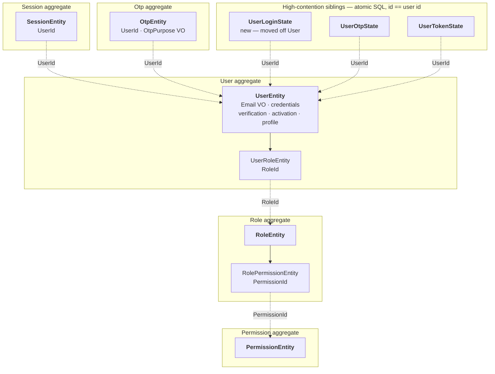

| Root | Inside the boundary | The invariant the boundary protects | Reached by id only |
| --- | --- | --- | --- |
| `UserEntity` | `UserRoleEntity` | A user never holds the same role twice; credentials, verification and activation move in one commit | Role, Session, Otp, the three siblings |
| `RoleEntity` | `RolePermissionEntity` | A role never holds the same permission twice | Permission, User |
| `PermissionEntity` | — | Resource + action unique among non-deleted | Role |
| `SessionEntity` | — | Revoked at most once; a refresh never extends past the absolute expiry | User |
| `OtpEntity` | — | A code is spent at most once; attempts never exceed the cap | User |
| `UserLoginState` · `UserOtpState` · `UserTokenState` | — | The counter moves atomically, never contending on the user's lock | User |

#### The same map, in plain words

```text
  ╔═ User aggregate ══════════════════════════════════╗
  ║  ★ UserEntity                        THE ROOT     ║
  ║      email · password · verified · active         ║
  ║      profile · avatar · phone                     ║
  ║                                                   ║
  ║      └── UserRoleEntity              member       ║
  ║            carries a RoleId and nothing else      ║
  ╚═══════════════════════════════════════════════════╝
         ╎ RoleId  — a plain Guid, no navigation property
         ▼
  ╔═ Role aggregate ══════════════════════════════════╗
  ║  ★ RoleEntity                        THE ROOT     ║
  ║      name · description · active                  ║
  ║                                                   ║
  ║      └── RolePermissionEntity        member       ║
  ║            carries a PermissionId                 ║
  ╚═══════════════════════════════════════════════════╝
         ╎ PermissionId
         ▼
  ╔═ Permission aggregate ════════════════════════════╗
  ║  ★ PermissionEntity                  THE ROOT     ║
  ╚═══════════════════════════════════════════════════╝

  These stand alone. Each one points back at the user by id, independently of the others:

  ╔═ Session ══════════╗  ╔═ Otp ══════════════╗  ╔═ Login / Otp / Token state ═╗
  ║  ★ SessionEntity   ║  ║  ★ OtpEntity       ║  ║  ★ three tiny rows          ║
  ║    holds a UserId  ║  ║    holds a UserId  ║  ║    id == the user's id      ║
  ╚═════════╪══════════╝  ╚═════════╪══════════╝  ╚═════════╪═══════════════════╝
            ╎                       ╎                       ╎
            └───────────────────────┴───────────────────────┘
                                    ╎ UserId
                                    ▼
                        the User aggregate, above
```

What the boxes mean when you sit down to write code:

- **To give a user a role**, you load the *user* and call `user.GrantRole(roleId, roleName)`.
  There is no `IUserRoleRepository` and you never load a `UserRoleEntity` by itself.
- **To show a role's name next to a user**, you cannot write `userRole.Role.Name` — that
  property is gone. You fetch the roles you need in one batched call and join them in the
  mapper.
- **To lock an account after failed logins**, you do not touch `UserEntity` at all. The counter
  lives on its own row so two simultaneous failed logins both count instead of one overwriting
  the other.
- **One commit changes one box.** Deactivating a user and revoking their sessions are two
  boxes, so they are two commits with a domain event in between — not one transaction.
- **Deleting a box deletes everything inside it, and nothing outside it.** Deleting a role
  removes its `RolePermissionEntity` rows; it does not remove the permissions themselves.

The three siblings are separate aggregates **on purpose** (D10/D11): their counters are bumped
by atomic SQL, so they must not share the user's optimistic lock. That is legitimate DDD —
eventual consistency between aggregates — and the only defect is that today it is undocumented
and the login counters sit on `UserEntity` instead.

### 1.4 Core — 1 root, 0 members

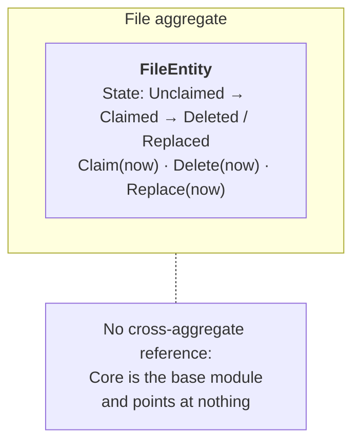

| Root | Inside the boundary | The invariant the boundary protects | Reached by id only |
| --- | --- | --- | --- |
| `FileEntity` | — | Claimed at most once, deleted at most once; the four states are total and mutually exclusive | Nothing — Core depends on no module |

#### The same map, in plain words

```text
  ╔═ File aggregate ══════════════════════════════════════════════╗
  ║  ★ FileEntity                                   THE ROOT      ║
  ║      name · mime · size · storage key · colours               ║
  ║                                                               ║
  ║      state:  Unclaimed ──▶ Claimed ──▶ Deleted                ║
  ║                    │            └────▶ Replaced               ║
  ║                    └──▶ Deleted  (reaper, grace elapsed)      ║
  ╚═══════════════════════════════════════════════════════════════╝

        Core points at nothing. It is the bottom of the stack:
        every other module depends on it, so it may depend on none.
```

What the box means when you sit down to write code:

- **A file is one box with no members.** There is nothing to navigate into and nothing to
  cascade.
- **The file never knows who uses it.** An article holds a `CoverImageFileId`; the file holds no
  `ArticleId`. That is why the claim-and-reap mechanism exists at all.
- **Uploading is not a repository call.** After this stage `IFileRepository` only reads and
  writes rows; `IFileUploadService` is what talks to Cloudinary.
- **Every state move takes the clock as an argument** — `Claim(now)`, `Delete(now)` — so the
  reaper's grace period cannot drift between the API host and the job host.

Core's boundary is already right. Its problem (Part B) is entirely that `IFileRepository` does
network IO and knows an Identity policy, which is an R12/R13 failure, not an R1 failure.

### 1.5 Content — 37 roots, 12 members

Three clusters. Same grammar throughout; the 15 single-entity interaction aggregates are listed
in the table rather than drawn, because each is one box with one node.

#### Editorial

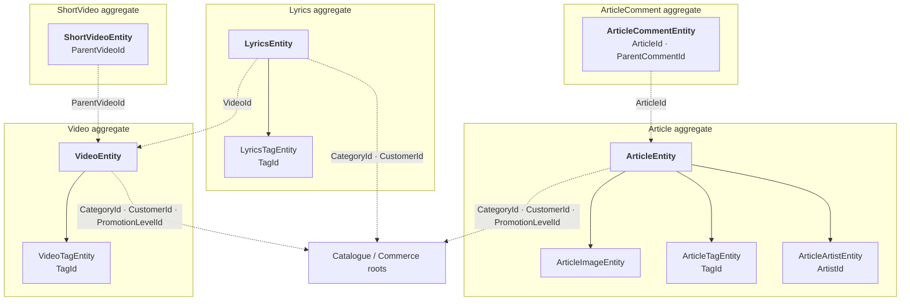

#### Community review — four independent lifecycles, which is exactly why they are roots

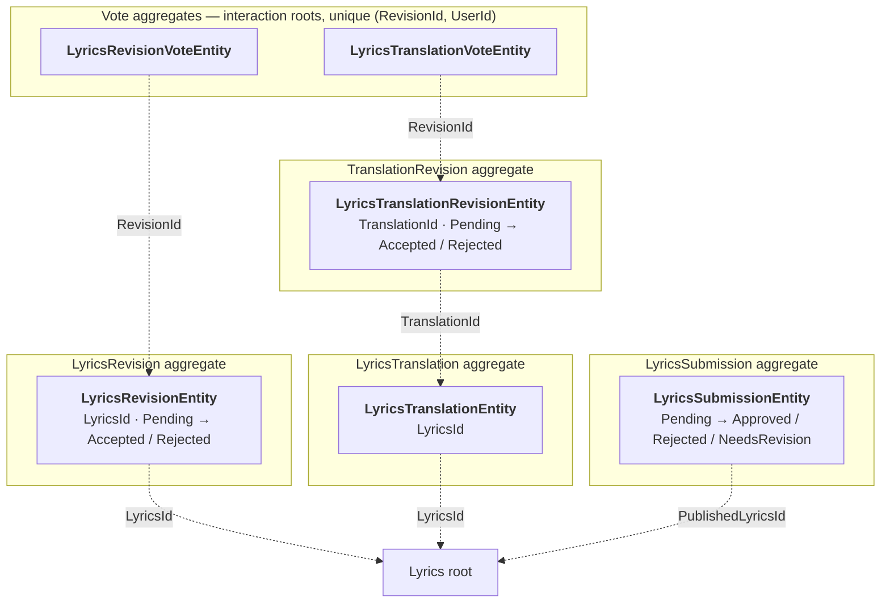

#### Commerce and catalogue

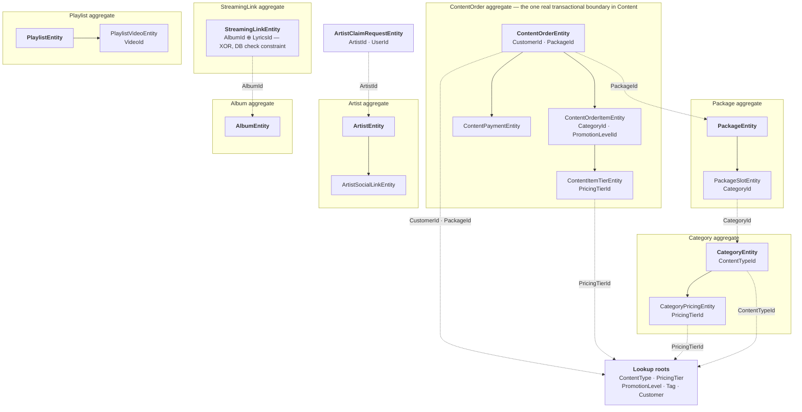

The complete target inventory — 37 roots and 12 members, summing to the 49 entities in the tree:

| Cluster | Roots | Members folded in |
| --- | --- | --- |
| Editorial | `Article`, `Video`, `ShortVideo`, `Lyrics`, `ArticleComment` | `ArticleImage`, `ArticleTag`, `ArticleArtist`, `VideoTag`, `LyricsTag` |
| Community review | `LyricsRevision`, `LyricsTranslationRevision`, `LyricsTranslation`, `LyricsSubmission` | — |
| Commerce | `ContentOrder`, `Customer`, `Package` | `ContentOrderItem`, `ContentItemTier`, `ContentPayment`, `PackageSlot` |
| Catalogue | `Category`, `ContentType`, `PricingTier`, `PromotionLevel`, `Tag` | `CategoryPricing` |
| Artists | `Artist`, `Album`, `ArtistClaimRequest`, `StreamingLink` *(see D9)* | `ArtistSocialLink` |
| Playlists | `Playlist` | `PlaylistVideo` |
| Interactions (15 single-entity aggregates, unchanged) | `ArticleLike`, `ArticleBookmark`, `ArticleShare`, `ArticleCommentLike`, `ShortVideoLike`, `ShortVideoBookmark`, `ShortVideoShare`, `ShortVideoViewEvent`, `LyricsLike`, `LyricsShare`, `LyricsViewEvent`, `VideoShare`, `VideoRating`, `LyricsRevisionVote`, `LyricsTranslationVote` | — |

The invariants each boundary protects:

| Root | The invariant the boundary protects |
| --- | --- |
| `ContentOrder` | The total always equals the sum of its billable items' tiers and promotions; items are added only while Draft; the payment settles this order and no other |
| `Article` · `Video` · `Lyrics` | Publication state and its stamp move together; images and tags never outlive the piece |
| `LyricsRevision` · `LyricsTranslationRevision` | Decided at most once — the tally lives outside the boundary (a SQL count over the vote aggregates), so the guard on `Accept` is what makes a threshold race harmless |
| `LyricsSubmission` | Decided at most once; an approved submission names exactly one published page |
| `Category` | Pricing rows exist only for a commissionable category |
| `Package` | Slots reference live categories; the slot set defines the bundle |
| `Artist` · `Album` | Social links never outlive the artist |
| `StreamingLink` | Exactly one owner — album or standalone single, never both (`ck_streaming_links_exactly_one_target`); one link per (owner, platform) |
| Interaction aggregates | One row per (user, target); creation and removal are independently idempotent |

#### The same map, in plain words

Thirty-four boxes are too many to draw at once. Here is the richest one, which is the pattern
every other cluster follows:

```text
  ╔═ ContentOrder aggregate ══════════════════════════════════════════╗
  ║  ★ ContentOrderEntity                              THE ROOT       ║
  ║      status: Draft ─▶ PendingPayment ─▶ Paid / Cancelled          ║
  ║      total  (always the sum of what is inside this box)           ║
  ║                                                                   ║
  ║      ├── ContentOrderItemEntity          member                   ║
  ║      │       └── ContentItemTierEntity   member                   ║
  ║      │                                                            ║
  ║      └── ContentPaymentEntity            member                   ║
  ║              proof · verified · receipt                           ║
  ╚═══════════════════════════════════════════════════════════════════╝
        ╎ CustomerId   ╎ PackageId   ╎ CategoryId   ╎ PricingTierId
        ▼              ▼             ▼              ▼
     Customer       Package       Category       PricingTier
     (own box)      (own box)     (own box)      (own box)
```

Compare that with a piece of content, where the review workflow deliberately sits *outside* the
box because it has its own life:

```text
  ╔═ Lyrics aggregate ════════════╗      ╔═ LyricsRevision aggregate ═══════════╗
  ║  ★ LyricsEntity      ROOT     ║      ║  ★ LyricsRevisionEntity    ROOT      ║
  ║      text · status · slug     ║◀╌╌╌╌╌╫──  LyricsId                          ║
  ║                               ║      ║      status: Pending ─▶ Accepted     ║
  ║      └── LyricsTagEntity      ║      ║                      └▶ Rejected     ║
  ║            carries a TagId    ║      ╚══════════╪═══════════════════════════╝
  ╚═══════════════════════════════╝                 ╎ RevisionId
                                                    ╎
  ╔═ one vote ═══════════════════════════╗          ╎
  ║  ★ LyricsRevisionVoteEntity   ROOT   ║╌╌╌╌╌╌╌╌╌╌┘
  ║    one row per (revision, user)      ║   cast by arbitrary users, like a like
  ╚══════════════════════════════════════╝
```

What the boxes mean when you sit down to write code:

- **Adding a line item is a message to the order, not a constructor call.** You write
  `order.AddItem(categoryId, tiers)` and the order builds the item itself. You never `new` a
  `ContentOrderItemEntity` in a handler and hand it over.
- **The total is never assigned.** It is recomputed inside the box whenever the box changes, so
  no call site can leave it stale.
- **A revision is its own box because it has its own status.** That is the whole test: an
  article's *image* has no status and dies with the article, so it is a member; a *revision*
  moves Pending → Accepted on its own schedule, so it is a root.
- **Accepting a revision touches two boxes**, so it is two steps: the revision decides, then the
  lyrics page is updated. Each step is idempotent on its own, which is what stops a
  double-clicked moderation from re-applying the text and re-notifying the proposer.
- **A like is its own box, and so is a vote.** They look tiny, but they are written by
  arbitrary users independently of the target's lifecycle, so each is a root with exactly one
  entity in it — that is normal and correct. Forcing votes through the revision root would
  serialize community voting for nothing; the unique `(RevisionId, UserId)` index is the real
  duplicate guard.
- **Nothing reaches across a dotted line.** You cannot write `order.Customer.Name`. You fetch
  the customers you need in one call and join in the mapper.

### 1.6 Mailer — 3 roots, 0 members, already correct

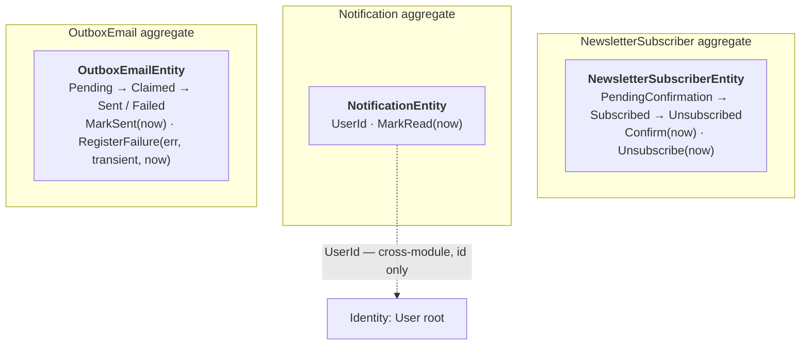

| Root | Inside the boundary | The invariant the boundary protects | Reached by id only |
| --- | --- | --- | --- |
| `NewsletterSubscriberEntity` | — | One row per address (unique index); unsubscribe is idempotent and re-subscription reuses the row via `ReissueConfirmation` | — |
| `NotificationEntity` | — | Read at most once | Identity's `User` |
| `OutboxEmailEntity` | — | Claimed by one dispatcher at a time; sent at most once; the lease is the only thing that returns a row to the pool | — |

#### The same map, in plain words

```text
  ╔═ NewsletterSubscriber ═════════╗  ╔═ Notification ═════════════════╗
  ║  ★ one row, one email address  ║  ║  ★ one row, one user           ║
  ║    Pending ─▶ Subscribed       ║  ║    unread ─▶ read              ║
  ║            └▶ Unsubscribed     ║  ║    UserId ╌╌▶ Identity's user  ║
  ╚════════════════════════════════╝  ╚════════════════════════════════╝

  ╔═ OutboxEmail ══════════════════════════════════════════════════════╗
  ║  ★ one row, one email to send                                      ║
  ║    Pending ─▶ Claimed ─▶ Sent                                      ║
  ║                  │   └──▶ Failed ─▶ back to Pending on retry       ║
  ║                  └─ the lease is the only way a stuck row returns  ║
  ╚════════════════════════════════════════════════════════════════════╝
```

Three boxes, nothing inside any of them, nothing pointing at anything except one id across a
module boundary. This is what the other three modules look like after Stage 15.

**No change is specified for Mailer** beyond the kernel-inherited `Id` fix (15.1). It is in this
document as the worked example: when Part A asks Identity to take `DateTime now` as a parameter
and return `bool` from a guarded transition, `OutboxEmailEntity.MarkSent(DateTime now)` is the
file to copy.

---

## Part A — Identity

### A.1 The model today

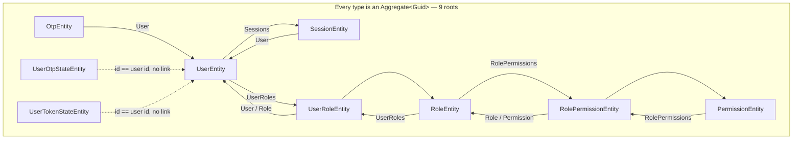

Eleven object navigations, ten of them forming bidirectional pairs — only `Otp.User` is
one-way — and no boundary anywhere: from a loaded
`PermissionEntity` a caller can walk to every user in the system.

### A.2 Violations, with evidence

**A.2.1 — Two of nine roots are not roots; two more are undocumented (R1, R13).**
`UserRoleEntity` and `RolePermissionEntity` are pure join rows: they exist only as part of a
user's grants and a role's permission set, they are never fetched by identity, and neither has
a repository. They are `Aggregate<Guid>` solely because they raise events
(`UserRoleEntity.cs:44,76`, `RolePermissionEntity.cs:46,57`) and `Aggregate` is the only base
that can. `UserOtpStateEntity` and `UserTokenStateEntity` are 1:1 with the user — their `Id`
*is* the user id (`UserOtpStateEntity.cs:33`) — but they are genuinely separate aggregates by
design, because their counters are bumped by atomic SQL and must not contend on the user's
lock. That is legitimate; what is missing is saying so.

**A.2.2 — `UserEntity` carries state it does not control (R4, R7).**
`FailedLoginAttempts` (`UserEntity.cs:63`) and `LockedUntil` (`UserEntity.cs:68`) are
`private set` properties on the aggregate, and the code comment above them says outright:

```csharp
// Login brute-force counters. Moved by atomic SQL through IAccountLockoutRepository, never by
// a tracked mutation, so an increment survives the exception the failed attempt throws.
```

The aggregate declares ownership of two fields no aggregate method ever writes. The `private
set` is not a guarantee, it is decoration. Meanwhile the *same* concern for OTP already lives
correctly on a sibling aggregate (`UserOtpStateEntity`) — the login counters simply never
followed.

`UserEntity` also spans four unrelated concerns: credentials, verification/activation, profile
(country, phone, avatar — 7 properties), and role grants. Nothing in the profile block
participates in a credential invariant.

**A.2.3 — Seven value objects, zero of them in the domain (R6).**
`Email`, `AuthProvider`, `OtpPurpose`, `SessionStatus`, `Client`, `ExportFormat`,
`VisitorPermissions` all live in `Identity/Domain/ValueObjects/`. Not one is referenced by any
entity. `UserEntity.Email` is `string?` (`UserEntity.cs:22`); `OtpEntity.Purpose` is the raw
`EnumOtpPurpose`. The 21 files importing the namespace are all Application, Infrastructure or
test files — the value object is constructed at the edge, validated, then unwrapped to a
primitive before it reaches the entity. The rule it encodes is therefore enforced on the path
the validator already covers, and *not* enforced on any other path into the aggregate
(seeders, social login, admin flows).

**A.2.4 — Seven transitions with no guard (R9, R10), in six rows.**

| Site | Problem |
| --- | --- |
| `SessionEntity.cs:176` `Revoke(reason)` | No `IsRevoked` check. Revoking twice re-stamps `RevokedAt` and raises a second `SessionRevokedEvent` — a duplicate security notification. |
| `SessionEntity.cs:189` `Reactivate(...)` | No status check. Reactivates an active session and raises `SessionReactivatedEvent` again. |
| `OtpEntity.cs:103` `MarkAsUsed()` | No `IsUsed` check; re-stamps `UsedAt`. The sibling `MarkAsConsumed()` (`:138`) does it correctly with `ConsumedAt ??= …` — the house shape already exists two methods away. |
| `UserEntity.cs:322` `Activate()` | No guard **and no event**. An account being reactivated is a notifiable fact with no domain record. |
| `UserEntity.cs:331` `Deactivate()` | Same; deactivation should also be the trigger that revokes sessions, and today the doc comment asks the caller to remember ("You should also invalidate all their sessions separately"). |
| `RoleEntity.cs:446` / `PermissionEntity.cs:249` `Update(...)` | Raises `RoleChangedEvent` / `PermissionChangedEvent` unconditionally, even when the submitted values are identical. |

**A.2.5 — Five methods that raise an event for a change they do not make (R10).**
`UserEntity.RecordMassSignOut`, `UserRoleEntity.RecordRevocation`,
`RolePermissionEntity.MarkRemoved`, `RoleEntity.MarkHardDeleted`,
`PermissionEntity.MarkHardDeleted`. Each exists so a handler can announce a fact while
performing the actual mutation itself (deleting the row, revoking sessions in a loop). The
aggregate is being used as an event bus. This is the symptom of A.2.1: the fact belongs to a
root that does not exist yet.

**A.2.6 — The OTP verification policy lives in a repository (R12, R13).**
`OtpRepository.ValidateOtpAsync` (`OtpRepository.cs:33-84`) is the clearest instance in the
codebase. In 50 lines it: runs a specification query, checks expiry, checks the attempt cap,
compares the code against the peppered hash, increments the attempt counter, registers a
failure against the account, **calls `Context.SaveChangesAsync` directly** — bypassing
`IIdentityUnitOfWork` entirely — and throws four different localized domain errors.

Every one of those is a domain decision. The commit in the middle also means a failed
verification is durable even when the surrounding handler later throws, which happens to be
the desired behaviour and is exactly why it was written this way; the point is that the
behaviour is a *policy* that no one can find, sitting in infrastructure.

**A.2.7 — Handler-resident rules (R12).**
`PublicVerifyOtpHandler.cs:53-73` decides that only an `EmailVerification` purpose may flip
`IsVerified`, and check-then-throws on `user.IsVerified && purpose == EmailVerification`. Both
are `UserEntity` rules. `UserEntity.ValidateCanLogin()` (`:340`) is the shape the rest should
take, but it is a void method the caller must remember to call, and it dereferences `Email!`.

**A.2.8 — `AssignRole` accepts a pre-built member (R8).**
`UserEntity.cs:386` takes a fully constructed `UserRoleEntity` from the handler, checks for a
duplicate, and adds it. The root does not create its own child, so nothing stops a caller
building a `UserRoleEntity` with a mismatched `UserId`.

**A.2.9 — Ambient clock in eight places (R15).**
`SessionEntity.cs:147,166,179`; `OtpEntity.cs:106,123,140`; `RoleEntity.cs:154`;
`PermissionEntity.cs:179`. `IsActive()` and `IsExpired()` are the expensive ones: a test cannot
drive them to a boundary without sleeping, and a session's validity depends on which machine
asks.

### A.3 The target model

**See §1.3** — five roots (`User`, `Role`, `Permission`, `Session`, `Otp`), two member entities
(`UserRole`, `RolePermission`), three high-contention sibling aggregates keyed by user id.

### A.4 The changes

1. **`UserRoleEntity` and `RolePermissionEntity` become `Entity<Guid>` members.** They lose
   `AddDomainEvent`; the grant/revoke facts move to the root that performs them —
   `UserEntity.GrantRole(roleId, roleName)` and `RevokeRole(roleId, roleName)`,
   `RoleEntity.GrantPermission(permissionId)` / `RevokePermission(permissionId)`. Each returns
   `bool` and raises only on a real change. `AssignRole(UserRoleEntity)` is deleted (A.2.8).
2. **Login counters move to `UserLoginStateEntity`**, a sibling of `UserOtpStateEntity` with
   the same shape and the same atomic-SQL repository. `UserEntity.FailedLoginAttempts` and
   `LockedUntil` are dropped. `IAccountLockoutRepository` re-points; migration drops two
   columns and creates one table.
3. **Value objects reach the entities.** `UserEntity.Email` becomes `Email?` with an EF value
   converter; `OtpEntity.Purpose` becomes `OtpPurpose`; `SessionEntity.Client` becomes
   `Client`. The converter is one line per property and the column type does not change, so
   this is a **no-migration** change. The four value objects that wrap an enum with only an
   `Enum.IsDefined` check (`SessionStatus`, `ExportFormat`, `AuthProvider`, and `Client` once
   converted) stay as edge parsers — recorded under D8.
4. **The six transitions get guards** in the Stage 6 shape: `bool` return, no-op returns
   `false` and raises nothing, illegal transition throws a coded `IdentityRuleException`.
   `Activate`/`Deactivate` gain `UserActivatedEvent` / `UserDeactivatedEvent`, and the session
   revocation that the doc comment asks callers to remember becomes a reaction to the latter.
5. **The OTP policy moves into the domain.** `OtpEntity.Verify(suppliedCodeMatches, now)`
   returns a `EnumOtpVerificationOutcome` (`Valid`, `Expired`, `AttemptsExhausted`, `Mismatch`)
   and performs the attempt increment itself. `OtpRepository.ValidateOtpAsync` shrinks to the
   query; the handler maps the outcome to its localized error, and the failed-attempt durability
   that the mid-repository `SaveChangesAsync` provided becomes an explicit second commit in the
   handler with a comment saying why.
6. **Clock injection.** `IsActive(now)`, `IsExpired(now)`, `Revoke(reason, now)`,
   `MarkAsUsed(now)`, `SoftDelete(now)` take the instant; callers pass `timeProvider.GetUtcNow()`.

---

## Part B — Core

### B.1 The model today

One entity, and the aggregate itself is close to correct — factory validation, guarded
`Delete()`/`MarkReplaced()` returning `bool`, events carrying the storage key. The problem is
entirely around it.


### B.2 Violations, with evidence

**B.2.1 — `IFileRepository` is not a repository (R13, R12).**
Twenty-one methods. Eleven are persistence-shaped (`GetByIdAsync`, `GetByIdsAsync`,
`GetStorageUrlsByIdsAsync`, `ClaimAsync`, `GetUnclaimedBeforeAsync`, `AddAsync`, `UpdateAsync`,
`Remove`, `GetAvatarFileAsync`, `SoftDeleteByIdAsync`, `SaveChangesAsync`). The other ten
perform network IO: `UploadAndStoreAvatarAsync`, `DownloadAndStoreAvatarFromUrlAsync`,
`UpdateAvatarFromUrlAsync`, `UpdateAvatarFromFileAsync`, `UpdateAvatarUrlFromSourceAsync`,
`UploadAndStoreImageFileAsync`, `UploadAndStoreVideoFileAsync`, `ReplaceImageFileAsync`,
`ReplaceVideoFileAsync`, `UploadAndStoreRawFileAsync`. A repository that uploads to Cloudinary
cannot be faked in a unit test, cannot be reasoned about transactionally, and cannot fail in a
way the caller can distinguish from a database failure.

And it commits. `SaveChangesAsync` is a public repository method, and `FileRepository` calls it
from **ten** internal sites — every upload, replace and claim path commits inside the
repository, so `ICoreUnitOfWork` (which exists, `Application/Shared/Persistence/`) is bypassed
on every file write. Even the reaper commits through the repository
(`UnclaimedFileReaperJob.cs:54`). This is the same defect as A.2.6, multiplied by ten.

**B.2.2 — Core knows an Identity policy (R13, module boundary).**
`UpdateAvatarUrlFromSourceAsync(..., bool isAvatarSourceManual, ...)`. `EnumAvatarSource` is an
Identity concept (`Identity/Domain/Enums/EnumAvatarSource.cs`); Core's file repository branches
on it, flattened to a bool so the dependency does not show up in the using list. Core is the
module every other module depends on — it must not depend back.

**B.2.3 — The claim decision sits in the repository (R12).**
`FileRepository.cs:77`:

```csharp
if (file is null || !file.Claim())
```

The aggregate's `Claim()` correctly returns `false` when already claimed (`FileEntity.cs:160`),
but what that `false` *means* — that the caller's referencing write is a duplicate — is decided
in infrastructure. `FileRepository.cs:65` also does `Context.Files.Update(file)`, the
whole-row attach of [04 §3].

**B.2.4 — The lifecycle is three flags, not a state (R9).**
`IsDeleted`, `DeletedAt`, `ClaimedAt` encode four states — Unclaimed, Claimed, Deleted,
Replaced — with no enum and no transition table. Nothing prevents the combination
`ClaimedAt != null && IsDeleted` from meaning two different things, and "replaced" is
distinguishable from "deleted" only by which event was raised, which is not queryable.

**B.2.5 — Ambient clock in three places (R15).**
`FileEntity.cs:167` (`Claim`), `:188` (`Delete`), `:210` (`MarkReplaced`). The reaper's grace
period is measured against `CreatedAt`, so a clock skew between the API host and the job host
silently changes the retention window.

**B.2.6 — Core has no application layer.** There is no `Application/.../UseCases` folder; every
file operation is invoked from another module *through the repository interface*. The
repository is Core's application layer. This is why B.2.1 and B.2.2 happened.

### B.3 The target model

The aggregate boundary is unchanged and already correct (**§1.4**). What changes is the layer
around it — the repository splits from the upload service:

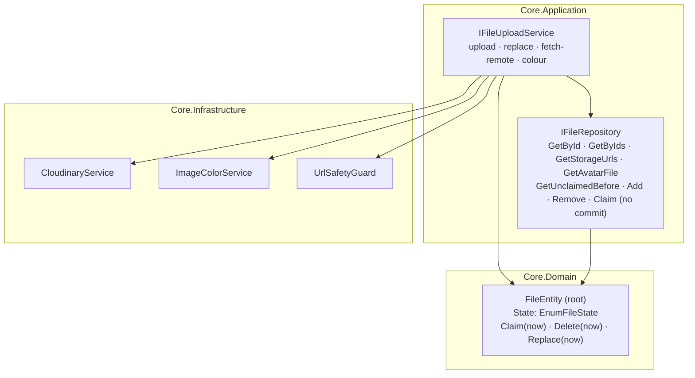

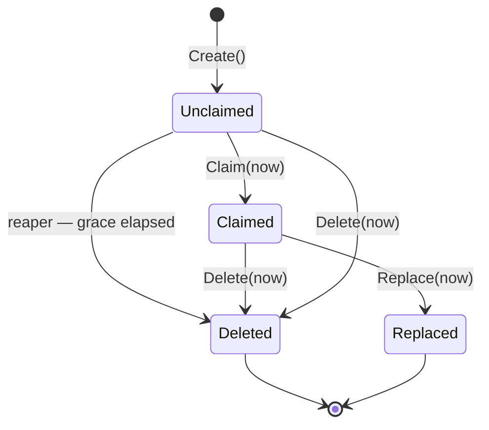

### B.4 The changes

1. **Split the repository.** The ten IO methods move to a new `IFileUploadService` in
   `Core/Application/Shared/Services/`, next to the `ICloudinaryService` they wrap. Of the
   eleven persistence methods, `SaveChangesAsync` is deleted — commit belongs to
   `ICoreUnitOfWork`, and the ten internal commit sites (including the reaper's,
   `UnclaimedFileReaperJob.cs:54`) convert with it; `UpdateAsync` is deleted per D4;
   `ClaimAsync` and `SoftDeleteByIdAsync` stop committing internally. Callers in Identity and
   Content re-point; signatures do not change, so the re-point is mechanical.
2. **Delete `UpdateAvatarUrlFromSourceAsync`.** Its branch moves to the Identity handler that
   owns `EnumAvatarSource`, which then calls the plain `ReplaceImageFileAsync`. Core stops
   knowing about avatars.
3. **`EnumFileState` replaces the flag trio.** `Unclaimed | Claimed | Deleted | Replaced`, with
   `IsDeleted` kept as a computed `=> State is Deleted or Replaced` for the existing global
   query filter (`CoreDbContext.cs:41`), so the filter and every read path are untouched. Migration adds the column and
   backfills from the flags; `DeletedAt`/`ClaimedAt` stay as timestamps.
4. **Clock as a parameter** on `Claim`, `Delete`, `Replace`; the reaper and the dispatcher jobs
   take `TimeProvider` (the same change the composition-root audit prescribes).
5. **The claim decision returns to the caller.** `FileRepository.ClaimAsync` loads and returns
   the aggregate; the calling handler invokes `Claim(now)` and decides what `false` means.

---

## Part C — Content

### C.1 The model today

49 entities, 49 aggregate roots, 0 member entities, 64 entity-typed navigations, 25
repositories, 137 specification classes behind 117 `ApplySpecification` call sites.

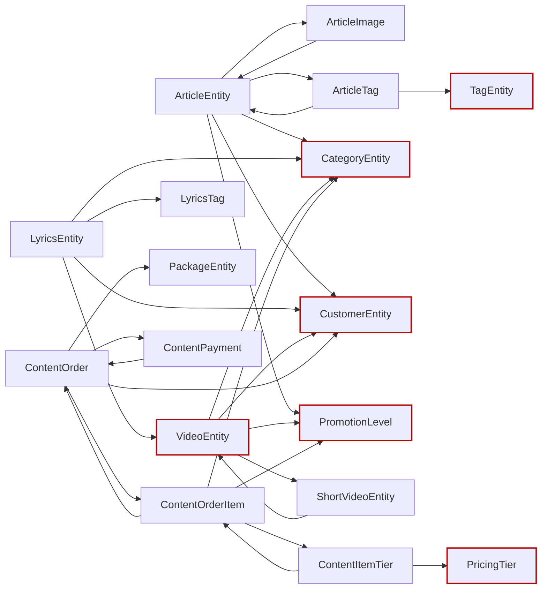

Red-outlined nodes are reached across an aggregate boundary by object reference. From a loaded
`ContentItemTierEntity` a caller can reach the order, its customer, and every other item on it.

### C.2 Violations, with evidence

**C.2.1 — Twelve member entities modelled as roots (R1).**
Each of these has a cascade FK to its parent, no repository, no independent retrieval, and is
written only through its parent's use cases:

| Member | Belongs to | Member | Belongs to |
| --- | --- | --- | --- |
| `ArticleImageEntity` | Article | `ContentOrderItemEntity` | ContentOrder |
| `ArticleTagEntity` | Article | `ContentItemTierEntity` | ContentOrder |
| `ArticleArtistEntity` | Article | `ContentPaymentEntity` | ContentOrder |
| `VideoTagEntity` | Video | `PackageSlotEntity` | Package |
| `LyricsTagEntity` | Lyrics | `CategoryPricingEntity` | Category |
| `PlaylistVideoEntity` | Playlist | `ArtistSocialLinkEntity` | Artist |

The 15 interaction types (`ArticleLikeEntity`, `ArticleBookmarkEntity`, `ArticleShareEntity`,
`ArticleCommentLikeEntity`, the ShortVideo and Lyrics equivalents, `VideoRatingEntity`,
`LyricsViewEventEntity`, `ShortVideoViewEventEntity`, and the two revision votes) are
**correctly** roots — single-entity aggregates written concurrently by arbitrary users, each
with a unique (user, target) index as its duplicate guard. The votes are the case the schema
decides: `ILyricsRevisionVoteRepository` exists with its own tally query
(`GetNetApprovalsAsync`), the unique index is `(RevisionId, UserId)`
(`LyricsRevisionVoteConfiguration.cs:29`) — byte-for-byte the `VideoRating` shape
(`VideoRatingConfiguration.cs:27`), which no one proposes folding into the video. They are not
part of this reduction. `StreamingLinkEntity` is also excluded — see D9. 49 roots →
37 roots + 12 members.

**C.2.2 — Twenty-six cross-aggregate navigations (R3).**
The complete list, by file and line:

| Navigation | Site | Navigation | Site |
| --- | --- | --- | --- |
| `Article.PromotionLevel` | `ArticleEntity.cs:114` | `ContentOrder.Customer` | `ContentOrderEntity.cs:42` |
| `Article.Customer` | `:193` | `ContentOrder.Package` | `:47` |
| `Article.Category` | `:198` | `ContentOrderItem.Category` | `ContentOrderItemEntity.cs:65` |
| `Video.PromotionLevel` | `VideoEntity.cs:102` | `ContentOrderItem.PromotionLevel` | `:70` |
| `Video.Customer` | `:184` | `ContentItemTier.PricingTier` | `ContentItemTierEntity.cs:37` |
| `Video.Category` | `:189` | `CategoryPricing.PricingTier` | `CategoryPricingEntity.cs:37` |
| `Video.Shorts` | `:199` | `PackageSlot.Category` | `PackageSlotEntity.cs:43` |
| `Lyrics.Video` | `LyricsEntity.cs:230` | `ShortVideo.ParentVideo` | `ShortVideoEntity.cs:103` |
| `Lyrics.Customer` | `:235` | `StreamingLink.Lyrics` | `StreamingLinkEntity.cs:50` |
| `Lyrics.Category` | `:240` | `ArticleArtist.Artist` | `ArticleArtistEntity.cs:32` |
| `Category.ContentType` | `CategoryEntity.cs:105` | `ArticleTag.Tag` | `ArticleTagEntity.cs:29` |
| `ArticleComment.Article` | `ArticleCommentEntity.cs:56` | `VideoTag.Tag` | `VideoTagEntity.cs:29` |
| `PlaylistVideo.Video` | `PlaylistVideoEntity.cs:33` | `LyricsTag.Tag` | `LyricsTagEntity.cs:29` |

The remaining 38 are within-aggregate and stay — except the back-references
(`ArticleImage.Article`, `ArticleLike.Article`, `ContentOrderItem.Order`, …), which are
unnecessary once traversal is root-down only.

**C.2.3 — Seven transitions with no guard (R9, R10).**
The [03 §7] finding, enumerated:

| Site | Effect of a second call |
| --- | --- |
| `LyricsRevisionEntity.cs:85` `Accept` | Re-sets `Accepted`, re-raises `LyricsRevisionDecidedEvent` — a second notification to the proposer, and the accepted text is re-applied to the lyrics page. |
| `LyricsRevisionEntity.cs:105` `Reject` | Same, and can flip an already-accepted revision to rejected. |
| `LyricsTranslationRevisionEntity.cs:83` `Accept` | Same shape. |
| `LyricsTranslationRevisionEntity.cs:103` `Reject` | Same shape. |
| `LyricsSubmissionEntity.cs:101` `Approve` | Re-stamps reviewer and `PublishedLyricsId`; a second approval can point at a different lyrics page. |
| `LyricsSubmissionEntity.cs:115` `Reject` | Can reject an already-approved submission. |
| `LyricsSubmissionEntity.cs:129` `RequestRevision` | Can pull an approved submission back to `NeedsRevision`. |

All seven are the revision/submission review workflow; nothing else in Content is unguarded.
`ArtistEntity.ClaimOwnership` (`:322`) already throws `ArtistAlreadyClaimed` when `UserId` is
set, and `ContentOrderEntity.Cancel` (`:291`) already throws on `Paid`/`Cancelled` — both are
correct and out of scope. `ContentPaymentEntity.Verify` (`:127`) and `Reject` (`:158`) are the
counter-example to copy: both guard on `Verified`/`Rejected` and throw coded errors. That is
the shape the seven above must take. (`Verify` still raises no event while `Reject` does — an asymmetry worth closing, since
`OrderPaidEvent` currently carries the fact from the order instead.)

The consequence is visible end-to-end: `AdminDecideLyricsRevisionHandler` calls
`revision.Accept(...)` then `lyrics.ReplaceLyricsText(...)` with no idempotency anywhere on the
path, so a double-submitted moderation click re-applies the text and re-notifies. The community
path is the same shape with a third aggregate: `PublicVoteOnLyricsRevisionHandler` commits the
vote, the revision's auto-accept and the lyrics text in one transaction, and its threshold
check (`GetNetApprovalsAsync` + the in-memory `+1`) races a concurrent vote — today both racers
can pass `Status == Pending` before either commits; after this stage the second `Accept`
returns `false` and the race is harmless.

**C.2.4 — Public guards and externally built members (R7, R8).**
`ContentOrderEntity.EnsureDraft()` (`:91`) is a public method whose entire purpose is for
callers to remember to call it. `AddItem(ContentOrderItemEntity)` (`:121`) and
`AddItems(IEnumerable<…>)` (`:132`) accept members the handler constructed — nothing checks
that the item's `OrderId` matches, and `AddItem` does not call `EnsureDraft`, so an item can
be appended to a paid order.

**C.2.5 — Raw setters dressed as behaviour (R7, R16).**
`LyricsEntity.cs:708` `ReplaceLyricsText(string) => LyricsText = lyricsText;` — no guard on
status, no length rule, no event, and it is the method the revision-acceptance path calls.
Likewise `ArticleEntity.cs:576` and `VideoEntity.cs:597` `StampSocialBoost() => SocialBoost =
true;`, `LyricsEntity.cs:626/632/639/644` `LinkArtist`/`UnlinkArtist`/`LinkAlbum`/`UnlinkAlbum`,
`VideoEntity.cs:670` `LinkArtist`, and `ArticleCommentEntity.cs:130` `Edit(string body) => Body
= body;` — which will happily edit a soft-deleted comment.

Six bulk `Update(...)` methods (`ArticleEntity.cs:321`, `LyricsEntity.cs:383`,
`VideoEntity.cs:305`, `CategoryEntity.cs:188`, `ArtistEntity.cs:180`, `AlbumEntity.cs:112`) require
re-supplying every field, which makes a partial update indistinguishable from a clear-to-null
and is why `ReplaceLyricsText` had to exist alongside `Update` in the first place.

**C.2.6 — `HasLyrics` has three writers (R14).**
`VideoEntity.cs:130` stores it; `:397`/`:402` mutate it; and three handlers must each remember:
`AdminCreateLyricsHandler.cs:61`, `AdminUpdateLyricsHandler.cs:81` and `:91` (the old and new
video on a re-link), `AdminDeleteLyricsHandler.cs:37`. Any fourth path that creates or deletes
lyrics — a community submission approval, a cascade — leaves the flag wrong, and nothing
detects it.

**C.2.7 — Engagement counters are `private set` but written by SQL (R7, R14).**
`ArticleEntity.cs:173-188`, `LyricsEntity.cs:210-220`, `VideoEntity.cs:179` and the ShortVideo
equivalents declare `LikeCount`/`CommentCount`/`ShareCount`/`BookmarkCount`/`ViewCount` with
`private set`, but every write is `ExecuteUpdateAsync` in a repository:
`ArticleInteractionRepository.cs:242`, `LyricsRepository.cs:365`,
`ShortVideoRepository.cs:343`, `ArticleCommentRepository.cs:197`, plus `VideoRepository`.

This is **deliberate** — Stage 8 made the counters atomic precisely because a read-modify-write
through the aggregate lost increments under concurrency. The defect is not the SQL, it is that
the aggregate still claims the fields. See D10.

**C.2.8 — One value object for 49 entities (R6).**
`ShareChannel` is the only type in `Content/Domain/ValueObjects/`, and it is used by four
endpoint files — never by an entity. The primitives carrying rules today:
`ContentOrderEntity.TotalAmountUsd` (`decimal`, "never negative" enforced nowhere),
`ContentItemTierEntity.PriceSnapshotUsd`, `ContentOrderItemEntity.PromoPriceSnapshotUsd`,
`ArticleEntity.Slug` / `LyricsEntity.Slug` (`string`, format enforced in a validator),
`LyricsTranslationEntity.Language` (`string`, no BCP-47 check),
`LyricsEntity.ReleaseYear` (`short?`, no range).

**C.2.9 — Ambient clock in 29 places (R15).**
The full list is in the verification grep. The two that matter most:
`VideoEntity.cs:358` decides whether a shoot is still upcoming by reading the wall clock inside
a domain predicate, and the ten interaction factories stamp `CreatedAt = DateTime.UtcNow`
inside `Create(...)`, duplicating what the audit interceptor already does.

**C.2.10 — Attach-Update and specifications (R7, R13).**
`ContentOrderRepository.cs:44,51,206`, `ArtistRepository.cs:197`,
`ArticleCommentRepository.cs:129`, `VideoRepository.cs:200` call `DbSet.Update(...)` — the
whole row goes `Modified`, so every commit rewrites `body`, `lyrics_text` and every other large
column ([04 §3]). And 137 specification classes serve 117 call sites, i.e. the average
specification has fewer than one caller ([04 §12] / [06 §14]).

### C.3 The target model

**See §1.5** — 37 roots and 12 members across six clusters, with the full inventory table and
the invariant each boundary protects.

The review workflow, as a state machine — the [03 §7] fix expressed once:

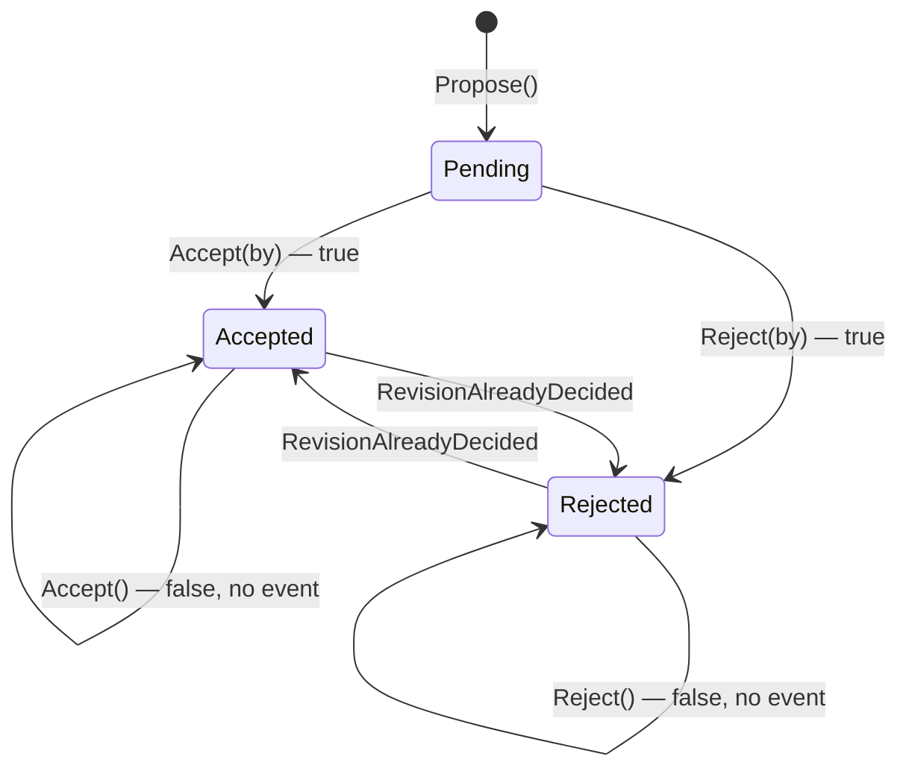

### C.4 The changes

1. **Twelve types demote to `Entity<Guid>`** (C.2.1). They lose events and their own `DbSet`
   is kept only where EF needs it for the owned collection. Each root gains the creation
   method its members need: `Article.AddImage(...)`, `Order.AddItem(categoryId, tiers, …)`
   constructing the item internally (closing C.2.4), `Package.AddSlot(...)`.
2. **Twenty-six navigations become id-only** (C.2.2). The FK columns already exist, so this is
   a **no-migration** change per aggregate: delete the navigation, delete its EF configuration
   line, delete every `.Include(...)` of it, and re-point the mapper at the batched lookup the
   handler already performs (Stage 9's shapes). Reconcile each removed `Include` against Stage
   9's split-query list. Order: Commerce (fewest), then Catalogue, then Editorial.
   `[03 §9]` falls out here — the test builders' reflection hacks exist to satisfy navigations
   that no longer exist.
3. **Seven guards** (C.2.3), all in the Stage 6 shape:

   ```csharp
   /// <summary>
   /// Accepts this revision. Idempotent: a revision already accepted reports false and raises
   /// nothing; a revision already rejected cannot be flipped.
   /// </summary>
   /// <param name="decidedByUserId">The moderator, or null when auto-accepted by vote threshold.</param>
   /// <returns><c>true</c> if the revision transitioned; <c>false</c> if already accepted.</returns>
   public bool Accept(Guid? decidedByUserId)
   {
       if (Status == EnumRevisionStatus.Accepted)
       {
           return false;
       }

       if (Status == EnumRevisionStatus.Rejected)
       {
           throw new ContentRuleException(ContentRuleCodes.RevisionAlreadyDecided);
       }

       Status = EnumRevisionStatus.Accepted;
       DecidedByUserId = decidedByUserId;

       AddDomainEvent(
           new LyricsRevisionDecidedEvent(
               RevisionId: Id,
               LyricsId: LyricsId,
               ProposedByUserId: ProposedByUserId,
               Accepted: true,
               ByModerator: decidedByUserId.HasValue
           )
       );

       return true;
   }
   ```

   `AdminDecideLyricsRevisionHandler` and `AdminDecideTranslationRevisionHandler` translate the
   `false` into the existing `AlreadyDecided` problem instead of silently re-applying the text
   and re-notifying. `RevisionAlreadyDecided` and `SubmissionAlreadyDecided` join `ContentRuleCodes`
   and the catalog map (`ArtistAlreadyClaimed` already exists at `ContentRuleCodes.cs:130`).
4. **Raw setters gain rules** (C.2.5). `ReplaceLyricsText` becomes
   `bool ApplyAcceptedRevision(string text, Guid revisionId)` — guards on `Published`, no-ops
   when the text is unchanged, raises `LyricsTextRevisedEvent`. `ArticleComment.Edit` guards on
   `IsDeleted` and enforces the body rule the validator duplicates. The six bulk `Update(...)`
   methods split into the verbs the use cases actually invoke (`Retitle`, `Recategorize`,
   `ReviseBody`, `Reschedule`), which also removes the clear-to-null ambiguity.
5. **`HasLyrics` becomes derived** (C.2.6). The column, `MarkHasLyrics`/`UnmarkHasLyrics` and
   the three maintenance sites are deleted; the fact is computed at its source:

   ```csharp
   // VideoRepository — the one place the fact is computed from its source of truth.
   public Task<bool> HasPublishedLyricsAsync(Guid videoId, CancellationToken cancellationToken = default)
   {
       return context.Lyrics.AnyAsync(
           l => l.VideoId == videoId && l.Status == EnumContentStatus.Published,
           cancellationToken
       );
   }
   ```

   The feed queries project it as an `EXISTS` subquery; measure before denormalizing again.
   Column dropped in this stage's migration (generated, unapplied).
6. **Counters stop pretending** (C.2.7, D10). The five count properties become
   `{ get; private init; }` with a doc comment naming the repository method that maintains them,
   and the `private set` illusion goes. No behaviour change, no migration — this is an honesty
   fix so the next reader does not add a `Like()` method to the aggregate.
7. **Value objects for money and slug** (C.2.8). `Money` (amount + implicit USD, non-negative,
   arithmetic) replaces the four `decimal …Usd` properties; `Slug` replaces the two `string
   Slug` properties. Both are EF value converters over the existing columns — **no migration**.
   `Language` and `ReleaseYear` are left as primitives (D8).
8. **Clock injection** across the 29 sites; the ten interaction factories simply drop their
   `CreatedAt = DateTime.UtcNow` line, since the audit interceptor already stamps it.
9. **`Update()` deleted per repository** (C.2.10, D4) as its callers convert to tracked
   mutation, and the 137 specifications inline into their call sites (D5).

---

## Part D — Mailer

### D.1 The model today, which is the target

Three entities, three roots, three repositories, zero navigations. Boundary map in **§1.6**.

Mailer passes every rule the kernel does not force on it, so this part records *why*, so the
shape survives the next entity added to the module.

**Clock is a parameter, everywhere.** `grep UtcNow src/Modules/Mailer/Mailer/Domain/` returns
nothing. `NewsletterSubscriberEntity.Confirm(DateTime now)`, `Unsubscribe(DateTime now)`,
`NotificationEntity.MarkRead(DateTime now)`, `OutboxEmailEntity.MarkSent(DateTime now)` and
`RegisterFailure(string error, bool isTransient, DateTime now)` all take the instant. This is
the R15 shape the other three modules adopt in 15.17.

**Guards first** — the state-changing transitions return `bool` (`Confirm`, `Unsubscribe`,
`MarkRead`); the delivery bookkeeping ones (`MarkSent`, `ReissueConfirmation`) are guarded
no-op voids. `NewsletterSubscriberEntity.cs:86`:

```csharp
public bool Confirm(DateTime now)
{
    if (Status != EnumNewsletterStatus.PendingConfirmation)
    {
        return false;
    }

    Status = EnumNewsletterStatus.Subscribed;
    ConfirmedAt = now;
    return true;
}
```

That is the template for the seven Identity guards (15.5) and the seven Content guards (15.12).

**No navigations.** `NotificationEntity.UserId` is a bare `Guid` pointing into Identity — the
cross-module case where an object reference is impossible, which is exactly why it was modelled
correctly. D1 asks Content and Identity to treat their *intra*-module boundaries with the same
discipline the module boundary already forced here.

**Raises no domain events at all.** All three are terminal aggregates: nothing reacts to a
notification being read or an email being sent. `Aggregate<Guid>` is therefore carrying only
the id and audit fields for them — after 15.1 splits `Entity<TId>` from `Aggregate<TId>`, all
three could drop to `Entity<Guid>` and stay roots via `IAggregateRoot`. Recorded as **optional**;
it removes an unused `_domainEvents` list per row and nothing else.

### D.2 The one inherited gap

`Id` is publicly settable (R5), from `Entity<T>` in the kernel. Fixed for every module at once
by 15.1. No Mailer-specific work.

---

## Decisions

| # | Question | Options weighed | Decision |
| --- | --- | --- | --- |
| D1 | Cross-aggregate navigations | keep object references, or IDs at the boundary | **IDs at the boundary, navigations within.** The FK columns already exist, so **no migration**: the change is deleting the navigation, its `Include`, and re-pointing the mapper at a repository lookup the handler already batches. Done per aggregate, Commerce first (fewest navigations), Editorial last. |
| D2 | Strongly-typed IDs | wrap the 105 Guids, or reject with reasons | **Reject, recorded here.** The cost (every signature, EF converter, DTO, test builder — thousands of lines) buys compile-time protection against cross-assigning ids, but the top sources of that bug class — cross-aggregate navs (D1) and check-then-act guards (Stage 6) — are closed by cheaper means. Revisit only if an id-swap bug actually ships. `[03 §8]` closes as *decided-against*. |
| D3 | Review guards | ad-hoc ifs, or the Stage 6 pattern | **Stage 6's pattern:** idempotent transitions return `bool`, invalid transitions throw coded rule exceptions, events raised only on actual transition. |
| D4 | `Update()` semantics | keep attach-Update everywhere, or tracked mutation | **Tracked mutation on load-then-mutate paths.** Post-Stage 9 the write paths are explicitly `AsTracking`; a loaded entity's `SaveChanges` diffs columns. `Update()` (attach) remains only where the entity genuinely arrives detached — after this stage that is nowhere in Content, and the method is deleted per repository as its callers convert. |
| D5 | Specifications | make them carry include/sort/page, or retire the layer | **Retire.** 137 predicate-only classes behind 117 call sites, whose includes/sorts are re-hand-written per call site, is ceremony without leverage `[04 §12]` / `[06 §14]`. Specs inline into their single call sites; the base class stays in Shared for Identity's and Core's specifications until Stage 18. |
| D6 | `[06 §16]` unused `IMapper` | sweep now | **Verify first — likely already closed.** Stage 7's CS9113 cleanup removed unread primary-ctor params and the build holds at 0 warnings, which would flag an injected-never-read `mapper`. Re-census at finalization; sweep only what remains. |
| D7 | How to make R1 enforceable | convention + review, or a type-level marker | **`IAggregateRoot` marker in the kernel**, with `IRepository` constrained to it. Convention is what produced 49/49 roots; a constraint makes the mistake a compile error. Costs one interface and one `where` clause. |
| D8 | Which primitives become value objects | wrap everything with a rule, or only where the rule is violable | **Only where a non-validator path can violate it.** `Email` and `Money` and `Slug` are reachable from seeders, social login and event handlers that no FluentValidation rule covers — they get value objects. `Language`, `ReleaseYear` and the four enum-wrapping VOs (`SessionStatus`, `ExportFormat`, `AuthProvider`, `Client`) are only ever set from a validated request; they stay primitives and the VOs stay edge parsers. |
| D9 | `StreamingLinkEntity`'s parent | child of Album, child of Lyrics, or its own root | **Its own root.** The schema decides it: `ck_streaming_links_exactly_one_target` enforces `album_id XOR lyrics_id`, so half the rows (a standalone single's links) have no album at all and *cannot* be members of the Album aggregate — a link cannot be a member of two different aggregate types. It already has its own repository upserting by (owner, platform) under two unique indexes. It stays a single-entity root; the XOR stays in the factory + check constraint. |
| D10 | Engagement counters on the aggregate | move them back inside, or admit they are outside | **Admit they are outside.** Stage 8 moved them to atomic SQL for a real reason — a read-modify-write through the aggregate loses increments. Reverting that to satisfy R14 would reintroduce a concurrency bug to satisfy a diagram. The fix is to stop the aggregate claiming them: `private init` plus a doc comment naming the maintaining repository method. |
| D11 | `UserEntity` login counters | leave them, or move to a sibling aggregate | **Move to `UserLoginStateEntity`.** Same argument as D10, opposite conclusion: here the sibling aggregate already exists as a pattern (`UserOtpStateEntity`), so the honest model is reachable at the cost of one table and two dropped columns. |

---

## Checklist

- [ ] 15.1 — Kernel: `IAggregateRoot`, `Entity<T>` without events, `Id` init-only, `AddDomainEvent` protected, `OccurredOn` from the interceptor
- [ ] 15.2 — Identity: `UserRole`/`RolePermission` demote to members; grant/revoke verbs on the roots
- [ ] 15.3 — Identity: `UserLoginStateEntity`; drop `FailedLoginAttempts`/`LockedUntil` from `UserEntity` (D11)
- [ ] 15.4 — Identity: `Email`/`OtpPurpose`/`Client` value objects reach the entities via converters (D8)
- [ ] 15.5 — Identity: six transition guards; `UserActivatedEvent`/`UserDeactivatedEvent`; the five declarative raisers move to their owning root
- [ ] 15.6 — Identity: OTP verification policy moves out of `OtpRepository` into `OtpEntity.Verify`
- [ ] 15.7 — Core: `IFileRepository` splits from `IFileUploadService`; `UpdateAvatarUrlFromSourceAsync` moves to Identity
- [ ] 15.8 — Core: `EnumFileState` replaces the flag trio; clock injected
- [ ] 15.9 — Content: navigation census commit (the 64, classified within/across)
- [ ] 15.10 — Content: twelve members demote to `Entity<Guid>`; roots gain their member factories
- [ ] 15.11 — Content: cross-aggregate navs → id-only, Commerce → Catalogue → Editorial
- [ ] 15.12 — Content: seven review-workflow guards `[03 §7]`
- [ ] 15.13 — Content: raw setters gain rules; the six bulk `Update(...)` split into verbs
- [ ] 15.14 — Content: `HasLyrics` derived; the three maintaining handlers stop writing it `[03 §11]`
- [ ] 15.15 — Content: counters demote to `private init` with their maintaining method named (D10)
- [ ] 15.16 — Content: `Money` and `Slug` value objects via converters
- [ ] 15.17 — All modules: `DateTime.UtcNow` out of `Domain/` (40 sites)
- [ ] 15.18 — Load-then-mutate paths drop `Update()`; attach-Update deleted per repository `[04 §3]`
- [ ] 15.19 — Content specifications inlined; `ApplySpecification` call sites collapse `[04 §12]`
- [ ] 15.20 — D2/D6 verified and recorded
- [ ] 15.21 — Verify (build 0/0, csharpier, unit, integration; builder reflection hacks gone `[03 §9]`)

---

## Tests

- **Unit — every new guard transition.** Accept-after-accept returns `false`, accept-after-reject
  throws the coded error, and `DomainEvents.Count` is asserted after a double call so a
  re-raise fails the test. Same shape for the seven in Identity and the seven in Content.
- **Unit — value objects.** The existing `EmailTests` etc. stay; add the converter round-trip
  (entity → column → entity) as an integration repository test, since a converter is
  infrastructure.
- **Unit — member creation.** `Order.AddItem(...)` on a submitted order throws; the created
  item's `OrderId` matches the root. `AssignRole(UserRoleEntity)` no longer compiles.
- **Integration — the re-notify regression `[03 §7]`.** Decide a revision twice over HTTP: the
  second call 409s and **no second notification row or outbox email** exists. This fails today
  and is the proof for C.2.3.
- **Integration — the column-clobber regression `[04 §3]`.** Load an article on the tracked
  path, change only the title, commit; assert via SQL logging that `body` was not in the
  `UPDATE`. Fails before D4's change.
- **Integration — derived `HasLyrics`.** `HasPublishedLyricsAsync` against draft, published and
  deleted lyrics, driven through `IVideoRepository` from DI.
- **Integration — Core split.** The upload path still works through `IFileUploadService`; the
  reaper still sweeps through the narrowed `IFileRepository`. Both already have tests
  (`UnclaimedFileReaperJobTests`) that must stay green unchanged.
- **The existing suites are the no-op proof for D1**: removing navigations must not change any
  response body. Any assertion that moves is a bug in the mapper re-point, not a test to update.

---

## Rollout

Three schema changes, all generated and left unapplied per house rule:

| Migration | Module | Change |
| --- | --- | --- |
| `AddUserLoginState` | Identity | Create `user_login_states`; drop `users.failed_login_attempts`, `users.locked_until` |
| `AddFileState` | Core | Add `files.state`; backfill from `is_deleted`/`claimed_at` |
| `DropVideoHasLyrics` | Content | Drop `videos.has_lyrics` |

Everything else — the value objects, the navigation removals, the demotions, the guards — is
converter-level or code-level and touches no column.

The stage lands module by module in checklist order. 15.1 is the only step every other step
depends on; after it, Identity (15.2–15.6), Core (15.7–15.8) and Content (15.9–15.16) are
independently shippable and independently revertible. Content's 15.11 lands aggregate by
aggregate — Commerce, Catalogue, Editorial — each its own PR.

---

## Verification

1. Build/format/unit/integration green, 0 warnings.
2. `grep -rn "class .*Entity : Aggregate<" src/Modules/Content` → 37, not 49.
3. Cross-aggregate entity-typed navigations in Content `Domain/` → 0; in Identity → 0.
4. `grep -rn "Date\(Time\|TimeOffset\)\.UtcNow" src/Modules/*/*/Domain/` → empty.
5. `grep -rn "MarkHasLyrics\|UnmarkHasLyrics" src/` → empty.
6. `grep -rn "ApplySpecification" src/Modules/Content` → empty.
7. `grep -rln "SaveChangesAsync" src/Modules/*/*/Infrastructure/Repositories/` → shrinks from
   five files to two. `OtpRepository`'s commit moves to the handler (15.6) and
   `FileRepository`'s ten commit sites move behind `ICoreUnitOfWork` (15.7);
   `AccountLockoutRepository` and `UserTokenStateRepository` keep theirs **by design** — they
   are the atomic-counter aggregates whose write must survive the surrounding failure (D10/D11)
   — and `AuthRepository` is re-audited at 15.6 with the same test.
8. Every `IRepository<T, TId>` closes over a type implementing `IAggregateRoot` — enforced by
   the compiler after 15.1, so this is a build check, not a grep.
9. Builder reflection: `grep -rn "GetProperty\|SetValue" tests/Fixtures/Builders` → only the
   engagement-counter arrangement helper remains.
10. Root counts match §1.3–§1.6: Identity 5 roots + 3 siblings, Core 1, Content 37 roots + 12
    members = 49, Mailer 3.
11. **Mailer regression:** it enters this stage passing every rule (§0.2) and must leave it the
    same way. Its only change is the kernel `Id` fix, so any Mailer diff beyond that is drift.

---

**PR series:** `refactor(domain): aggregate roots, value objects, guarded transitions` —
one PR per checklist group, in module order.
